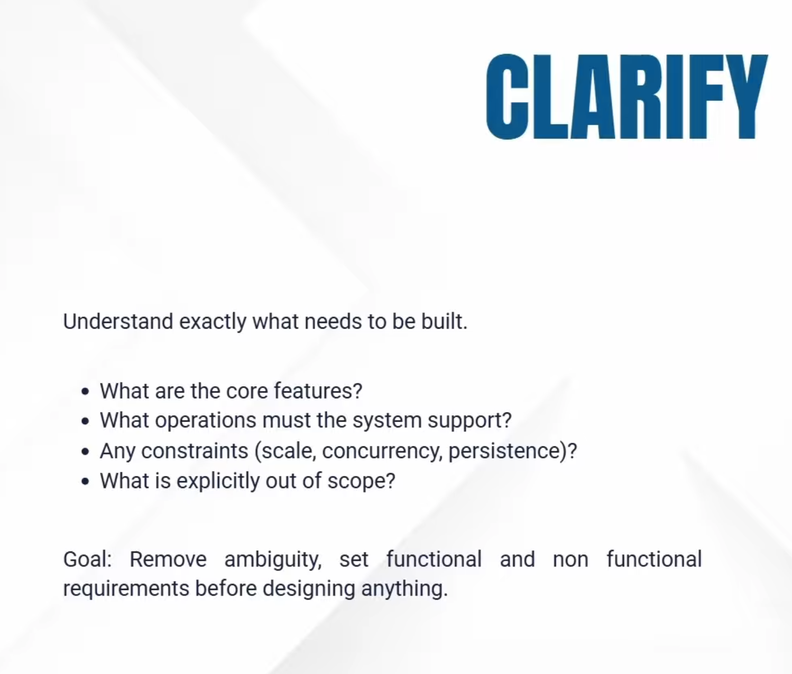
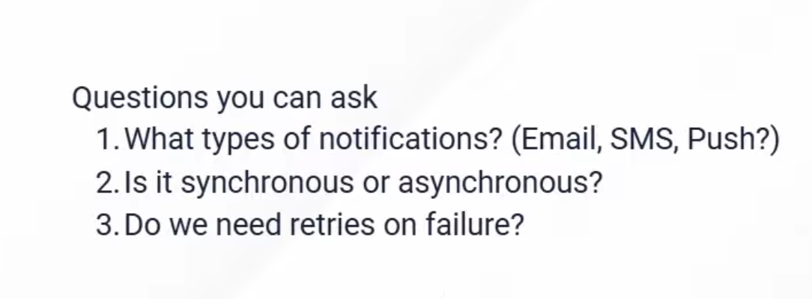
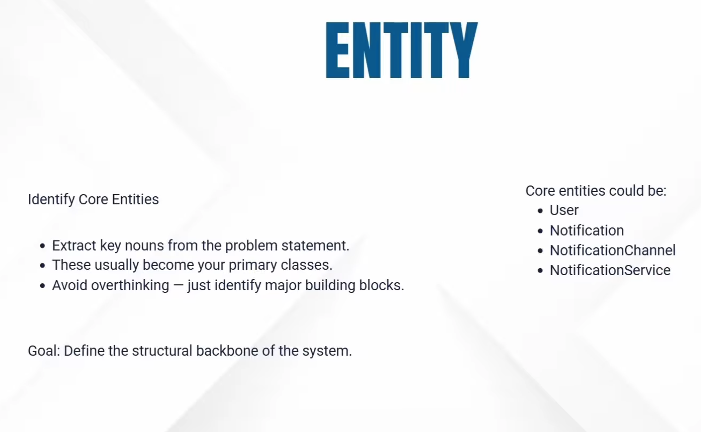
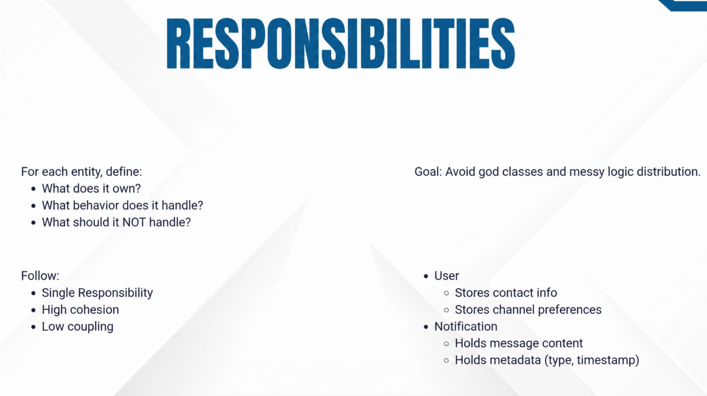
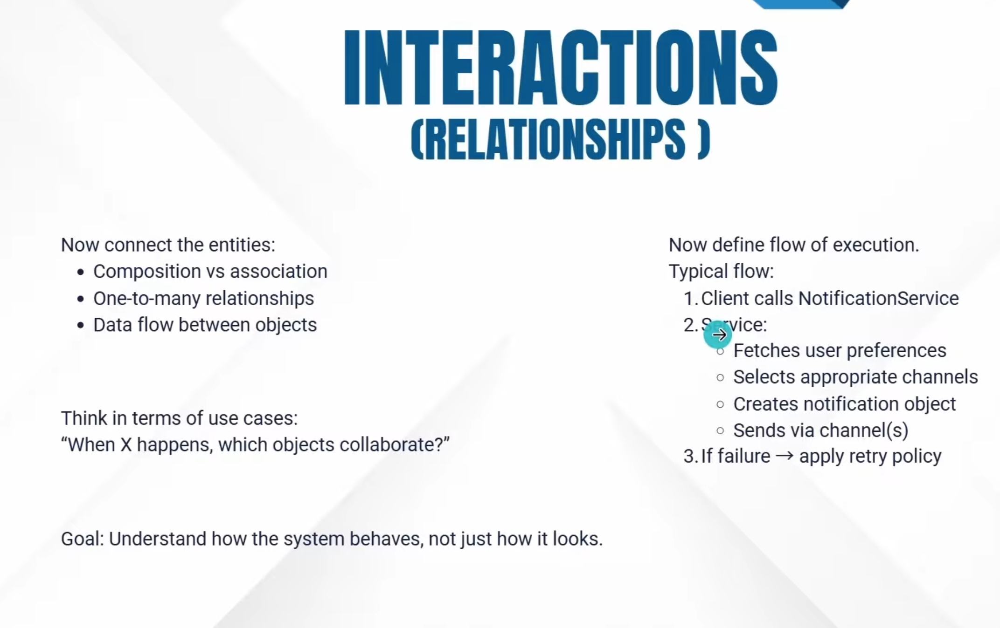
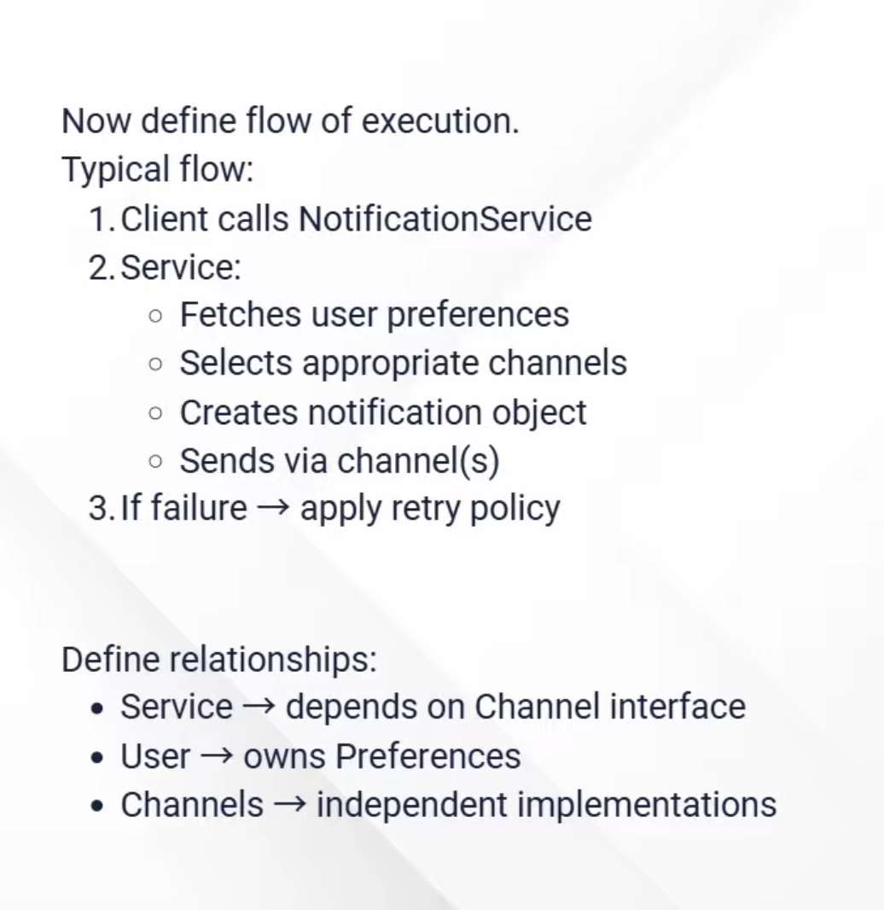
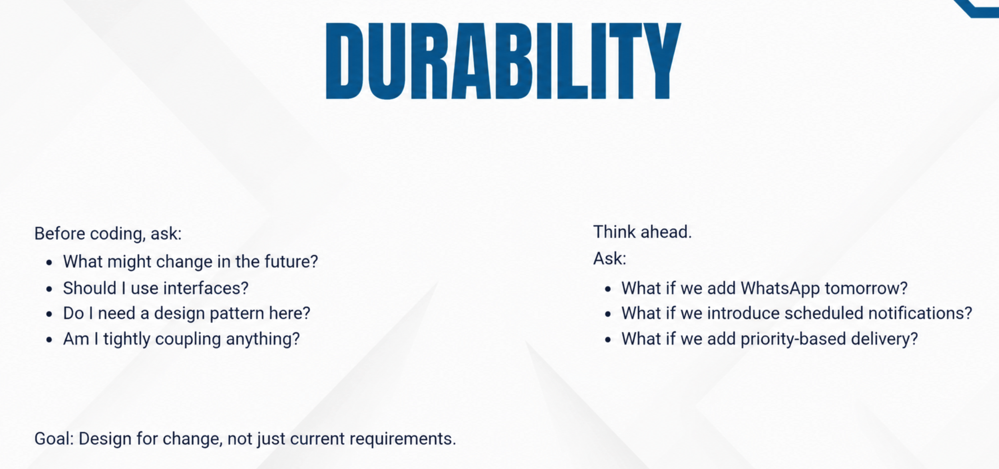
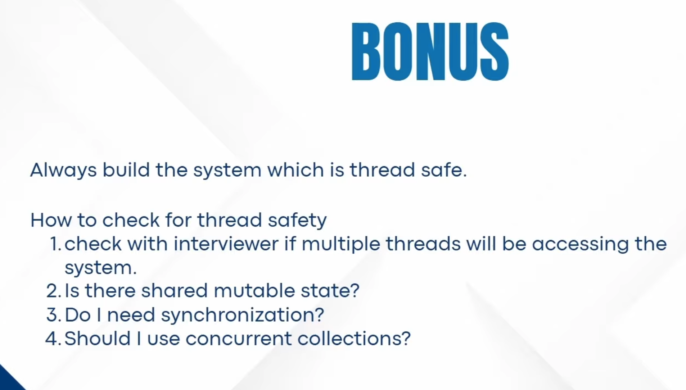

# LLD Approach: CERID Framework

## Problem Statement
**Design a Notification System**

> When the interviewer gives only a one-liner, **Don't start coding immediately!**  
> Follow the **CERID approach**

---

## Table of Contents

1. [CERID Framework Overview](#cerid-framework-overview)
2. [C - Clarify Requirements](#c---clarify-requirements)
3. [E - Entities](#e---entities)
4. [R - Responsibilities](#r---responsibilities)
5. [I - Interactions](#i---interactions)
6. [D - Durability](#d---durability)
7. [Bonus: Thread Safety](#bonus-thread-safety)

---

## CERID Framework Overview

- **C** - Clarify (Requirements)
- **E** - Entities
- **R** - Responsibilities
- **I** - Interactions
- **D** - Durability (Easy to Incorporate changes)

**Bonus:** Think about Thread Safety

---

## C - Clarify Requirements

---

## E - Entities

---

## R - Responsibilities

---

## I - Interactions

---

## D - Durability

*(Easy to Incorporate changes)*

---

## Bonus: Thread Safety

