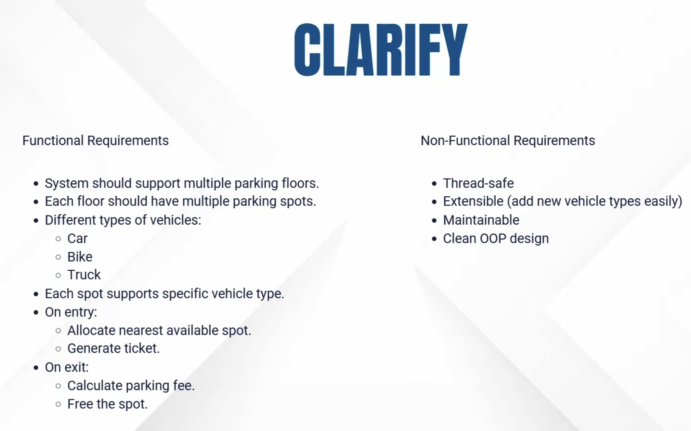
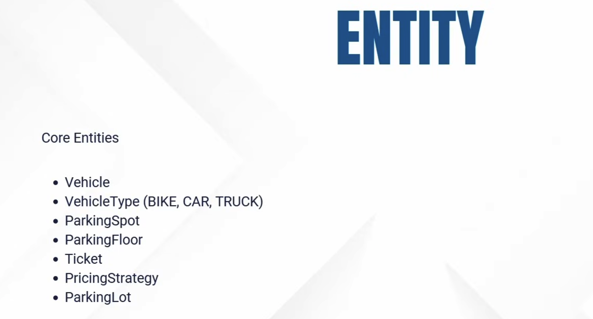
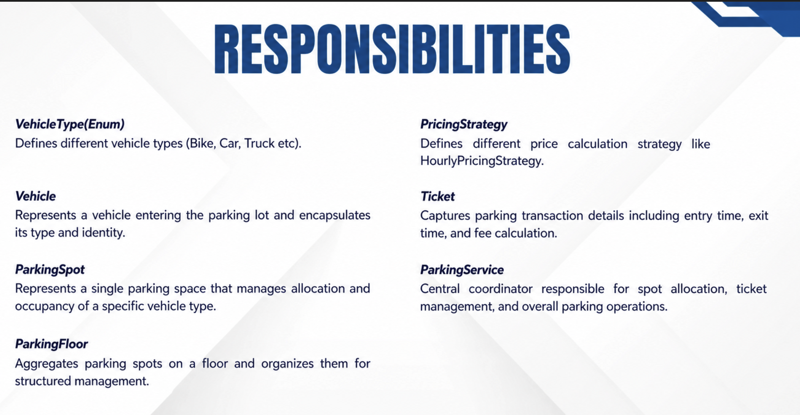
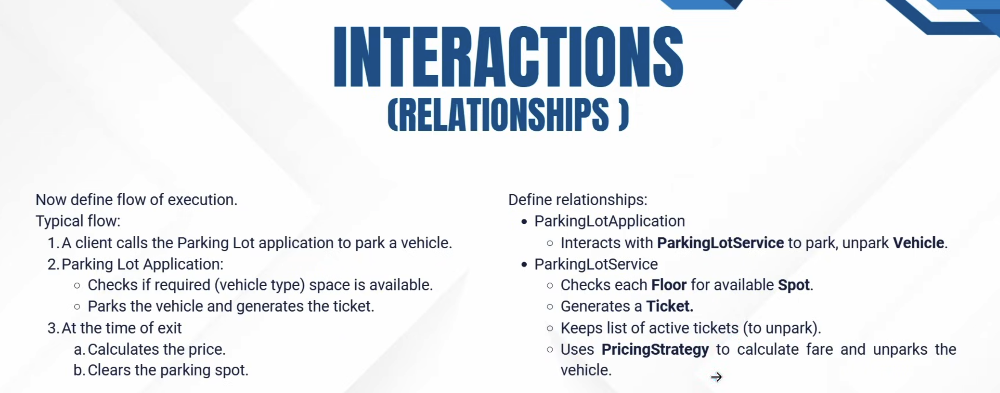
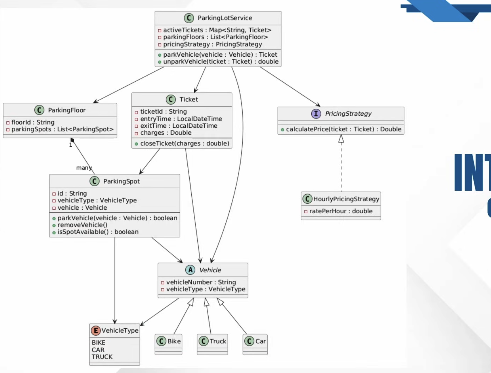

# Parking Lot System - Low Level Design

## Design Approach: CERID Framework

- **C** - Clarify (Requirements)
- **E** - Entities
- **R** - Responsibilities
- **I** - Interactions
- **D** - Durability (Easy to Incorporate Changes)

---

## 1. Clarify (Requirements)

### Functional Requirements

1. System should support multiple parking floors
2. Each floor should have multiple parking spots
3. Support different types of vehicles:
   - Car
   - Bike
   - Truck
4. Each spot supports specific vehicle types
5. **On Entry:**
   - Allocate nearest available spot
   - Generate ticket
6. **On Exit:**
   - Calculate parking fee
   - Free the spot

### Non-Functional Requirements

1. Thread-safe operations
2. Extensible (add new vehicle types easily)
3. Maintainable code structure
4. Clean OOPs Design principles

---

## 2. Entities

### Core Entities

1. **Vehicle** - Represents individual vehicles entering the parking lot
2. **Vehicle Type** - Enum for different vehicle types (Bus, Truck, Lorry, Car, Bike)
3. **Parking Spot** - Individual parking space
4. **Parking Floor** - Collection of parking spots on a single floor
5. **Ticket** - Records parking transaction details
6. **Pricing Strategy** - Handles fee calculation logic
7. **Parking Lot** - Root entity managing the entire system

---

## 3. Responsibilities

### Following Single Responsibility Principle (SRP)

#### 1. Vehicle Type (Enum)
- Define different vehicle types (Bus, Bike, Truck, Car, etc.)

#### 2. Vehicle
- Represents a vehicle entering the parking lot
- Encapsulates vehicle type and identity

#### 3. Parking Spot
- Represents a single parking space
- Manages allocation and occupancy of specific vehicle type
- Tracks availability status

#### 4. Parking Floor
- Aggregates parking spots on a floor
- Organizes spots for structured management
- Provides floor-level operations

#### 5. Pricing Strategy
- Defines different price calculation strategies
- Example: Hourly Pricing Strategy
- Enables flexible pricing models

#### 6. Ticket
- Captures parking transaction details
- Records entry time and exit time
- Handles fee calculation

#### 7. Parking Service
- Central coordinator for parking operations
- Responsible for:
  - Spot allocation
  - Ticket management
  - Overall parking operations

---

## 4. Interactions (Relationships)

### Flow of Execution

#### Typical Flow:

**Client Request:**
1. A client calls the Parking Lot Application to park a vehicle

**Parking Lot Application:**
1. Checks if required space is available based on vehicle type
2. Parks the vehicle
3. Generates a ticket

**At Exit:**
1. Calculates the parking price
2. Clears (frees) the parking spot

### Key Relationships

#### 1. ParkingLotApplication
- Interacts with ParkingLotService
- **Responsibilities:**
  - Park vehicle
  - Unpark vehicle

#### 2. ParkingLotService
- Checks each Floor for available Spot
- Generates a Ticket
- Maintains list of active tickets (for unpark flow)
- Uses PricingStrategy to:
  - Calculate fare
  - Unpark the vehicle

### Relationships Diagram

---

## 5. Durability (Extensibility)

The design follows SOLID principles to ensure:
- Easy addition of new vehicle types
- Flexible pricing strategies
- Scalable floor and spot management
- Maintainable codebase with clear separation of concerns