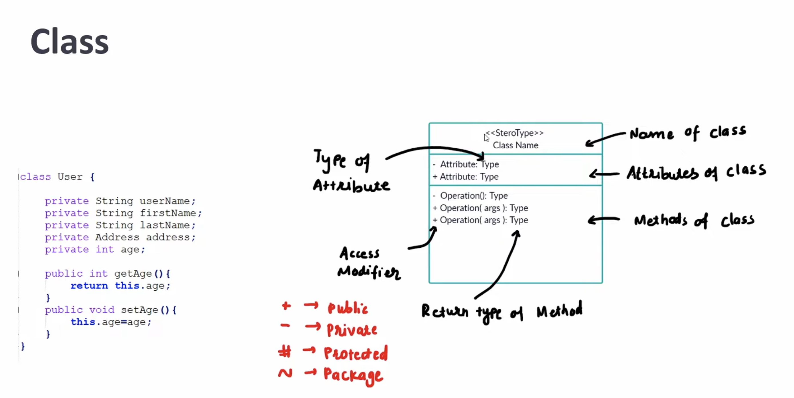
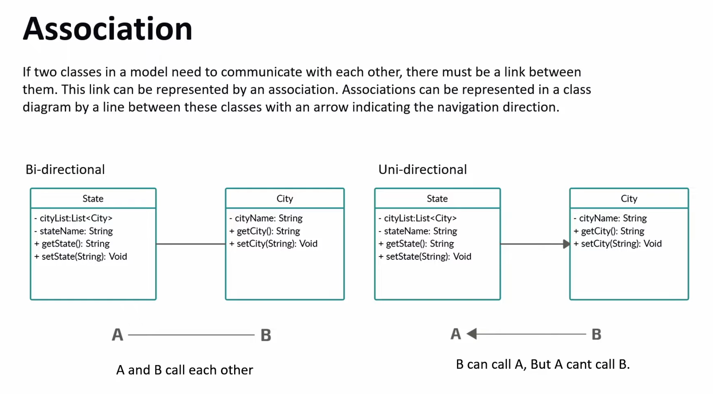
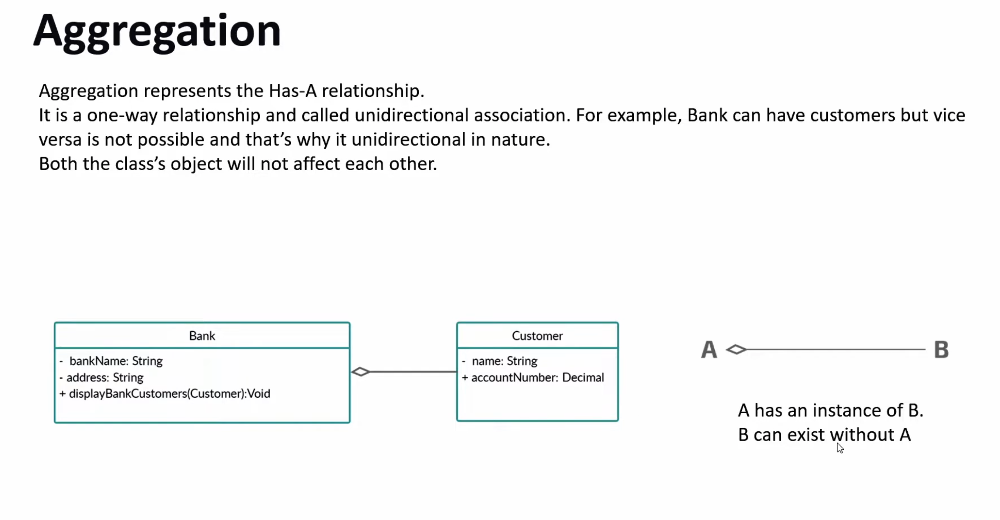
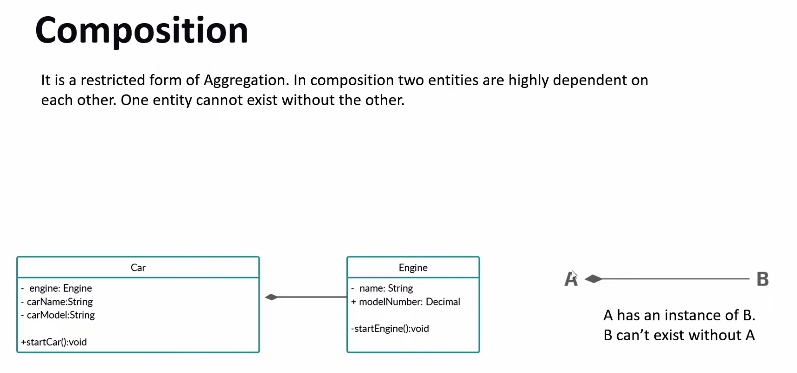
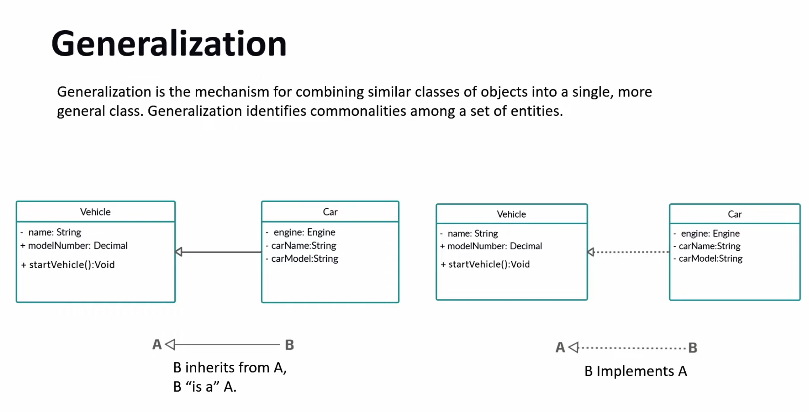
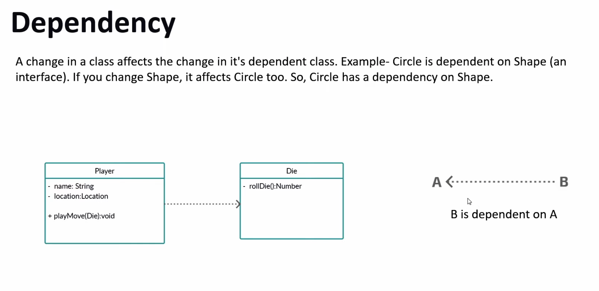
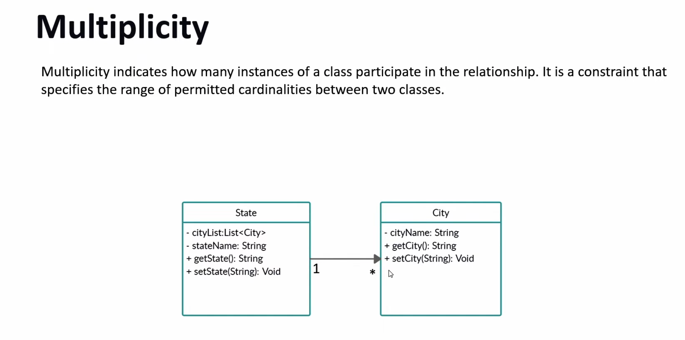
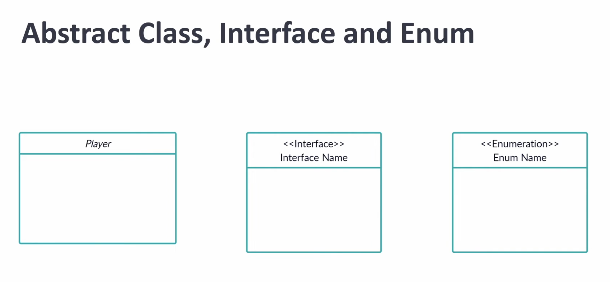
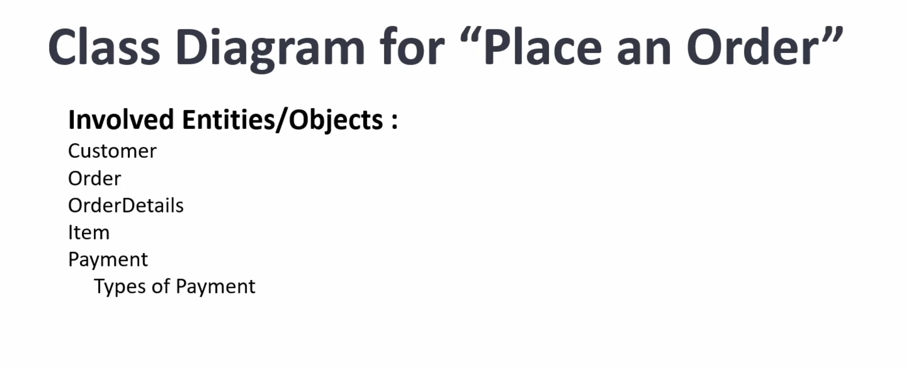
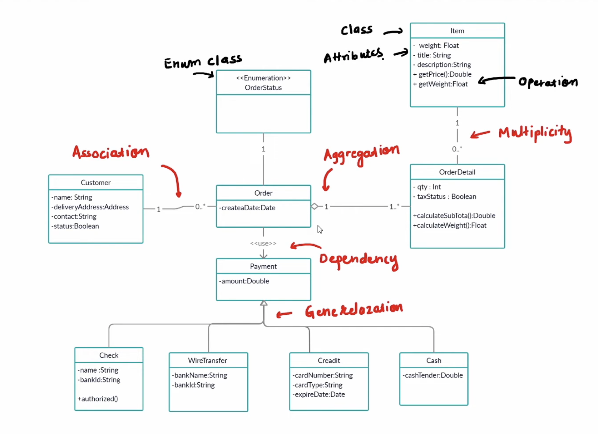

# Class Diagrams - Comprehensive Guide

## 📊 Introduction to Class Diagrams

Class diagrams are fundamental UML structural diagrams that visualize the static structure of a system by showing:

- **Classes** and their attributes/methods
- **Relationships** between classes
- **System architecture** at a high level

> 💡 **Key Concept:** Class diagrams serve as blueprints for implementing object-oriented systems

---

## 🏛️ Basic Class Structure



### Class Representation

A class is represented by a rectangle divided into three sections:

| Section | Content | Example |
|---------|---------|---------|
| **Top** | Class Name | `Customer` |
| **Middle** | Attributes (Fields) | `- name: String`<br/>`- email: String` |
| **Bottom** | Methods (Operations) | `+ register(): void`<br/>`+ login(): boolean` |

### Access Modifiers

| Symbol | Modifier | Visibility |
|--------|----------|------------|
| `+` | Public | Accessible from anywhere |
| `-` | Private | Accessible only within the class |
| `#` | Protected | Accessible within class and subclasses |
| `~` | Package | Accessible within the same package |

---

## 🔗 Class Relationships

Class diagrams use various relationship types to show how classes interact with each other.

---

## 1️⃣ Association



### Definition

**Association** represents a structural relationship where objects of one class are connected to objects of another class.

### Characteristics

- Represents a "has-a" or "uses-a" relationship
- Both classes can exist independently
- Typically bidirectional (can be unidirectional)
- Represented by a **solid line**

### Example

```
Customer ──────── Order
```
- A Customer is associated with Orders
- Both can exist independently

### Code Mapping

```cpp
#include <vector>

class Order; // Forward declaration

class Customer {
private:
    std::vector<Order*> orders;
public:
    Customer() {}
    ~Customer() {}
};

class Order {
private:
    Customer* customer;
public:
    Order(Customer* cust) : customer(cust) {}
};
```

---

## 2️⃣ Aggregation



### Definition

**Aggregation** is a specialized form of association representing a "whole-part" relationship where the part can exist independently of the whole.

### Characteristics

- Weaker "has-a" relationship
- Parts can exist without the whole
- Represented by a **hollow diamond** on the whole side
- Example: Bank has Customers, but customers can exist without the bank

### Example

```
Bank ◇──────── Customer
```
- A Bank has Customers
- Customers can exist even without the bank
- If the bank closes, customers continue to exist

### Code Mapping

```cpp
#include <vector>
#include <string>

class Customer {
private:
    std::string name;
    std::string accountNumber;
public:
    Customer(std::string n, std::string acc) : name(n), accountNumber(acc) {}
};

class Bank {
private:
    std::vector<Customer*> customers; // Customer objects can exist independently
public:
    void addCustomer(Customer* customer) {
        customers.push_back(customer);
    }
};
```

---

## 3️⃣ Composition



### Definition

**Composition** is a strong "whole-part" relationship where the part cannot exist without the whole.

### Characteristics

- Strong "contains-a" relationship
- Parts are destroyed when the whole is destroyed
- Represented by a **filled diamond** on the whole side
- Example: House has Rooms - rooms cannot exist without the house

### Example

```
House ◆──────── Room
```
- A House is composed of Rooms
- If the house is demolished, rooms cease to exist
- Rooms cannot exist independently

### Code Mapping

```cpp
#include <vector>
#include <string>
#include <memory>

class Room {
private:
    std::string name;
public:
    Room(std::string n) : name(n) {}
};

class House {
private:
    std::vector<std::unique_ptr<Room>> rooms; // Rooms are created and destroyed with House
public:
    House() {
        rooms.push_back(std::make_unique<Room>("Living Room"));
        rooms.push_back(std::make_unique<Room>("Bedroom"));
    }
    // Destructor automatically deletes all rooms
    ~House() = default;
};
```

### Aggregation vs Composition

| Aspect | Aggregation | Composition |
|--------|-------------|-------------|
| **Relationship Strength** | Weak | Strong |
| **Part Lifecycle** | Independent | Dependent on whole |
| **Symbol** | Hollow diamond ◇ | Filled diamond ◆ |
| **Example** | Bank - Customer | House - Room |

---

## 4️⃣ Generalization (Inheritance)



### Definition

**Generalization** represents an "is-a" relationship, where a subclass inherits from a superclass.

### Characteristics

- Represents inheritance hierarchy
- Child class inherits attributes and methods from parent
- Represented by a **solid line with hollow arrow** pointing to parent
- Supports code reusability and polymorphism

### Example

```
            Animal
              △
              │
      ┌───────┼───────┐
      │       │       │
    Dog      Cat     Bird
```

### Code Mapping

```cpp
#include <string>

class Animal {
protected:
    std::string name;
public:
    Animal() {}
    virtual ~Animal() {}
    
    void eat() { }
    void sleep() { }
};

class Dog : public Animal {
public:
    void bark() { }
};

class Cat : public Animal {
public:
    void meow() { }
};
```

---

## 5️⃣ Dependency



### Definition

**Dependency** represents a "uses" relationship where one class depends on another temporarily.

### Characteristics

- Weaker relationship than association
- One class uses another as a method parameter, local variable, or return type
- Changes to the independent class may affect the dependent class
- Represented by a **dashed arrow**

### Example

```
OrderService ⇢ ⇢ ⇢ EmailService
```
- OrderService depends on EmailService
- EmailService is used temporarily (method parameter)

### Code Mapping

```cpp
class Order; // Forward declaration

class EmailService {
public:
    void sendConfirmation(Order* order) { 
        // Send email confirmation
    }
};

class OrderService {
public:
    void placeOrder(Order* order, EmailService& emailService) {
        // Process order
        emailService.sendConfirmation(order); // Temporary dependency
    }
};
```

---

## 6️⃣ Multiplicity



### Definition

**Multiplicity** specifies how many instances of one class relate to instances of another class.

### Common Multiplicity Notations

| Notation | Meaning | Example |
|----------|---------|---------|
| `1` | Exactly one | Each order has exactly 1 customer |
| `0..1` | Zero or one | A person may have 0 or 1 passport |
| `*` or `0..*` | Zero or more | A customer can have 0 or more orders |
| `1..*` | One or more | A company has 1 or more employees |
| `n..m` | Specific range | A course has 5 to 30 students |

### Example

```
Customer 1 ──────── * Order
```
- One customer can have many (0 or more) orders
- Each order belongs to exactly one customer

### Code Mapping

```cpp
#include <vector>

class Order; // Forward declaration

class Customer {
private:
    std::vector<Order*> orders; // * (many orders)
public:
    void addOrder(Order* order) {
        orders.push_back(order);
    }
};

class Order {
private:
    Customer* customer; // 1 (one customer)
public:
    Order(Customer* cust) : customer(cust) {}
};
```

---

## 7️⃣ Abstract Classes, Interfaces, and Enums



### Abstract Class

**Representation:** Class name in *italics* or with `<<abstract>>` stereotype

**Characteristics:**
- Cannot be instantiated
- May contain abstract methods (without implementation)
- Can contain concrete methods with implementation

**Example:**
```
<<abstract>>
Shape
- color: String
+ draw(): void {abstract}
+ getArea(): double {abstract}
```

**Code Mapping:**
```cpp
#include <string>

class Shape {
protected:
    std::string color;
public:
    Shape() {}
    virtual ~Shape() {}
    
    virtual void draw() = 0; // Pure virtual function
    virtual double getArea() = 0; // Pure virtual function
};
```

### Interface

**Representation:** Class with `<<interface>>` stereotype

**Characteristics:**
- Defines a contract (method signatures)
- No implementation (Java 8+ allows default methods)
- Classes implement interfaces

**Example:**
```
<<interface>>
Drawable
+ draw(): void
+ render(): void
```

**Code Mapping:**
```cpp
// In C++, interfaces are implemented using abstract classes with pure virtual functions

class Drawable {
public:
    virtual ~Drawable() {}
    virtual void draw() = 0;
    virtual void render() = 0;
};

class Circle : public Drawable {
public:
    void draw() override { 
        // Implementation
    }
    void render() override { 
        // Implementation
    }
};
```

### Enum

**Representation:** Class with `<<enumeration>>` stereotype

**Characteristics:**
- Fixed set of constants
- Type-safe enumerations

**Example:**
```
<<enumeration>>
OrderStatus
+ PENDING
+ PROCESSING
+ SHIPPED
+ DELIVERED
+ CANCELLED
```

**Code Mapping:**
```cpp
enum class OrderStatus {
    PENDING,
    PROCESSING,
    SHIPPED,
    DELIVERED,
    CANCELLED
};

// Usage:
// OrderStatus status = OrderStatus::PENDING;
```

---

## 📦 Practical Example: Place an Order System



### System Overview

This diagram illustrates a complete order management system showing:
- Customer and Order relationship
- Product catalog
- Payment processing
- Order status tracking

### Key Relationships in the System

1. **Customer** `1` ──── `*` **Order** (One customer, many orders)
2. **Order** `*` ──── `*` **Product** (Many-to-many relationship)
3. **Order** `1` ──── `1` **Payment** (One order, one payment)
4. **Order** uses **OrderStatus** enum

---

## 🎨 Complete System Diagram



### Reading the Diagram

When analyzing a class diagram:

1. **Identify main entities** (classes)
2. **Examine relationships** (association, aggregation, composition)
3. **Check multiplicity** (how many instances)
4. **Look for inheritance** (generalization)
5. **Spot dependencies** (dashed arrows)
6. **Note interfaces and abstract classes**

---

## 🎯 Relationship Summary Cheat Sheet

| Relationship | Symbol | Strength | Use Case |
|--------------|--------|----------|----------|
| **Association** | ──── | Medium | General "has-a" relationship |
| **Aggregation** | ◇──── | Weak | Whole-part, part can exist independently |
| **Composition** | ◆──── | Strong | Whole-part, part cannot exist independently |
| **Generalization** | ──▷ | Strong | "is-a" relationship (inheritance) |
| **Dependency** | ⇢ ⇢ ⇢ | Weak | Temporary "uses" relationship |
| **Realization** | ⇢ ⇢ ▷ | Medium | Class implements interface |

---

## 💼 Interview Tips

### What Interviewers Look For:

1. **Clear understanding** of relationship types
2. **Ability to choose** the right relationship for a scenario
3. **Knowledge of multiplicity** and when to use it
4. **Understanding of inheritance** vs composition

### Common Questions:

**Q: Difference between Aggregation and Composition?**
- **Aggregation:** Part can exist independently (Bank-Customer)
- **Composition:** Part destroyed with whole (House-Room)

**Q: When to use Association vs Dependency?**
- **Association:** Persistent relationship (class field)
- **Dependency:** Temporary usage (method parameter)

**Q: How to represent a many-to-many relationship?**
- Use `*` on both sides or introduce a junction/association class

### Best Practices:

✅ **Do:**
- Keep diagrams simple and focused
- Use proper notation consistently
- Include multiplicity for clarity
- Show only relevant attributes/methods

❌ **Avoid:**
- Overcrowding diagrams with too many classes
- Mixing different abstraction levels
- Including implementation details
- Using unclear or inconsistent notation

---

## 💻 From Diagram to Code

### Design Pattern: Follow the relationships

```cpp
#include <vector>
#include <string>
#include <memory>

// 1. Start with independent classes
class Product {
private:
    std::string name;
    double price;
public:
    Product(std::string n, double p) : name(n), price(p) {}
};

// Forward declarations
class Order;
class OrderItem;

// 2. Add associations
class Customer {
private:
    std::string name;
    std::vector<Order*> orders; // Association
public:
    Customer(std::string n) : name(n) {}
    void addOrder(Order* order) {
        orders.push_back(order);
    }
};

// 3. Implement composition
class Order {
private:
    std::vector<std::unique_ptr<OrderItem>> items; // Composition - items owned by order
    Customer* customer; // Association
public:
    Order(Customer* cust) : customer(cust) {
        // Items are created and managed by the order
    }
    
    void addItem(std::unique_ptr<OrderItem> item) {
        items.push_back(std::move(item));
    }
};

// 4. Add aggregation where appropriate
class ShoppingCart {
private:
    std::vector<Product*> products; // Aggregation - products exist independently
public:
    void addProduct(Product* product) {
        products.push_back(product);
    }
};
```

---

## ✅ Quick Reference for Interviews

### Decision Tree for Relationships:

1. **Is it inheritance?** → Use **Generalization** (──▷)
2. **Does one class use another temporarily?** → Use **Dependency** (⇢ ⇢ ⇢)
3. **Is it a whole-part relationship?**
   - Can part exist independently? → Use **Aggregation** (◇────)
   - Part destroyed with whole? → Use **Composition** (◆────)
4. **Otherwise** → Use **Association** (────)

### Memorization Tip:

**"A Car Has-A Engine"**
- **A**ssociation: General connection
- **Car** (whole) **Has-A** (relationship) **Engine** (part)
- If Engine can work outside the car → **Aggregation**
- If Engine is built into the car → **Composition**

---

## 🎓 Summary

Class diagrams are essential for:
- **Designing** object-oriented systems
- **Communicating** architecture to team members
- **Understanding** existing codebases
- **Planning** before coding

Master these concepts and you'll excel in both interviews and real-world software design!