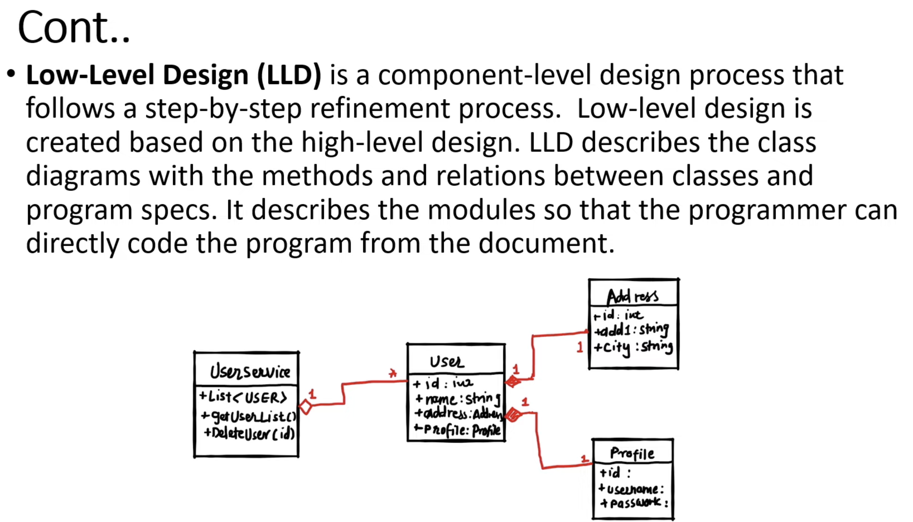
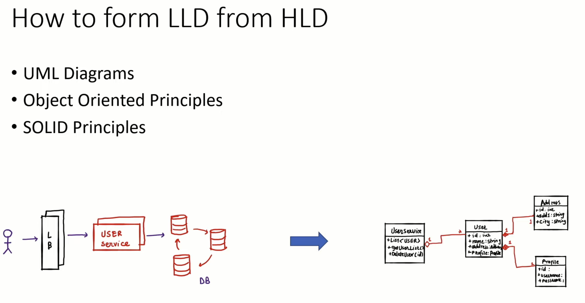
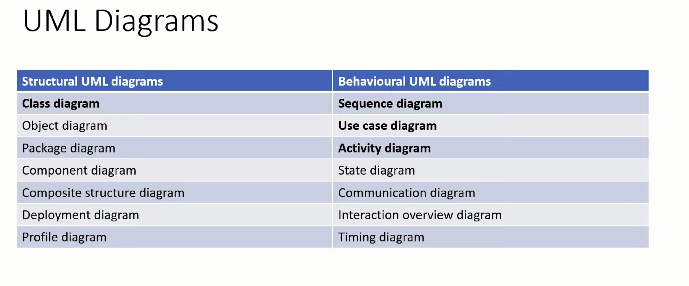

# Low-Level Design (LLD) - Complete Guide

## 📚 Table of Contents
1. [Overview of Low-Level Design (LLD)](#1-overview-of-low-level-design-lld)
   - [What is LLD?](#what-is-lld)
   - [Key Characteristics](#key-characteristics)
2. [HLD vs LLD](#2-hld-vs-lld)
   - [Comparison Table](#comparison-table)
   - [Simple Analogy](#simple-analogy)
3. [How to Transform HLD → LLD](#3-how-to-transform-hld--lld)
   - [Step-by-step Approach](#step-by-step-approach)
4. [Real-Life Example: Food Delivery App](#4-real-life-example-food-delivery-app)
   - [HLD (High-Level View)](#hld-high-level-view)
   - [LLD Breakdown](#lld-breakdown-zoom-into-order--payment)
5. [Interview Tips](#5-interview-tips-important)
6. [Quick Summary](#6-quick-summary)

---

## 1. Overview of Low-Level Design (LLD)

### What is LLD?

Low-Level Design focuses on **how the system will be implemented in code**.

It answers:
- What classes will exist?
- What methods and attributes do they have?
- How objects interact?
- What design patterns are used?

### Key Characteristics

- **Class-level / object-level design**
- **Focus on code structure**
- **Includes:**
  - Classes, interfaces
  - Method signatures
  - Relationships (inheritance, composition)
  - Design patterns (Factory, Strategy, Observer)

### Think of it like:

> If **HLD** = "We need a payment system"  
> Then **LLD** = "Here are the classes: `PaymentProcessor`, `CreditCardPayment`, `UPI`, and their methods"

---

## 2. HLD vs LLD

### Comparison Table

| Aspect | High-Level Design (HLD) | Low-Level Design (LLD) |
|--------|------------------------|------------------------|
| **Focus** | System architecture | Code-level design |
| **Abstraction** | High | Low |
| **Components** | Services, APIs, DBs | Classes, methods |
| **Audience** | Architects | Developers |
| **Example** | "Use microservices" | "Class UserService with methods createUser()" |

### Simple Analogy

**Building a house:**
- **HLD** → Blueprint (rooms, floors, plumbing layout)
- **LLD** → Exact wiring, pipe sizes, materials

---

## 3. How to Transform HLD → LLD

> **This is very important for interviews.**

### Step-by-step Approach

#### Step 1: Identify Components (from HLD) 

HLD


LLD


**Example:**
- User Service
- Payment Service
- Notification Service

#### Step 2: Break into Classes

**For Payment Service:**
- `PaymentProcessor`
- `PaymentMethod` (interface)
- `CreditCardPayment`
- `UpiPayment`

#### Step 3: Define Responsibilities

Use **Single Responsibility Principle (SRP)**

**Example:**
- `PaymentProcessor` → orchestrates payment
- `PaymentMethod` → handles payment logic

#### Step 4: Define Relationships

- Inheritance / Interface
- Composition

#### Step 5: Add Methods & Attributes

**Example:**

```cpp
class PaymentMethod {
public:
    virtual bool pay(double amount) = 0;
};
```

#### Step 6: Apply Design Patterns

- **Strategy** → multiple payment methods
- **Factory** → create payment objects
- **Observer** → notifications




---

## 4. Real-Life Example: Food Delivery App

*(like Swiggy or Uber Eats)*

### HLD (High-Level View)

**Components:**
- User Service
- Restaurant Service
- Order Service
- Payment Service
- Delivery Service

### LLD Breakdown (Zoom into Order + Payment)

#### Classes

```cpp
class User {
public:
    int id;
    string name;
};

class Restaurant {
public:
    int id;
    string name;
};

class Order {
public:
    int id;
    User user;
    Restaurant restaurant;
    double amount;

    void placeOrder();
};
```

#### Payment Design (Strategy Pattern)

```cpp
class PaymentMethod {
public:
    virtual bool pay(double amount) = 0;
};

class CreditCardPayment : public PaymentMethod {
public:
    bool pay(double amount) override {
        // logic
        return true;
    }
};

class UpiPayment : public PaymentMethod {
public:
    bool pay(double amount) override {
        // logic
        return true;
    }
};
```

#### Payment Processor

```cpp
class PaymentProcessor {
private:
    PaymentMethod* method;

public:
    PaymentProcessor(PaymentMethod* m) {
        method = m;
    }

    bool process(double amount) {
        return method->pay(amount);
    }
};
```

#### Flow

1. User places order
2. Order created
3. PaymentProcessor selects strategy
4. Payment executed

---

## 5. Interview Tips (Important)

### 1. Always clarify requirements

**Ask:**
- Scale?
- Concurrency?
- Edge cases?

### 2. Start with HLD → then LLD

Don't jump directly to classes.

### 3. Mention Design Principles

- **SOLID**
- **DRY**
- **KISS**

### 4. Use Design Patterns when needed

- **Strategy** → interchangeable logic
- **Factory** → object creation
- **Singleton** → shared resource

### 5. Think in terms of:

- ✅ Extensibility
- ✅ Maintainability
- ✅ Testability

---

## 6. Quick Summary

- **LLD** = Code-level blueprint
- **HLD** = System-level blueprint

### Convert HLD → LLD by:

1. Breaking services into classes
2. Assigning responsibilities
3. Defining relationships
4. Applying patterns


UML Diagrams:
