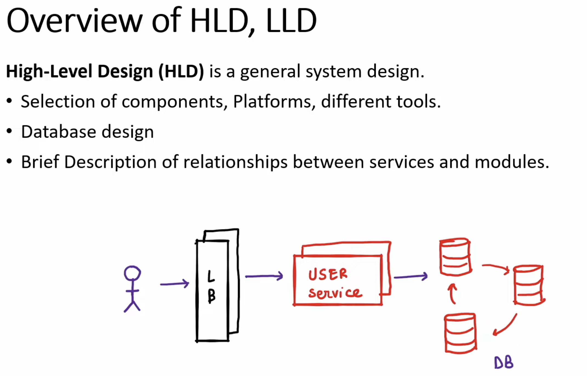

# Factory Pattern

## 📑 Table of Contents
- [📋 Overview](#-overview)
  - [🎨 UML Diagram](#-uml-diagram)
- [❌ BEFORE Factory Pattern (Without Factory)](#-before-factory-pattern-without-factory)
- [✅ AFTER Factory Pattern](#-after-factory-pattern)
- [🔄 Main Difference](#-main-difference)
- [🚀 Future Advantage Example](#-future-advantage-example)
- [🧠 Real Understanding](#-real-understanding)
- [📊 Visual Comparison](#-visual-comparison)
- [🎯 Modern C++ Version (Recommended)](#-modern-c-version-recommended)
- [📝 Key Takeaways](#-key-takeaways)
- [🎓 When to Use Factory Pattern](#-when-to-use-factory-pattern)
- [🔗 Related Patterns](#-related-patterns)

---

## 📋 Overview

The **Factory Pattern** is a **Creational Design Pattern**.

### Purpose
> Create objects **without exposing** the exact object creation logic to the client.

### 🎨 UML Diagram
> 📐 [**View Interactive UML Diagram on Excalidraw**](https://excalidraw.com/#room=afffc96cc2cdf9edc0cd,DrNeOY9-Dw6RYHsfynsrUw)

---

## ❌ BEFORE Factory Pattern (Without Factory)

### The Problem



When client directly creates objects, it becomes **tightly coupled** with:
- `Car`
- `Bike`
- `Truck`

**Every new type requires client code changes** ⚠️

### Code WITHOUT Factory Pattern

```cpp
#include <iostream>
using namespace std;

//////////////////////////////////////////////////////////////
// CONCRETE CLASSES (No abstraction)
//////////////////////////////////////////////////////////////

class Car {
public:
    void drive() {
        cout << "Driving Car\n";
    }
};

class Bike {
public:
    void drive() {
        cout << "Driving Bike\n";
    }
};

class Truck {
public:
    void drive() {
        cout << "Driving Truck\n";
    }
};

//////////////////////////////////////////////////////////////
// CLIENT (Tightly Coupled)
//////////////////////////////////////////////////////////////

int main() {
    // Client directly creates objects
    Car* car = new Car();
    Bike* bike = new Bike();
    Truck* truck = new Truck();

    car->drive();
    bike->drive();
    truck->drive();

    delete car;
    delete bike;
    delete truck;

    return 0;
}
```

### What's Wrong? 🤔

| Issue | Description |
|-------|-------------|
| **Tight Coupling** | Client knows about `Car`, `Bike`, `Truck` |
| **Hard to Extend** | Adding `ElectricCar`, `Bus`, `AutoRickshaw` requires client changes |
| **No Abstraction** | No common interface |
| **Violates OCP** | Open/Closed Principle violated |

### Dependency Flow (BEFORE)
```
Client (Knows Everything ❌)
   |
   +--> new Car()
   +--> new Bike()
   +--> new Truck()
```

**Too much dependency!**

---

## ✅ AFTER Factory Pattern


### The Solution

**Client only knows:**
- `Vehicle` (interface)
- `VehicleFactory` (for creation)

**Factory handles object creation** 🏭

### Code WITH Factory Pattern

```cpp
#include <iostream>
using namespace std;

//////////////////////////////////////////////////////////////
// PRODUCT INTERFACE (Abstraction)
//////////////////////////////////////////////////////////////

class Vehicle {
public:
    virtual void drive() = 0;
    virtual ~Vehicle() {}
};

//////////////////////////////////////////////////////////////
// CONCRETE PRODUCTS (Implementations)
//////////////////////////////////////////////////////////////

class Car : public Vehicle {
public:
    void drive() override {
        cout << "Driving Car\n";
    }
};

class Bike : public Vehicle {
public:
    void drive() override {
        cout << "Driving Bike\n";
    }
};

class Truck : public Vehicle {
public:
    void drive() override {
        cout << "Driving Truck\n";
    }
};

//////////////////////////////////////////////////////////////
// FACTORY (Centralized Creation Logic)
//////////////////////////////////////////////////////////////

class VehicleFactory {
public:
    static Vehicle* createVehicle(string type) {
        if (type == "car")
            return new Car();
        else if (type == "bike")
            return new Bike();
        else if (type == "truck")
            return new Truck();
        
        return nullptr;
    }
};

//////////////////////////////////////////////////////////////
// CLIENT (Loosely Coupled ✅)
//////////////////////////////////////////////////////////////

int main() {
    // Client delegates creation to factory
    Vehicle* v1 = VehicleFactory::createVehicle("car");
    Vehicle* v2 = VehicleFactory::createVehicle("bike");
    Vehicle* v3 = VehicleFactory::createVehicle("truck");

    v1->drive();
    v2->drive();
    v3->drive();

    delete v1;
    delete v2;
    delete v3;

    return 0;
}
```

**Output:**
```
Driving Car
Driving Bike
Driving Truck
```

---

## 🔄 Main Difference

| Approach | Code | Responsibility |
|----------|------|----------------|
| **BEFORE** | `Car* c = new Car();` | Client creates concrete objects |
| **AFTER** | `Vehicle* v = VehicleFactory::createVehicle(type);` | Factory creates objects |

---

## 🚀 Future Advantage Example

### Scenario: Adding New ElectricCar

```cpp
class ElectricCar : public Vehicle {
public:
    void drive() override {
        cout << "Driving Electric Car 🔋\n";
    }
};
```

### WITHOUT Factory ❌
Need changes **everywhere**:
```cpp
ElectricCar* e = new ElectricCar();  // Changes in client code!
```

### WITH Factory ✅
**Only modify factory** (Client unchanged):
```cpp
// Inside VehicleFactory::createVehicle()
else if (type == "electric")
    return new ElectricCar();
```

**Client code remains untouched!** 🎉

---

## 🧠 Real Understanding

### What Factory Pattern Does:

> Moves **Object Creation Logic** from **Client** → **Factory**

| Component | Before Factory | After Factory |
|-----------|----------------|---------------|
| **Client** | Knows all concrete classes | Knows only interface |
| **Creation** | Scattered everywhere | Centralized in factory |
| **Coupling** | Tight | Loose |
| **Extensibility** | Hard | Easy |

---

## 📊 Visual Comparison

### WITHOUT Factory 🔴
```
Client (Knows Everything)
   |
   +--> Car    (Direct dependency)
   +--> Bike   (Direct dependency)
   +--> Truck  (Direct dependency)
```

### WITH Factory 🟢
```
Client (Knows Interface Only)
   |
   +--> VehicleFactory
              |
              +--> Car
              +--> Bike  
              +--> Truck
```

**Cleaner architecture!** ✨

---

## 🎯 Modern C++ Version (Recommended)

### Using Smart Pointers

```cpp
#include <memory>
#include <iostream>
using namespace std;

class VehicleFactory {
public:
    static unique_ptr<Vehicle> createVehicle(string type) {
        if (type == "car")
            return make_unique<Car>();
        else if (type == "bike")
            return make_unique<Bike>();
        else if (type == "truck")
            return make_unique<Truck>();
        
        return nullptr;
    }
};

// Usage in main()
int main() {
    auto v1 = VehicleFactory::createVehicle("car");
    auto v2 = VehicleFactory::createVehicle("bike");
    
    v1->drive();
    v2->drive();
    
    // No need to delete! Smart pointers handle cleanup
    return 0;
}
```

**Benefits:**
- ✅ Automatic memory management
- ✅ Avoids memory leaks
- ✅ Exception safe
- ✅ Modern C++ best practice

---

## 📝 Key Takeaways

1. **Factory Pattern** = Centralized object creation
2. **Client** works with abstractions, not concrete classes
3. **Adding new types** = Modify factory only, not client
4. **Follows SOLID principles** (especially OCP)
5. **Use smart pointers** in modern C++

---

## 🎓 When to Use Factory Pattern

✅ **Use when:**
- Object creation is complex
- Need to centralize creation logic
- Want to decouple client from concrete classes
- Expect to add new types frequently

❌ **Avoid when:**
- Only one or two simple classes
- No expected future variations
- Overhead not justified

---

## 🔗 Related Patterns

- **Abstract Factory** - Factory of factories
- **Builder Pattern** - Step-by-step construction
- **Prototype Pattern** - Clone existing objects