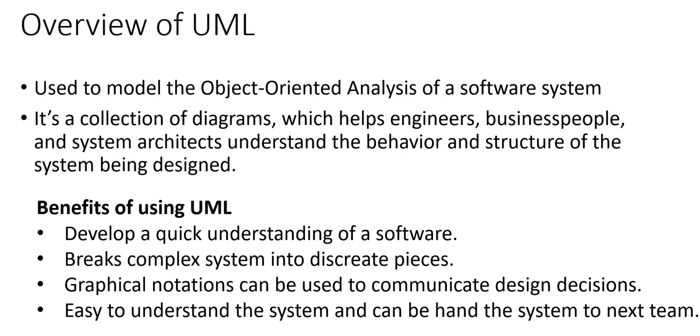
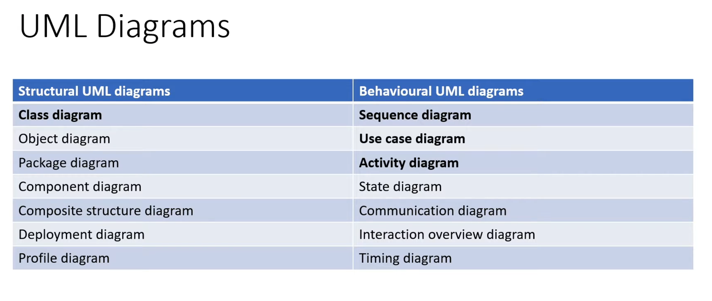
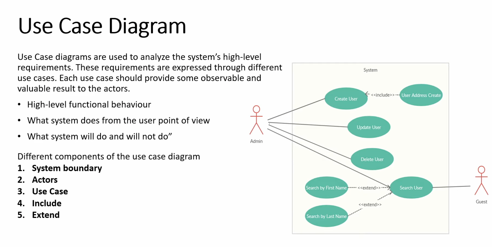
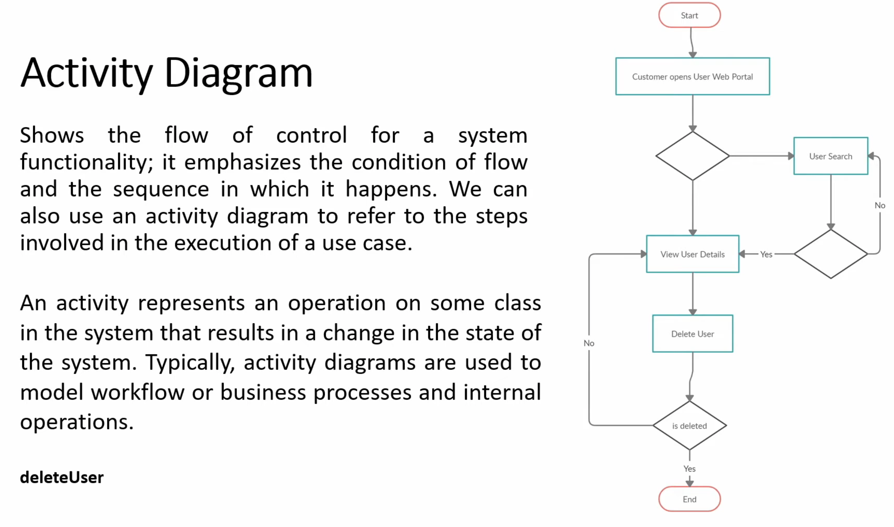
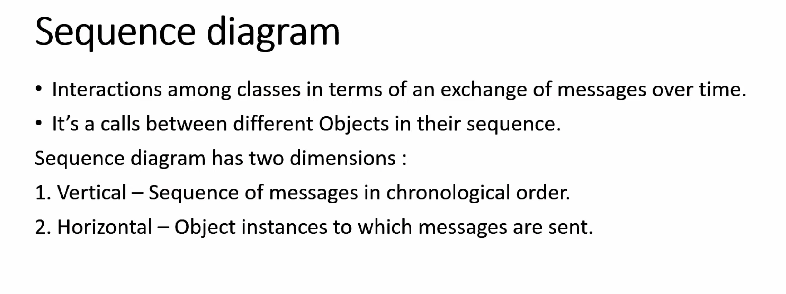
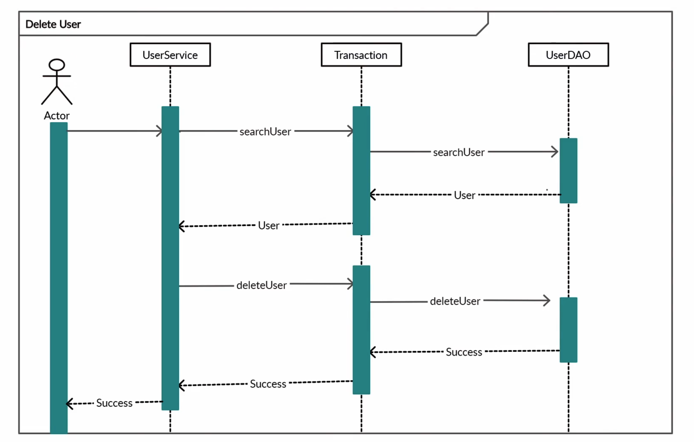

# Comprehensive Guide to UML Diagrams

## 📊 Understanding UML



## 📋 Categories of UML Diagrams



---

## 1️⃣ Use Case Diagram



### Understanding Use Case Diagrams

A **Use Case Diagram** serves as a high-level behavioral model that illustrates:

- **System requirements** from a functional perspective
- **How actors communicate** with the system
- **System capabilities** (rather than implementation details)

> 💡 **Essential Concept:** This diagram presents functionality from the user's viewpoint

### Importance in Low-Level Design (LLD)

Although LLD emphasizes code implementation, use case diagrams provide value by:

- ✅ Revealing system features prior to class design
- ✅ Establishing clear boundaries and scope of the system
- ✅ Facilitating collaboration among developers, testers, and stakeholders

### Key Attributes

| Attribute | Details |
|-----------|---------||
| **Primary Focus** | System behavior and functionality |
| **Coverage** | Interactions from external perspective |
| **Objective** | Determines "What capabilities will the system provide?" |
| **Level of Detail** | High-level without implementation specifics |

---

## 🔧 Essential Elements of Use Case Diagrams

### 1. System Boundary

**Explanation:** A rectangular border encompassing all use cases, defining what's inside the system.

**Illustration:**
```
┌─────────────────────────────┐
│  User Management System     │
│  (all use cases inside)     │
└─────────────────────────────┘
```

### 2. Actors

**Explanation:** External parties or entities that interact with the system.

**Actor Categories:**
- **People:** Admin, Guest, Registered User
- **External Systems:** Payment Gateway, Email Service, Database

**Illustration:**
- **Admin** → Complete system privileges
- **Guest** → Restricted read-only permissions

### 3. Use Cases

**Explanation:** Specific system functions or actions depicted as oval shapes.

**Sample Use Cases:**
- Create User
- Update User
- Delete User
- Search User

### 4. Include Relationship (`<<include>>`)

**Function:** Indicates a required dependency where one use case must invoke another.

**Application:** Use when a use case cannot be completed without executing another use case.

**Illustration:**
```
Create User ──<<include>>──> Create Address
```
> 📌 **Interpretation:** User creation mandatorily includes address creation

### 5. Extend Relationship (`<<extend>>`)

**Function:** Represents conditional or optional functionality.

**Application:** Use when additional behavior may be triggered based on specific scenarios.

**Illustration:**
```
Search User <──<<extend>>── Search by First Name
            <──<<extend>>── Search by Last Name
```
> 📌 **Interpretation:** These search filters are optional enhancements to the base functionality

---

## 🔗 Relationship Types Summary

| Relationship | Symbol | Meaning | Usage |
|--------------|--------|---------|-------|
| **Association** | ──── | Actor interacts with use case | Basic interaction |
| **Include** | <<include>> | Mandatory sub-function | Code reusability |
| **Extend** | <<extend>> | Optional behavior | Conditional logic |

---

## 📝 Practical Example Breakdown

### System: User Management

**Actors:**
- Admin
- Guest

**Use Cases:**
- Create User
- Update User
- Delete User
- Search User

**Relationships:**
- `Create User` ──<<include>>─→ `User Address Create`
- `Search User` ←──<<extend>>── `Search by First Name`
- `Search User` ←──<<extend>>── `Search by Last Name`

---

## 🎯 When to Use Use Case Diagrams in LLD

### ✅ Use When:

- Defining requirements **before** creating class diagrams
- Gathering functional requirements from stakeholders
- Designing APIs, services, or system interfaces
- Communicating system behavior to non-technical people

### ❌ Avoid When:

- Designing internal logic or algorithms
- Modeling data structures or database schemas
- Implementing code-level details

---

## 💼 Interview Tips

### What to Always Mention:

1. **Actors** and their roles
2. **Use cases** and their purpose
3. **Include vs Extend** relationships
4. **System boundary** defines scope

### Common Mistakes to Avoid:

| ❌ Wrong | ✅ Correct |
|---------|-----------|
| Including internal logic in use cases | Keep it user-centric and external |
| Confusing include with extend | Include = mandatory, Extend = optional |
| Over-complicating diagrams | Keep it simple and focused |

### Key Points to Clarify:

- "The system boundary clearly defines what's inside vs outside the system"
- "Include relationships promote reusability"
- "Extend relationships handle conditional features"

---

## 💻 Mapping Use Cases to Code

### Conceptual Mapping:

| Use Case | Maps To |
|----------|---------|
| Create User | `UserService.createUser()` |
| Search User | `UserService.searchUser()` |
| Update User | `UserService.updateUser()` |
| Delete User | `UserService.deleteUser()` |

### Architecture Layers:

```
Use Case → API Endpoint → Controller → Service → Repository
```

**Example:**
```java
// Use Case: Create User
@PostMapping("/users")
public User createUser(@RequestBody UserRequest request) {
    return userService.createUser(request);
}
```

---

## ✅ Quick Interview Template

When asked to design a use case diagram, follow these steps:

1. **Identify actors** (who interacts with the system?)
2. **List use cases** (what can they do?)
3. **Define system boundary** (what's in scope?)
4. **Add relationships** (include/extend when needed)
5. **Validate** with real-world scenarios

---

## 2️⃣ Activity Diagram



### What is an Activity Diagram?

An **Activity Diagram** models the flow of control or data through a system. It shows:

- **Sequential** and **parallel** activities
- **Decision points** and **branches**
- **Start** and **end** states

> 💡 **Think of it as:** A flowchart showing how processes flow from start to finish

### Key Components:

| Component | Symbol | Purpose |
|-----------|--------|---------|
| **Start Node** | ● | Entry point |
| **Action** | Rectangle | Single step or task |
| **Decision** | Diamond | Conditional branching |
| **Merge** | Diamond | Combining branches |
| **Fork/Join** | Thick bar | Parallel execution |
| **End Node** | ◉ | Exit point |

### When to Use:

- ✅ Modeling business workflows
- ✅ Showing algorithm logic
- ✅ Documenting complex processes
- ✅ Visualizing parallel activities

---

## 3️⃣ Sequence Diagram





### What is a Sequence Diagram?

A **Sequence Diagram** shows **how objects interact** over time through message exchanges.

### Key Characteristics:

- **Time flows** from top to bottom
- Shows **order** of method calls
- Illustrates **object lifetimes**
- Focuses on **interaction** between components

### Core Components:

| Component | Description |
|-----------|-------------|
| **Actor/Object** | Entities participating in interaction |
| **Lifeline** | Vertical dashed line showing object existence |
| **Message** | Horizontal arrow showing method call |
| **Activation** | Thin rectangle showing object is active |
| **Return** | Dashed arrow showing return value |

### Types of Messages:

| Message Type | Arrow Style | Meaning |
|--------------|-------------|---------|
| **Synchronous** | Solid arrow → | Caller waits for response |
| **Asynchronous** | Open arrow ⇢ | Caller doesn't wait |
| **Return** | Dashed arrow ← | Response/return value |
| **Self-call** | Loop arrow ↻ | Object calls itself |

### When to Use:

- ✅ Understanding object interactions in a use case
- ✅ Designing API call flows
- ✅ Documenting system behavior for specific scenarios
- ✅ Debugging complex interaction issues

### Example Scenario:

**User Login Flow:**
```
User → UI: enterCredentials()
UI → AuthService: authenticate(username, password)
AuthService → Database: queryUser(username)
Database → AuthService: return userData
AuthService → UI: return authToken
UI → User: displayDashboard()
```

---

## 🎓 Summary

| Diagram Type | Purpose | Focus | When to Use |
|--------------|---------|-------|-------------|
| **Use Case** | What system does | Functional requirements | Requirements gathering |
| **Activity** | How processes flow | Control/data flow | Workflow modeling |
| **Sequence** | How objects interact | Message exchange | Interaction design |

---

## 📌 Final Tips for Interviews

### For Use Case Diagrams:
- Start with actors and system boundary
- Keep use cases atomic and user-focused
- Use include/extend judiciously

### For Activity Diagrams:
- Show clear start and end points
- Use decision nodes for branching logic
- Indicate parallel activities with fork/join

### For Sequence Diagrams:
- Arrange objects/actors logically
- Show message flow chronologically (top to bottom)
- Include return messages for clarity
- Name messages descriptively
