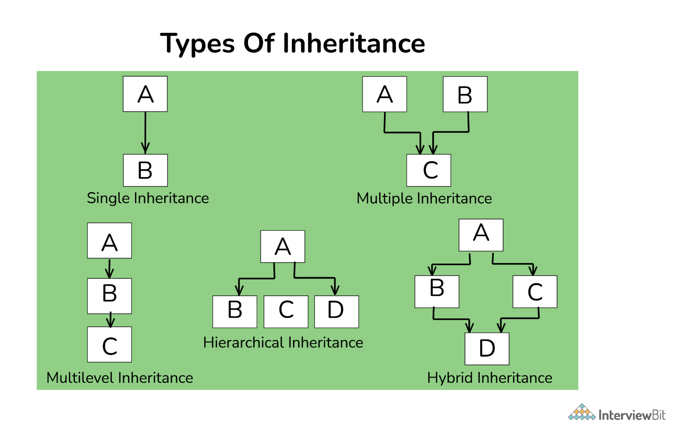

# OOPS (Object-Oriented Programming)

## 📑 Table of Contents

1. [What is OOPS?](#what-is-oops)
2. [Class](#class)
3. [Object](#object)
4. [Benefits of OOPS](#benefits-of-oops)
5. [Coding Example for Classes and Objects](#coding-example-for-classes-and-objects)
6. [What is a Constructor?](#what-is-a-constructor)
7. [What is a Destructor?](#what-is-a-destructor)
8. [What is Data Abstraction?](#what-is-data-abstraction)
9. [What is Encapsulation?](#what-is-encapsulation)
10. [What is Inheritance and Its Types?](#what-is-inheritance-and-its-types)
11. [What is the Diamond Problem?](#what-is-the-diamond-problem)
12. [What is Polymorphism?](#what-is-polymorphism)

---

## What is OOPS?

**Definition:**  
A programming paradigm that structures code using objects and classes, focusing on modeling real-world entities and their interactions.

---

## Class

**Definition:**  
A blueprint/template used to create objects. It defines attributes (data) and methods (functions).

**👉 Example:**

```cpp
class Vehicle {
public:
    string color;
    int speed;

    void drive() {
        cout << "Driving..." << endl;
    }
};
```

---

## Object

**Definition:**  
An instance of a class. It represents a real-world entity and holds actual values.

**👉 Example:**

```cpp
Vehicle v1;
v1.color = "Red";
v1.speed = 100;
v1.drive();
```

---

## Benefits of OOPS

### 1. Code Reusability (Inheritance)
Using inheritance, you reuse existing code instead of rewriting.

### 2. Data Security (Encapsulation)
Data can be hidden using private and accessed via methods.

### 3. Flexibility (Polymorphism)
Same function behaves differently depending on the object.

### 4. Data Hiding (Abstraction)
Abstraction reduces complexity by exposing only relevant interfaces and hiding internal implementation details.

### 5. Modularity
Code is divided into small, manageable classes.

### 6. Easy Maintenance
Changes in one class don't affect the entire system.

### 7. Real-world Mapping
Models real-world entities (Car, User, BankAccount) → easier to design.

---

## Coding Example for Classes and Objects

```cpp
#include <iostream>
using namespace std;

class Vechile{
public:
    int number;
    string color;
    int price;

    // Constructor
    Vechile(string color , int number , int price )
    {
        this->number = number;
        this->color = color;
        this->price = price;
        cout << "Constructor called" << endl;
    }

    // Destructor
    ~Vechile()
    {
        cout << "Destructor called for Vehicle with number: " << number << endl;
    }

    void display()
    {
        cout << "Number: " << number << endl;
        cout << "Color: " << color << endl;
        cout << "Price: " << price << endl;
    }
};

int main() {
    Vechile v1("Red", 12, 25000);
    v1.display();

    v1.number = 1999;
    v1.color = "Blue";
    v1.price = 25;

    v1.display();

    return 0;
}
```

**Output:**

```
Constructor called
Number: 12
Color: Red
Price: 25000
Number: 1999
Color: Blue
Price: 25
Destructor called for Vehicle with number: 1999
```

---

## What is a Constructor?

**🔹 Constructor (C++)**

**Definition:**  
A constructor is a special member function of a class that is automatically called when an object is created. Its main purpose is to initialize the object's data members.

### 🔧 Key Properties

- Same name as the class
- No return type (not even void)
- Called automatically when object is created
- Can be overloaded (multiple constructors)

### ✅ Simple Example

```cpp
#include <iostream>
using namespace std;

class Vehicle {
public:
    string color;
    int speed;

    // Constructor
    Vehicle(string c, int s) {
        color = c;
        speed = s;
    }

    void display() {
        cout << color << " " << speed << endl;
    }
};

int main() {
    Vehicle v1("Red", 100);   // constructor called automatically
    v1.display();
}
```

### ⚙️ Types of Constructors

#### 1. Default Constructor

No parameters

```cpp
Vehicle() {
    color = "Black";
    speed = 0;
}
```

#### 2. Parameterized Constructor

Takes inputs to initialize values

```cpp
Vehicle(string c, int s) {
    color = c;
    speed = s;
}
```

#### 3. Copy Constructor

Creates object from another object

```cpp
Vehicle(const Vehicle &v) {
    color = v.color;
    speed = v.speed;
}
```

---

## What is a Destructor?

**Definition:**  
A destructor is a special member function that is automatically called when an object goes out of scope or is destroyed.

**Syntax:**

```cpp
~ClassName() {
    // cleanup code
}
```

### ⚙️ When is it Called?

In your case:

- `v1` is a stack object
- Destructor is called automatically at the end of `main()`

### 🧠 Output Flow

```
Constructor called
Number: 12
Color: Red
Price: 25000

Number: 1999
Color: Blue
Price: 25

Destructor called for Vehicle with number: 1999
```

---

## What is Data Abstraction?

**🔹 Data Abstraction (C++ OOP)**

**Definition:**  
Exposing only the essential features of an object while hiding internal implementation details.

**It answers:**

- What an object does ✅
- Not how it does it ❌

### 🚗 Real-life Intuition

Think of driving a car:

- You use steering, brake, accelerator
- You don't care about engine combustion logic

👉 That's abstraction: simple interface, hidden complexity

### ✅ C++ Example (Clean and Interview-Ready)

```cpp
#include <iostream>
using namespace std;

class Car {
public:
    void start() {   // exposed method
        igniteEngine();   // hidden logic
        cout << "Car started\n";
    }

private:
    void igniteEngine() {  // hidden implementation
        cout << "Engine ignition process\n";
    }
};

int main() {
    Car c;
    c.start();   // user only sees start()
}
```

### 🔷 What's Happening Here

- `start()` → public interface (visible to user)
- `igniteEngine()` → hidden logic (private)

👉 User doesn't need to know internal steps  
👉 Just calls `start()`

### 🔷 Key Points (What Interviewer Expects)

**Achieved using:**
- Classes
- Access specifiers (private, protected, public)

**Improves:**
- Security 🔐
- Maintainability 🧩
- Flexibility 🔄

### 🔷 Abstraction vs Encapsulation (Important Distinction)

| Concept | Focus |
|---------|-------|
| Abstraction | Hides complexity (what vs how) |
| Encapsulation | Hides data (data protection) |

👉 In interviews, many candidates mix these—don't.

### 🔷 Real-world Example (Strong Answer)

"In a car, the driver only interacts with controls like steering and pedals, while the complex engine mechanisms are hidden. Similarly, in C++, abstraction exposes only necessary methods and hides implementation details."

### 🔥 One-liner to Impress Interviewer

"Abstraction reduces complexity by exposing only relevant interfaces and hiding internal implementation details."

---

## What is Encapsulation?

**🔷 Encapsulation (C++ OOP)**

**Definition:**  
Bundling data (variables) and methods (functions) together into a single unit (class) and restricting direct access to that data.

**In simple terms:**

- Keep data safe inside a class
- Allow access only through controlled methods

### 🏦 Real-life Analogy

Think of a bank account:

- Your balance is not directly accessible
- You interact via:
  - `deposit()`
  - `withdraw()`

👉 You can't randomly change balance → controlled access

### ✅ C++ Example (Clear and Practical)

```cpp
#include <iostream>
using namespace std;

class BankAccount {
private:
    int balance;   // hidden data

public:
    // setter
    void deposit(int amount) {
        if (amount > 0)
            balance += amount;
    }

    // getter
    int getBalance() {
        return balance;
    }
};

int main() {
    BankAccount acc;

    acc.deposit(1000);
    cout << acc.getBalance();  // 1000

    // acc.balance = 5000; ❌ not allowed (private)
}
```

### 🔷 What's Happening Here

- `balance` → private (hidden)
- Access only via:
  - `deposit()`
  - `getBalance()`

👉 This ensures data safety and control

### 🔷 Why Encapsulation is Important

**✔️ 1. Data Security**

Prevents unauthorized access

**✔️ 2. Control over Data**

You can validate inputs (e.g., no negative deposit)

**✔️ 3. Maintainability**

Internal implementation can change without affecting users

**✔️ 4. Modularity**

Each class manages its own data

---

## What is Inheritance and Its Types?



**Definition:**  
A mechanism in C++ where one class (called the derived/child class) acquires the properties and behavior (data members and functions) of another class (called the base/parent class).

### 1. Single Inheritance

**Pattern:** One base → one derived

```cpp
#include <iostream>
using namespace std;

class Vehicle {
public:
    void start() { cout << "Vehicle started\n"; }
};

class Car : public Vehicle {
public:
    void drive() { cout << "Car driving\n"; }
};

int main() {
    Car c;
    c.start();   // inherited
    c.drive();
}
```

**Use case:** Straightforward extension of a base type.

### 2. Multiple Inheritance

**Pattern:** One derived → multiple bases

```cpp
#include <iostream>
using namespace std;

class Engine {
public:
    void engineOn() { cout << "Engine ON\n"; }
};

class GPS {
public:
    void navigate() { cout << "Navigating\n"; }
};

class Car : public Engine, public GPS {
public:
    void drive() { cout << "Car driving\n"; }
};

int main() {
    Car c;
    c.engineOn();
    c.navigate();
    c.drive();
}
```

**Note:** Powerful but can introduce ambiguity (diamond problem).

### 3. Multilevel Inheritance

**Pattern:** Chain of inheritance (A → B → C)

```cpp
#include <iostream>
using namespace std;

class Vehicle {
public:
    void start() { cout << "Vehicle started\n"; }
};

class Car : public Vehicle {
public:
    void drive() { cout << "Car driving\n"; }
};

class SportsCar : public Car {
public:
    void turbo() { cout << "Turbo boost\n"; }
};

int main() {
    SportsCar s;
    s.start();  // from Vehicle
    s.drive();  // from Car
    s.turbo();  // own
}
```

**Use case:** Progressively specialized types.

### 4. Hierarchical Inheritance

**Pattern:** One base → multiple derived

```cpp
#include <iostream>
using namespace std;

class Vehicle {
public:
    void start() { cout << "Vehicle started\n"; }
};

class Car : public Vehicle {
public:
    void drive() { cout << "Car driving\n"; }
};

class Bike : public Vehicle {
public:
    void ride() { cout << "Bike riding\n"; }
};

int main() {
    Car c;
    Bike b;

    c.start();
    c.drive();

    b.start();
    b.ride();
}
```

**Use case:** Common functionality shared across multiple types.

### 5. Hybrid Inheritance

**Pattern:** Combination of multiple + multilevel (often leads to diamond)

```cpp
#include <iostream>
using namespace std;

class Vehicle {
public:
    void start() { cout << "Vehicle started\n"; }
};

// virtual inheritance to avoid duplicate base
class Car : virtual public Vehicle {};
class Bike : virtual public Vehicle {};

class HybridVehicle : public Car, public Bike {
public:
    void feature() { cout << "Hybrid features\n"; }
};

int main() {
    HybridVehicle h;
    h.start();    // no ambiguity due to virtual inheritance
    h.feature();
}
```

**Key point (important in interviews):**

- Without `virtual`, Vehicle would be inherited twice → ambiguity
- `virtual` solves the diamond problem

### 🔥 Quick Interview Summary

| Type | Structure |
|------|-----------|
| Single | A → B |
| Multiple | A + B → C |
| Multilevel | A → B → C |
| Hierarchical | A → B, C |
| Hybrid | Combination |

---

## What is the Diamond Problem?

**Structure (Why it's called "diamond")**

```
        Vehicle
        /     \
     Car     Bike
        \     /
     HybridVehicle
```

- Car and Bike both inherit from Vehicle
- HybridVehicle inherits from both

👉 This creates a diamond shape

### ❌ Problem WITHOUT Virtual

If you write:

```cpp
class Car : public Vehicle {};
class Bike : public Vehicle {};
class HybridVehicle : public Car, public Bike {};
```

**What happens internally:**

HybridVehicle gets TWO copies of Vehicle

```
HybridVehicle
 ├── Car → Vehicle (copy 1)
 └── Bike → Vehicle (copy 2)
```

### 🚨 Ambiguity Issue

```cpp
HybridVehicle h;
h.start();  // ❌ ERROR
```

**Compiler error:**

“request is ambiguous”

**Because:**

- `start()` exists in two Vehicle objects
- Compiler doesn't know which one to call

### ⚠️ Memory Problem

- Duplicate base class data
- Waste of memory
- Inconsistent state possible

### ✅ Solution: Virtual Inheritance

```cpp
class Car : virtual public Vehicle {};
class Bike : virtual public Vehicle {};
```
### 🔷 What Virtual Does

It tells the compiler:

"Ensure that only ONE shared instance of Vehicle exists, even if multiple paths inherit it."

**✅ Internal structure WITH virtual**

```
HybridVehicle
 ├── Car
 ├── Bike
 └── Vehicle (only ONE shared instance)
```

**✅ Now your code works**

```cpp
HybridVehicle h;
h.start();   // ✅ no ambiguity
```

**Because:**

- Only one Vehicle
- Only one `start()`

### 🔷 Full Working Example

```cpp
#include <iostream>
using namespace std;

class Vehicle {
public:
    void start() { cout << "Vehicle started\n"; }
};

// virtual inheritance
class Car : virtual public Vehicle {};
class Bike : virtual public Vehicle {};

class HybridVehicle : public Car, public Bike {
public:
    void feature() { cout << "Hybrid features\n"; }
};

int main() {
    HybridVehicle h;
    h.start();     // no ambiguity
    h.feature();
}
```

### 🔷 Important Interview Concepts

**✔️ 1. Constructor Call Order (VERY commonly asked)**

With virtual inheritance:

- Virtual base class (Vehicle) is constructed first
- Then Car, Bike
- Then HybridVehicle

**✔️ 2. Who initializes Vehicle?**

In virtual inheritance:    
👉 Most derived class (HybridVehicle) is responsible

```cpp
class Vehicle {
public:
    Vehicle(int x) { cout << "Vehicle " << x << endl; }
};

class Car : virtual public Vehicle {
public:
    Car() : Vehicle(1) {}  // ignored
};

class Bike : virtual public Vehicle {
public:
    Bike() : Vehicle(2) {}  // ignored
};

class HybridVehicle : public Car, public Bike {
public:
    HybridVehicle() : Vehicle(100) {}  // ✅ actual call
};
```

**✔️ 3. Why virtual is needed (perfect answer)**

“Without virtual inheritance, multiple copies of the base class are created in a diamond hierarchy, leading to ambiguity and redundancy. Virtual inheritance ensures a single shared instance of the base class.”

### 🔥 Interview-ready Explanation (Short)

“Hybrid inheritance combines multiple and multilevel inheritance. In a diamond structure, if two classes inherit from the same base and a fourth class inherits from both, it creates ambiguity due to duplicate base instances. Virtual inheritance ensures only one shared base class instance, resolving this issue.”

### ⚡ One-liner to Impress

“Virtual inheritance removes duplication of base class subobjects in diamond hierarchies.”

---

## What is Polymorphism?

**Definition:**  
Polymorphism means:

“One interface, multiple implementations.”

In C++, it allows the same function call to behave differently depending on the object type.

### 🔷 Your Example → Runtime Polymorphism

```cpp
Payment* p1 = new CreditCard();
p1->pay();   // calls CreditCard::pay()
```

Even though the pointer type is `Payment*`,  
👉 the actual object type (CreditCard) decides the behavior

### 🔷 Types of Polymorphism in C++

#### 1️⃣ Compile-Time Polymorphism (Static Binding)

👉 Decided at compile time

**✔️ Method: Function Overloading**

```cpp
#include <iostream>
using namespace std;

class Calculator {
public:
    int add(int a, int b) {
        return a + b;
    }

    double add(double a, double b) {
        return a + b;
    }
};

int main() {
    Calculator c;
    cout << c.add(2, 3) << endl;        // int version
    cout << c.add(2.5, 3.5) << endl;    // double version
}
```

**🔷 Key idea:**
- Same function name
- Different parameters
- Compiler decides which one to call

#### 2️⃣ Runtime Polymorphism (Dynamic Binding)

👉 Decided at runtime using `virtual`

**✔️ Method: Function Overriding**

Your example:

```cpp
#include <iostream>
using namespace std;

// Base class
class Payment {
public:
    virtual void pay() {
        cout << "Processing generic payment\n";
    }
};

// Derived class 1
class CreditCard : public Payment {
public:
    void pay() override {   // 👈 override
        cout << "Payment done using Credit Card\n";
    }
};

// Derived class 2
class UPI : public Payment {
public:
    void pay() override {   // 👈 override
        cout << "Payment done using UPI\n";
    }
};

int main() {
    Payment* p1 = new CreditCard();
    Payment* p2 = new UPI();

    p1->pay();  // CreditCard version
    p2->pay();  // UPI version

    delete p1;
    delete p2;

    return 0;
}
```

**🔷 Key idea:**
- Base pointer → derived object
- Function resolved at runtime using vtable

### 🔷 Difference Between Types

| Feature | Compile-Time Polymorphism | Runtime Polymorphism |
|---------|---------------------------|----------------------|
| Binding | Early (compile time) | Late (runtime) |
| Mechanism | Function Overloading | Function Overriding |
| Inheritance | Not required | Required |
| Keyword | No virtual | Uses `virtual` |
| Performance | Faster | Slight overhead (vtable) |
| Flexibility | Less | More |

### 🔷 Real-life Analogy (Strong Answer)

**Compile-time:**  
Like a calculator → based on input type, correct function is chosen immediately

**Runtime:**  
Like payment system →
- same `pay()` call
- → behaves differently for CreditCard / UPI

### 🔷 Interview-ready Definition

“Polymorphism in C++ allows a single interface to represent different behaviors. It is achieved either at compile time through function overloading or at runtime through function overriding using virtual functions.”

