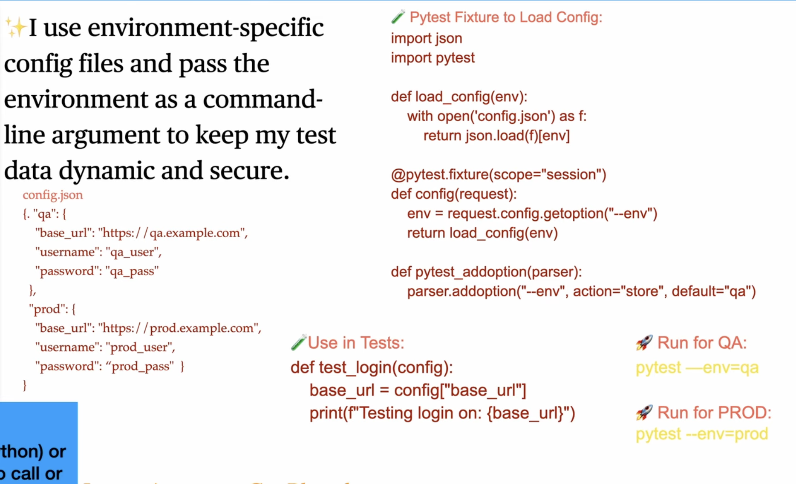
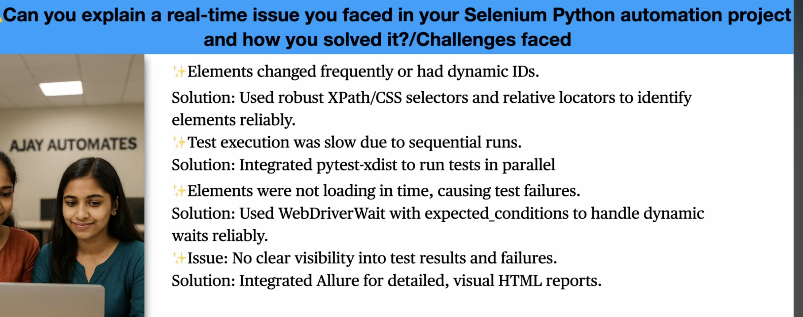
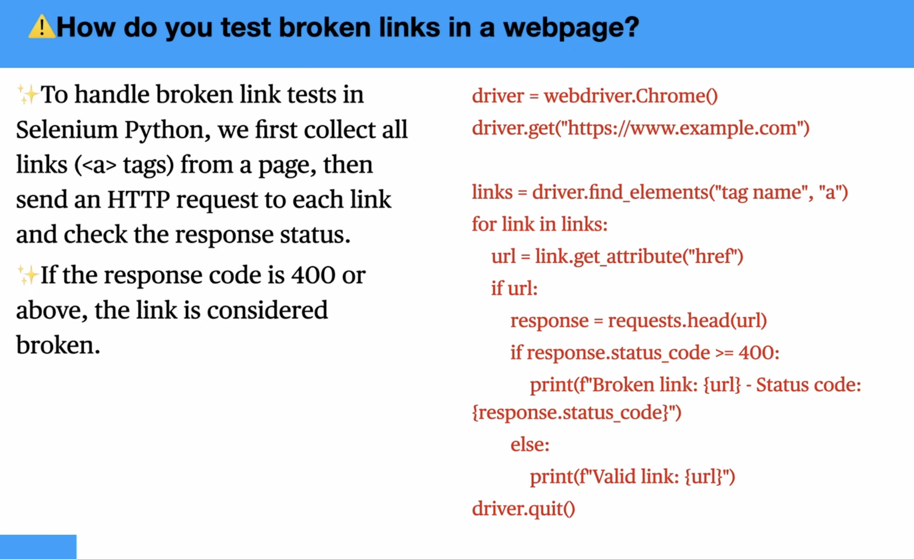
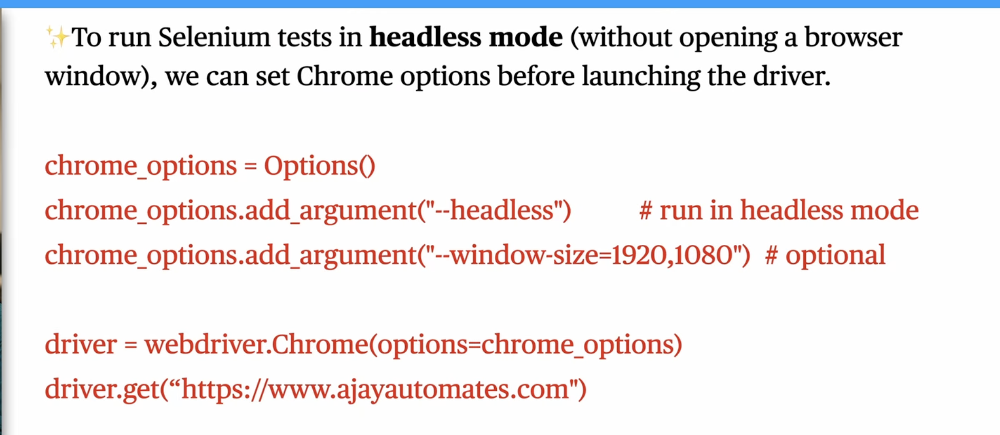

# Pytest Interview Prep

## 📑 Table of Contents

1. [What is Pytest and why use it over unittest?](#what-is-pytest-and-why-use-it-over-unittest)
2. [What is meant by pytest ordering?](#what-is-meant-by-pytest-ordering)
3. [What is meant by pytest markers?](#what-is-meant-by-pytest-markers)
4. [What is meant by fixtures?](#what-is-meant-by-fixtures)
5. [When do you use ID, XPath, and CSS selectors?](#when-do-you-use-id-xpath-and-css-selectors)
6. [What is "scope" in pytest fixtures?](#what-is-scope-in-pytest-fixtures)
7. [What is ZeroDivisionError?](#what-is-zerodivisionerror)
8. [What is Parametrization in Pytest?](#what-is-parametrization-in-pytest)
9. [How do you run tests in parallel?](#how-do-you-run-tests-in-parallel)
10. [What is logging in pytest?](#what-is-logging-in-pytest)
11. [What are common exceptions during automation?](#what-are-common-exceptions-during-automation)
12. [How do you manage test data for different environments?](#how-do-you-manage-test-data-for-different-environments)
13. [Can you explain a real-life issue/challenge you faced?](#can-you-explain-a-real-life-issuechallenge-you-faced)
14. [How do you test broken links in a web page?](#how-do-you-test-broken-links-in-a-web-page)
15. [How do you run headless mode in Selenium Python?](#how-do-you-run-headless-mode-in-selenium-python)
16. [How do we skip the test case in pytest?](#how-do-we-skip-the-test-case-in-pytest)

---

## What is Pytest and why use it over unittest?

**Expected Answer (concept)**

- Simpler syntax (no class required)
- Powerful fixtures
- Better assertions (no self.assertEqual)
- Plugins ecosystem
- Parametrization support

**Example:**

```python
import pytest


def add(a, b):
    return a + b

def test_add():
    assert add(2, 3) == 5
    assert add(-1, 1) == 0
    assert add(0, 0) == 0
```

---

## What is meant by pytest ordering?

### 1. Using pytest-order Plugin (Most Expected Answer)

**Install:**

```bash
pip install pytest-order
```

**Example:**

```python
import pytest

@pytest.mark.order(2)
def test_second():
    print("Second")
    assert True

@pytest.mark.order(1)
def test_first():
    print("First")
    assert True

@pytest.mark.order(3)
def test_third():
    print("Third")
    assert True
```

**Run:**

```bash
pytest -v
```

👉 **Output order:**

- test_first
- test_second
- test_third

### 2. Order Using Class (Natural Grouping)

```python
class TestFlow:

    def test_step1(self):
        print("Step 1")

    def test_step2(self):
        print("Step 2")

    def test_step3(self):
        print("Step 3")
```

👉 Runs in defined order inside the class

⚠️ **But:**

- Not guaranteed across files
- Not reliable for complex flows

### 3. Naming Convention Trick (Basic)

```python
def test_1_login():
    pass

def test_2_add_item():
    pass

def test_3_checkout():
    pass
```

👉 Pytest runs in lexicographical order

⚠️ This is a hack, not recommended for production

### 4. Using pytest-dependency (Better for Real Scenarios)

**Install:**

```bash
pip install pytest-dependency
```

**Example:**

```python
import pytest

@pytest.mark.dependency()
def test_login():
    assert True

@pytest.mark.dependency(depends=["test_login"])
def test_dashboard():
    assert True
```

👉 test_dashboard runs only if test_login passes

---

## What is meant by pytest markers?

Markers in pytest let you tag tests (e.g., smoke, regression, slow) and then selectively run them from the CLI.

### 1. Basic Marker Example

```python
import pytest

@pytest.mark.smoke
def test_login():
    assert True

@pytest.mark.regression
def test_payment():
    assert True

@pytest.mark.smoke
def test_logout():
    assert True
```

### 2. How to Run Marked Tests

**Run only smoke tests:**

```bash
pytest -m smoke
```

👉 Runs:

- test_login
- test_logout

**Run only regression tests:**

```bash
pytest -m regression
```

### 3. Run Multiple Markers

**AND condition:**

```bash
pytest -m "smoke and regression"
```

👉 Runs tests marked with both

**OR condition:**

```bash
pytest -m "smoke or regression"
```

👉 Runs tests with either marker

**NOT condition:**

```bash
pytest -m "not smoke"
```

👉 Runs everything except smoke tests

### 4. Register Markers (Important for Interviews)

Create `pytest.ini`:

```ini
[pytest]
markers =
    smoke: smoke tests
    regression: regression tests
```

👉 Avoids warnings like:

```
PytestUnknownMarkWarning
```

### 5. Real-World Example (Selenium/API style)

```python
import pytest

@pytest.mark.smoke
def test_login_api():
    assert True

@pytest.mark.regression
def test_full_checkout_flow():
    assert True

@pytest.mark.slow
def test_large_data_processing():
    assert True
```

**Run fast tests only:**

```bash
pytest -m "not slow"
```

### 🔥 Interview Insight

**If asked:** 👉 Why use markers?

**Answer:**

- Categorize tests (smoke, regression, sanity)
- Selective execution
- Faster CI pipelines
- Better test organization

---

## What is meant by fixtures?

Fixtures in the literal sense, are each of the arrange steps and data. They're everything that test needs to do its thing.

**Test Phases:**

1. Arrange
2. Act
3. Assert
4. Cleanup

**Example:**

```python
import pytest 

@pytest.fixture
def suitesetupandclean():
    print("suite setup\n")
    yield
    print("suite clean up\n")


def test_case1(suitesetupandclean):
    print("execution of the test case 1\n")
```

### Scopes

| Scope | Runs When |
|-------|-----------|
| function | every test |
| class | per class |
| module | per file |
| session | once per run |

---

## When do you use ID, XPath, and CSS selectors?

### ✅ 1. Use ID (First Preference)

**👉 Use when:**

- Element has a unique id
- ID is stable (not dynamic)

**Why?**

- Fastest locator (direct DOM lookup)
- Most reliable

**Example:**

```python
driver.find_element(By.ID, "username")
```

### 2. Use CSS Selector (Second Preference)

**👉 Use when:**

- ID is not available
- DOM structure is simple
- You want clean and readable locators

**Why?**

- Faster than XPath
- Cleaner syntax
- Good for most UI automation

**Examples:**

```python
# by class
driver.find_element(By.CSS_SELECTOR, ".login-btn")

# by attribute
driver.find_element(By.CSS_SELECTOR, "input[type='text']")

# nested
driver.find_element(By.CSS_SELECTOR, "div.form input#username")
```

### 3. Use XPath (When Needed)

**👉 Use when:**

- No unique ID or class
- Element is dynamic
- Need to traverse DOM (parent/child/sibling)
- Need text-based selection

**🔥 XPath Examples (Interview Gold):**

#### 1. Contains (dynamic elements)

```python
driver.find_element(By.XPATH, "//input[contains(@id,'user_')]")
```

#### 2. Based on text

```python
driver.find_element(By.XPATH, "//button[text()='Login']")
```

#### 3. Parent → Child navigation

```python
driver.find_element(By.XPATH, "//div[@class='form']//input")
```

#### 4. Child → Parent (very important)

```python
driver.find_element(By.XPATH, "//span[text()='Username']/parent::div")
```

### 🔥 Priority Order (Best Practice)

```
ID > CSS > XPath
```

### 🔥 Real Interview Answer (Perfect Version)

**If interviewer asks:** 👉 "Which locator do you prefer and why?"

**Say:**

> I always prefer ID when it is unique and stable because it is the fastest and most reliable.
> If ID is not available, I prefer CSS selectors since they are faster and cleaner than XPath.
> I use XPath when dealing with dynamic elements, text-based selection, or when I need to traverse the DOM like parent-child relationships.

### 🔥 Important Edge Cases (Very Important)

**❌ Avoid: Absolute XPath**

```python
/html/body/div[2]/div[1]/input   # ❌ fragile
```

**✅ Prefer: Relative XPath**

```python
//input[@name='email']
```

**Dynamic ID Handling:**

```python
//input[contains(@id,'user')]
```

---

## What is "scope" in pytest fixtures?

Scope defines how often a fixture is created and destroyed during a test run.

Think of it as: **"Lifecycle of the fixture"**

### 🔥 The 4 Fixture Scopes (with meaning)

| Scope | Runs When | Lifetime |
|-------|-----------|----------|
| function | Every test | Shortest |
| class | Once per class | Medium |
| module | Once per file | Longer |
| session | Once per run | Longest |

### 1. Function Scope (default)

👉 Runs before every test function

```python
@pytest.fixture(scope="function")
def setup():
    print("Setup")
    yield
    print("Teardown")
```

**Example:**

```python
def test_a(setup): pass
def test_b(setup): pass
```

**Output flow:**

```
Setup → test_a → Teardown
Setup → test_b → Teardown
```

### 2. Class Scope

👉 Runs once per class

```python
@pytest.fixture(scope="class")
def setup_class():
    print("Class Setup")
    yield
    print("Class Teardown")

class TestExample:

    def test_1(self, setup_class): pass
    def test_2(self, setup_class): pass
```

**Output:**

```
Class Setup
test_1
test_2
Class Teardown
```

### 3. Module Scope

👉 Runs once per file

```python
@pytest.fixture(scope="module")
def setup_module():
    print("Module Setup")
    yield
    print("Module Teardown")
```

All tests in the file share it.

### 4. Session Scope

👉 Runs once for entire pytest run

```python
@pytest.fixture(scope="session")
def setup_session():
    print("Session Setup")
    yield
    print("Session Teardown")
```

### 🔥 Execution Order (VERY IMPORTANT)

When multiple scopes exist, order is:

```
session → module → class → function
```

Teardown happens in reverse:

```
function → class → module → session
```

### 🔥 Example with All Scopes

If a test uses all:

```python
def test_all(session_fixture, module_fixture, class_fixture, function_fixture):
    print("Running test")
```

**Execution will be:**

```
session setup
module setup
class setup
function setup

test runs

function teardown
class teardown
module teardown
session teardown
```

### 🔥 Real Interview Insight

**👉 "When do you use different scopes?"**

| Scope | Use Case |
|-------|----------|
| function | Default - Safe (test isolation) |
| class | When tests share setup (e.g., login once) |
| module | Shared resources (DB connection, config) |
| session | Expensive setup (browser grid, API token, environment init) |

### 🔥 Common Mistake (Important)

❌ Using session scope for mutable data → Causes flaky tests

✔ Use function scope for isolation

### 🚀 One-Line Summary

**Scope controls how long a fixture lives and how often it runs.**

---

## What is ZeroDivisionError?

It is raised when you try to divide a number by zero, which is mathematically undefined.

### Example (without pytest)

```python
def divide(a, b):
    return a / b

divide(10, 0)
```

👉 This will crash with:

```
ZeroDivisionError: division by zero
```

### Why does Python raise this?

Because:

- Division by zero has no valid result
- Python prevents invalid mathematical operations by raising an exception

### In your pytest code

```python
def test_divide_by_zero():
    with pytest.raises(ZeroDivisionError):
        divide(10, 0)
```

👉 **Meaning:**

- "I expect this function to throw ZeroDivisionError"
- If it throws → ✅ test passes
- If it doesn't → ❌ test fails

### Think of it like this

**Normal test:**

```python
assert divide(10, 2) == 5
```

**Exception test:**

```python
assert divide(10, 0) raises ZeroDivisionError
```

### 🔥 Real Interview Explanation

**If asked:** 👉 "What is ZeroDivisionError?"

**Say:**

> It is a built-in Python exception that occurs when a division operation is performed with zero as the denominator.

### Other Similar Built-in Exceptions

- `ValueError` → wrong value type
- `TypeError` → wrong data type
- `IndexError` → invalid index
- `KeyError` → missing dictionary key

### 🚀 One-Line Summary

**ZeroDivisionError = Python error raised when dividing by zero.**

---

## What is Parametrization in Pytest?

Parametrization in pytest means running the same test multiple times with different inputs—cleanly and without duplicating code.

### 🔹 1. Basic Usage: @pytest.mark.parametrize

```python
import pytest

@pytest.mark.parametrize("username,password", [
    ("admin", "admin123"),
    ("user1", "pass1"),
    ("user2", "wrongpass")
])
def test_login(username, password):
    print(f"Testing with {username} / {password}")
    assert username != "" and password != ""
```

**What happens:**

- This single test runs 3 times
- Each run uses a different (username, password) pair

### 🔹 2. Why use parametrization?

- Eliminates duplicate tests
- Improves coverage
- Makes tests data-driven

Instead of:

```python
def test_login1(): ...
def test_login2(): ...
def test_login3(): ...
```

👉 You write one test + multiple data sets

### 🔹 3. Parametrization with Expected Output

```python
@pytest.mark.parametrize("a,b,expected", [
    (1, 2, 3),
    (2, 3, 5),
    (5, 5, 10)
])
def test_add(a, b, expected):
    assert a + b == expected
```

### 🔹 4. Parametrization with Negative Case

```python
@pytest.mark.parametrize("username,password", [
    ("admin", "admin123"),   # valid
    ("", "pass1"),           # invalid username
    ("user", "")             # invalid password
])
def test_login(username, password):
    assert username != "" and password != ""
```

### 🔹 5. Parametrization + Fixtures (Advanced)

```python
@pytest.fixture
def base_url():
    return "https://example.com"

@pytest.mark.parametrize("endpoint", ["/login", "/home", "/profile"])
def test_api(base_url, endpoint):
    url = base_url + endpoint
    print(url)
```

### 🔹 6. Custom Test Names (Interview Level)

```python
@pytest.mark.parametrize(
    "username,password",
    [
        pytest.param("admin", "admin123", id="valid_user"),
        pytest.param("user1", "pass1", id="normal_user"),
        pytest.param("user2", "wrongpass", id="invalid_user"),
    ]
)
def test_login(username, password):
    assert username != ""
```

👉 Output will show meaningful names

### 🔥 Real Interview Answer (Best Version)

If asked:

👉 “How do you handle parametrization?”

Say:

I use @pytest.mark.parametrize to execute the same test with multiple datasets. It helps reduce code duplication and improves test coverage. I commonly use it for login scenarios, API inputs, and validation cases. I also combine it with fixtures and custom IDs for better readability.

🔥 Common Follow-ups
Q: How many times will test run?

→ Equal to number of data sets

Q: Can we use external data?

→ Yes (CSV, JSON, Excel)

Example:

import json

data = json.load(open("data.json"))

@pytest.mark.parametrize("user", data)
def test_user(user):
    assert user["name"] != ""
🚀 One-Line Summary

Parametrization = run one test multiple times with different inputs.

9) To achieve parallel test execution in pytest, the standard approach is using the pytest-xdist plugin.

🔹 1. Install xdist
pip install pytest-xdist
🔹 2. Run tests in parallel
pytest -n 4

👉 This runs tests using 4 workers (processes)

🔹 3. Auto-detect CPU cores
pytest -n auto

👉 Uses all available CPU cores

🔥 How it works
Each worker runs tests independently
Tests are distributed across workers
Total execution time reduces significantly
🔹 4. Control distribution (Advanced)
pytest -n 4 --dist=loadscope
Options:
load → distribute test-by-test (default)
loadscope → group by class/module
loadfile → group by file
🔹 5. Real Example

Without parallel:

10 tests → 10 seconds

With parallel (-n 5):

10 tests → ~2–3 seconds
🔥 Important Interview Points (Very Critical)
⚠️ 1. Tests must be independent

❌ Bad:

Shared global variables
Shared DB without isolation

✅ Good:

Independent test data
Proper fixtures
⚠️ 2. Fixture Scope Matters
Avoid session scope with mutable data
Prefer function scope for isolation
⚠️ 3. Selenium + Parallel

👉 You need:

Separate browser instances
OR Selenium Grid

Example:

@pytest.fixture
def driver():
    driver = webdriver.Chrome()
    yield driver
    driver.quit()
🔹 6. Combine with other options
pytest -n 4 -v --maxfail=2


10) what is meant by logging ?
import pytest
import logging
from selenium import webdriver

# Global logging configuration (only once)
logging.basicConfig(
    level=logging.INFO,
    format="%(asctime)s - %(name)s - %(levelname)s - %(message)s",
    handlers=[
        logging.FileHandler("test.log"),
        logging.StreamHandler()
    ]
)

LOG = logging.getLogger(__name__)


@pytest.fixture(scope="function")
def driver():
    LOG.info("Launching browser")
    driver = webdriver.Chrome()

    yield driver

    LOG.info("Closing browser")
    driver.quit()

11) what are the common execptions you see during the automation?
1. NoSuchElementException
✅ Meaning

Element is not found in DOM

❌ Causes
Wrong locator (XPath/CSS)
Page not loaded yet
Element inside iframe
✅ Fix
from selenium.webdriver.common.by import By
from selenium.webdriver.support.ui import WebDriverWait
from selenium.webdriver.support import expected_conditions as EC

WebDriverWait(driver, 10).until(
    EC.presence_of_element_located((By.ID, "username"))
)

👉 Use explicit wait instead of direct find

🔹 2. TimeoutException
✅ Meaning

Wait condition not satisfied within given time

❌ Causes
Element never appears
Slow network/app
✅ Fix
Increase timeout
Verify locator
Check backend/API delays
🔹 3. ElementNotInteractableException
✅ Meaning

Element is present but cannot be interacted with

❌ Causes
Hidden element
Disabled button
Not visible yet
✅ Fix
EC.element_to_be_clickable((By.ID, "submit"))

👉 Ensure:

visible
enabled
clickable
🔹 4. StaleElementReferenceException
✅ Meaning

Element is no longer attached to DOM

❌ Causes
Page refreshed
DOM updated dynamically (React/Angular)
✅ Fix
element = driver.find_element(By.ID, "btn")
driver.refresh()

# Re-locate element
element = driver.find_element(By.ID, "btn")
element.click()

👉 Always re-find element after DOM change

🔹 5. WebDriverException
✅ Meaning

Generic Selenium error (browser/driver issue)

❌ Causes
Driver mismatch
Browser crash
Invalid commands
✅ Fix
Update ChromeDriver/GeckoDriver
Match browser version
Check logs
🔹 6. UnexpectedAlertPresentException
✅ Meaning

An alert popup appeared unexpectedly

❌ Causes
JS alert
Confirmation popup
✅ Fix
alert = driver.switch_to.alert
alert.accept()

12) how do you manage test data for different environment like QA and production?


Concept: Managing Test Data Across Environments

In pytest, we manage environment-specific data by:

Keeping separate configs (QA / PROD / DEV)
Passing environment via command-line
Loading config using fixture
🔹 1. config.json (Environment Data)
{
  "qa": {
    "base_url": "https://qa.example.com",
    "username": "qa_user",
    "password": "qa_pass"
  },
  "prod": {
    "base_url": "https://prod.example.com",
    "username": "prod_user",
    "password": "prod_pass"
  }
}
🔹 2. conftest.py (Core Logic)
import pytest
import json


def load_config(env):
    with open("config.json") as f:
        return json.load(f)[env]


def pytest_addoption(parser):
    parser.addoption(
        "--env",
        action="store",
        default="qa",
        help="Environment to run tests against"
    )


@pytest.fixture(scope="session")
def config(request):
    env = request.config.getoption("--env")
    return load_config(env)
🔹 3. Test Case Usage
def test_login(config):
    base_url = config["base_url"]
    username = config["username"]

    print(f"Running test on: {base_url}")
    print(f"Using user: {username}")

    assert base_url.startswith("https")
🔹 4. Run Tests for Different Environments
# QA
pytest --env=qa

# PROD
pytest --env=prod
🔥 What This Solves
No hardcoded URLs ❌
No hardcoded credentials ❌
Same test runs across environments ✅
🔥 Advanced Improvements (Interview Gold)
✅ Use .env or secrets (for security)
export USERNAME=qa_user
✅ Separate config files
config/
  qa.json
  prod.json
✅ Combine with fixtures
@pytest.fixture
def base_url(config):
    return config["base_url"]

    
13) Can you explain  a real-life issue you faced in your selenium python automation project and how you solved it ? challenges faced?


Real-Time Issue (Best Answer)
✅ Problem

In my Selenium + pytest automation project, we faced flaky test failures because:

Elements had dynamic IDs
Page content loaded asynchronously
Tests passed locally but failed in CI
✅ Root Cause
We were using static locators (ID-based)
Using time.sleep() instead of proper waits
No synchronization with UI rendering
✅ Solution
1. Improved Locators
Replaced brittle locators with:
Relative XPath
CSS selectors using stable attributes
//input[contains(@id,'user')]
2. Introduced Explicit Waits (Key Fix)
from selenium.webdriver.common.by import By
from selenium.webdriver.support.ui import WebDriverWait
from selenium.webdriver.support import expected_conditions as EC

WebDriverWait(driver, 10).until(
    EC.visibility_of_element_located((By.ID, "username"))
)
3. Removed Hard Sleeps
Eliminated time.sleep()
Replaced with condition-based waits
4. Parallel Execution Optimization
Integrated pytest-xdist
Reduced execution time significantly
pytest -n auto
5. Reporting & Debugging
Added Allure Report
Captured:
Screenshots on failure
Logs
Step-level details
✅ Result
Reduced flaky failures by ~70–80%
Improved execution time by ~50%
Better visibility into failures

14) how do you test broken links in web page?


Approach to Test Broken Links
Steps:
Open webpage using Selenium
Collect all <a> tags
Extract href attribute
Send HTTP request
Check status code
🔹 Complete Working Example (Improved Version)
import requests
from selenium import webdriver
from selenium.webdriver.common.by import By

driver = webdriver.Chrome()
driver.get("https://example.com")

links = driver.find_elements(By.TAG_NAME, "a")

for link in links:
    url = link.get_attribute("href")

    if url is None or url.strip() == "":
        continue

    try:
        response = requests.head(url, allow_redirects=True, timeout=5)

        if response.status_code >= 400:
            print(f"❌ Broken link: {url} | Status: {response.status_code}")
        else:
            print(f"✅ Valid link: {url}")

    except Exception as e:
        print(f"⚠️ Error checking {url}: {e}")

driver.quit()
🔥 Important Improvements (Interview Level)
✅ Use requests.head() instead of get()
Faster (no full response body)
✅ Handle redirects
allow_redirects=True
✅ Skip invalid links
if url is None or url.startswith("javascript"):
    continue
🔹 Status Code Meaning
Code Range	Meaning
200–399	Valid
400–499	Client error (broken)
500+	Server error (broken)

15) how do we run headless mode in selenium python?


Running Selenium tests in headless mode means executing tests without opening a visible browser UI—critical for CI/CD pipelines, Docker, and faster execution.

🔹 Basic Example (Chrome Headless)
from selenium import webdriver
from selenium.webdriver.chrome.options import Options

options = Options()
options.add_argument("--headless=new")   # modern headless mode (recommended)
options.add_argument("--window-size=1920,1080")

driver = webdriver.Chrome(options=options)
driver.get("https://example.com")

print(driver.title)

driver.quit()
🔹 Key Points
✅ --headless=new
New implementation (Chrome 109+)
More stable than old --headless
✅ --window-size
Important because no GUI → default size may break UI locators
🔹 Pytest Fixture (Real Interview Use Case)
import pytest
from selenium import webdriver
from selenium.webdriver.chrome.options import Options

@pytest.fixture
def driver():
    options = Options()
    options.add_argument("--headless=new")
    options.add_argument("--window-size=1920,1080")

    driver = webdriver.Chrome(options=options)
    yield driver
    driver.quit()
### 🔥 Common Follow-ups

**Q: How many times will test run?**

→ Equal to number of data sets

**Q: Can we use external data?**

→ Yes (CSV, JSON, Excel)

**Example:**

```python
import json

data = json.load(open("data.json"))

@pytest.mark.parametrize("user", data)
def test_user(user):
    assert user["name"] != ""
```

### 🚀 One-Line Summary

**Parametrization = run one test multiple times with different inputs.**

---

## How do you run tests in parallel?

To achieve parallel test execution in pytest, the standard approach is using the **pytest-xdist** plugin.

### 🔹 1. Install xdist

```bash
pip install pytest-xdist
```

### 🔹 2. Run tests in parallel

```bash
pytest -n 4
```

👉 This runs tests using 4 workers (processes)

### 🔹 3. Auto-detect CPU cores

```bash
pytest -n auto
```

👉 Uses all available CPU cores

### 🔥 How it works

- Each worker runs tests independently
- Tests are distributed across workers
- Total execution time reduces significantly

### 🔹 4. Control distribution (Advanced)

```bash
pytest -n 4 --dist=loadscope
```

**Options:**
- `load` → distribute test-by-test (default)
- `loadscope` → group by class/module
- `loadfile` → group by file

### 🔹 5. Real Example

**Without parallel:**

10 tests → 10 seconds

**With parallel (-n 5):**

10 tests → ~2–3 seconds

### 🔥 Important Interview Points (Very Critical)

**⚠️ 1. Tests must be independent**

❌ Bad:
- Shared global variables
- Shared DB without isolation

✅ Good:
- Independent test data
- Proper fixtures

**⚠️ 2. Fixture Scope Matters**
- Avoid session scope with mutable data
- Prefer function scope for isolation

**⚠️ 3. Selenium + Parallel**

👉 You need:
- Separate browser instances
- OR Selenium Grid

**Example:**

```python
@pytest.fixture
def driver():
    driver = webdriver.Chrome()
    yield driver
    driver.quit()
```

### 🔹 6. Combine with other options

```bash
pytest -n 4 -v --maxfail=2
```

---

## What is logging in pytest?

Logging in pytest helps track test execution, debug failures, and maintain detailed test reports.

### Example Configuration

```python
import pytest
import logging
from selenium import webdriver

# Global logging configuration (only once)
logging.basicConfig(
    level=logging.INFO,
    format="%(asctime)s - %(name)s - %(levelname)s - %(message)s",
    handlers=[
        logging.FileHandler("test.log"),
        logging.StreamHandler()
    ]
)

LOG = logging.getLogger(__name__)


@pytest.fixture(scope="function")
def driver():
    LOG.info("Launching browser")
    driver = webdriver.Chrome()

    yield driver

    LOG.info("Closing browser")
    driver.quit()
```

### Key Points

- Use `logging.basicConfig()` for configuration
- Set appropriate log level (INFO, DEBUG, ERROR)
- Log to both file and console with handlers
- Use fixture scope appropriately
- Log important test steps and actions

---

## What are common exceptions during automation?

### 1. NoSuchElementException

**✅ Meaning:**

Element is not found in DOM

**❌ Causes:**
- Wrong locator (XPath/CSS)
- Page not loaded yet
- Element inside iframe

**✅ Fix:**

```python
from selenium.webdriver.common.by import By
from selenium.webdriver.support.ui import WebDriverWait
from selenium.webdriver.support import expected_conditions as EC

WebDriverWait(driver, 10).until(
    EC.presence_of_element_located((By.ID, "username"))
)
```

👉 Use explicit wait instead of direct find

### 2. TimeoutException

**✅ Meaning:**

Wait condition not satisfied within given time

**❌ Causes:**
- Element never appears
- Slow network/app

**✅ Fix:**
- Increase timeout
- Verify locator
- Check backend/API delays

### 3. ElementNotInteractableException

**✅ Meaning:**

Element is present but cannot be interacted with

**❌ Causes:**
- Hidden element
- Disabled button
- Not visible yet

**✅ Fix:**

```python
EC.element_to_be_clickable((By.ID, "submit"))
```

👉 Ensure:
- visible
- enabled
- clickable

### 4. StaleElementReferenceException

**✅ Meaning:**

Element is no longer attached to DOM

**❌ Causes:**
- Page refreshed
- DOM updated dynamically (React/Angular)

**✅ Fix:**

```python
element = driver.find_element(By.ID, "btn")
driver.refresh()

# Re-locate element
element = driver.find_element(By.ID, "btn")
element.click()
```

👉 Always re-find element after DOM change

### 5. WebDriverException

**✅ Meaning:**

Generic Selenium error (browser/driver issue)

**❌ Causes:**
- Driver mismatch
- Browser crash
- Invalid commands

**✅ Fix:**
- Update ChromeDriver/GeckoDriver
- Match browser version
- Check logs

### 6. UnexpectedAlertPresentException

**✅ Meaning:**

An alert popup appeared unexpectedly

**❌ Causes:**
- JS alert
- Confirmation popup

**✅ Fix:**

```python
alert = driver.switch_to.alert
alert.accept()
```

---

## How do you manage test data for different environments?

### Concept: Managing Test Data Across Environments

In pytest, we manage environment-specific data by:

- Keeping separate configs (QA / PROD / DEV)
- Passing environment via command-line
- Loading config using fixture

### 🔹 1. config.json (Environment Data)

```json
{
  "qa": {
    "base_url": "https://qa.example.com",
    "username": "qa_user",
    "password": "qa_pass"
  },
  "prod": {
    "base_url": "https://prod.example.com",
    "username": "prod_user",
    "password": "prod_pass"
  }
}
```

### 🔹 2. conftest.py (Core Logic)

```python
import pytest
import json


def load_config(env):
    with open("config.json") as f:
        return json.load(f)[env]


def pytest_addoption(parser):
    parser.addoption(
        "--env",
        action="store",
        default="qa",
        help="Environment to run tests against"
    )


@pytest.fixture(scope="session")
def config(request):
    env = request.config.getoption("--env")
    return load_config(env)
```

### 🔹 3. Test Case Usage

```python
def test_login(config):
    base_url = config["base_url"]
    username = config["username"]

    print(f"Running test on: {base_url}")
    print(f"Using user: {username}")

    assert base_url.startswith("https")
```

### 🔹 4. Run Tests for Different Environments

```bash
# QA
pytest --env=qa

# PROD
pytest --env=prod
```

### 🔥 What This Solves

- No hardcoded URLs ❌
- No hardcoded credentials ❌
- Same test runs across environments ✅

### 🔥 Advanced Improvements (Interview Gold)

**✅ Use .env or secrets (for security)**

```bash
export USERNAME=qa_user
```

**✅ Separate config files**

```
config/
  qa.json
  prod.json
```

**✅ Combine with fixtures**

```python
@pytest.fixture
def base_url(config):
    return config["base_url"]
```

---

## Can you explain a real-life issue/challenge you faced?

### Real-Time Issue (Best Answer)

**✅ Problem:**

In my Selenium + pytest automation project, we faced flaky test failures because:

- Elements had dynamic IDs
- Page content loaded asynchronously
- Tests passed locally but failed in CI

**✅ Root Cause:**

- We were using static locators (ID-based)
- Using `time.sleep()` instead of proper waits
- No synchronization with UI rendering

**✅ Solution:**

**1. Improved Locators**

Replaced brittle locators with:
- Relative XPath
- CSS selectors using stable attributes

```python
//input[contains(@id,'user')]
```

**2. Introduced Explicit Waits (Key Fix)**

```python
from selenium.webdriver.common.by import By
from selenium.webdriver.support.ui import WebDriverWait
from selenium.webdriver.support import expected_conditions as EC

WebDriverWait(driver, 10).until(
    EC.visibility_of_element_located((By.ID, "username"))
)
```

**3. Removed Hard Sleeps**
- Eliminated `time.sleep()`
- Replaced with condition-based waits

**4. Parallel Execution Optimization**
- Integrated pytest-xdist
- Reduced execution time significantly

```bash
pytest -n auto
```

**5. Reporting & Debugging**
- Added Allure Report
- Captured:
  - Screenshots on failure
  - Logs
  - Step-level details

**✅ Result:**

- Reduced flaky failures by ~70–80%
- Improved execution time by ~50%
- Better visibility into failures

---

## How do you test broken links in a web page?

### Approach to Test Broken Links

**Steps:**
1. Open webpage using Selenium
2. Collect all `<a>` tags
3. Extract `href` attribute
4. Send HTTP request
5. Check status code

### 🔹 Complete Working Example (Improved Version)

```python
import requests
from selenium import webdriver
from selenium.webdriver.common.by import By

driver = webdriver.Chrome()
driver.get("https://example.com")

links = driver.find_elements(By.TAG_NAME, "a")

for link in links:
    url = link.get_attribute("href")

    if url is None or url.strip() == "":
        continue

    try:
        response = requests.head(url, allow_redirects=True, timeout=5)

        if response.status_code >= 400:
            print(f"❌ Broken link: {url} | Status: {response.status_code}")
        else:
            print(f"✅ Valid link: {url}")

    except Exception as e:
        print(f"⚠️ Error checking {url}: {e}")

driver.quit()
```

### 🔥 Important Improvements (Interview Level)

**✅ Use requests.head() instead of get()**
- Faster (no full response body)

**✅ Handle redirects**
- `allow_redirects=True`

**✅ Skip invalid links**

```python
if url is None or url.startswith("javascript"):
    continue
```

### 🔹 Status Code Meaning

| Code Range | Meaning |
|------------|---------|
| 200–399 | Valid |
| 400–499 | Client error (broken) |
| 500+ | Server error (broken) |

---

## How do you run headless mode in Selenium Python?

Running Selenium tests in headless mode means executing tests without opening a visible browser UI—critical for CI/CD pipelines, Docker, and faster execution.

### 🔹 Basic Example (Chrome Headless)

```python
from selenium import webdriver
from selenium.webdriver.chrome.options import Options

options = Options()
options.add_argument("--headless=new")   # modern headless mode (recommended)
options.add_argument("--window-size=1920,1080")

driver = webdriver.Chrome(options=options)
driver.get("https://example.com")

print(driver.title)

driver.quit()
```

### 🔹 Key Points

**✅ --headless=new**
- New implementation (Chrome 109+)
- More stable than old `--headless`

**✅ --window-size**
- Important because no GUI → default size may break UI locators

### 🔹 Pytest Fixture (Real Interview Use Case)

```python
import pytest
from selenium import webdriver
from selenium.webdriver.chrome.options import Options

@pytest.fixture
def driver():
    options = Options()
    options.add_argument("--headless=new")
    options.add_argument("--window-size=1920,1080")

    driver = webdriver.Chrome(options=options)
    yield driver
    driver.quit()
```

### Benefits of Headless Mode

- Faster execution
- Works in CI/CD pipelines
- No display required
- Lower resource usage
- Ideal for Docker containers

---

## How do we skip the test case in pytest?

### 🔹 1. Skip using decorator (before execution)

```python
import pytest

@pytest.mark.skip(reason="Feature not ready")
def test_login():
    assert True
```

👉 Test is never executed

### 🔹 2. Skip at runtime

```python
import pytest

def test_search():
    pytest.skip("Skipping this test temporarily")
```

👉 Test starts → then gets skipped

### 🔹 3. Conditional Skip (Very Important 🔥)

```python
import pytest
import sys

@pytest.mark.skipif(sys.platform == "win32", reason="Not supported on Windows")
def test_linux_feature():
    assert True
```

👉 Runs only when condition is False

### 🔹 4. Skip Entire Class

```python
@pytest.mark.skip(reason="Skipping all tests in class")
class TestExample:
    def test_a(self):
        pass
    def test_b(self):
        pass
```

### 🔹 5. Skip via Command Line (Advanced)

```bash
pytest -k "not login"
```

👉 Not exactly skip marker, but filters tests

### 🔹 Output Example

```
SKIPPED [1] test_sample.py:3: Feature not ready
```

### 🔥 Difference (Important)

| Method | When it happens |
|--------|----------------|
| @pytest.mark.skip | Before execution |
| pytest.skip() | During execution |

### 🔥 Interview Answer (Perfect)

👉 “In pytest, we can skip tests using @pytest.mark.skip for static skipping, pytest.skip() for runtime skipping, and @pytest.mark.skipif for conditional skipping.”