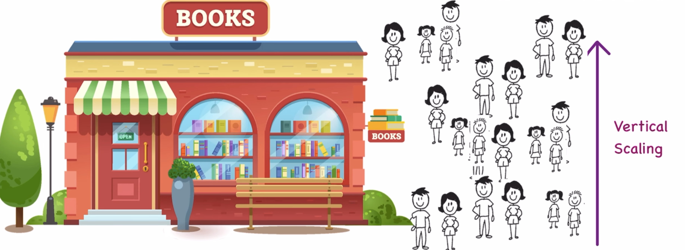
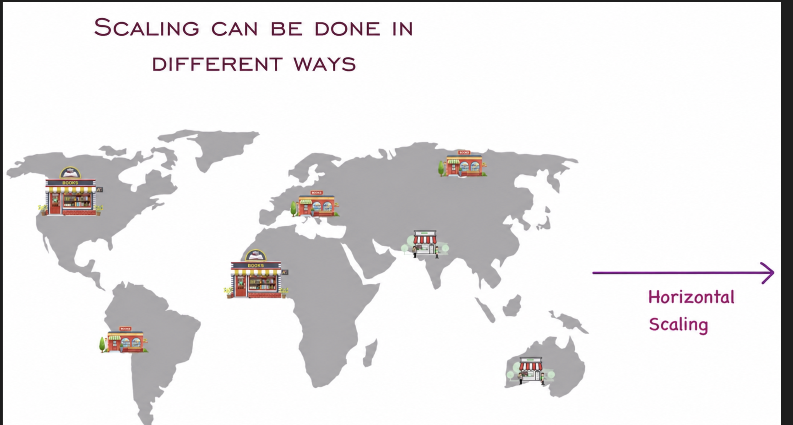
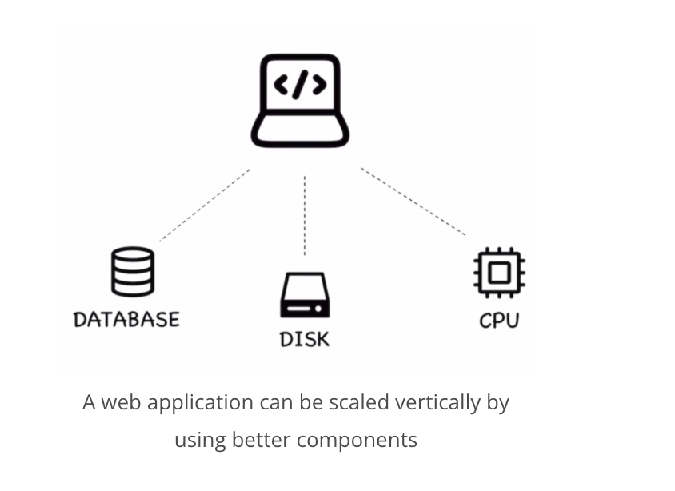
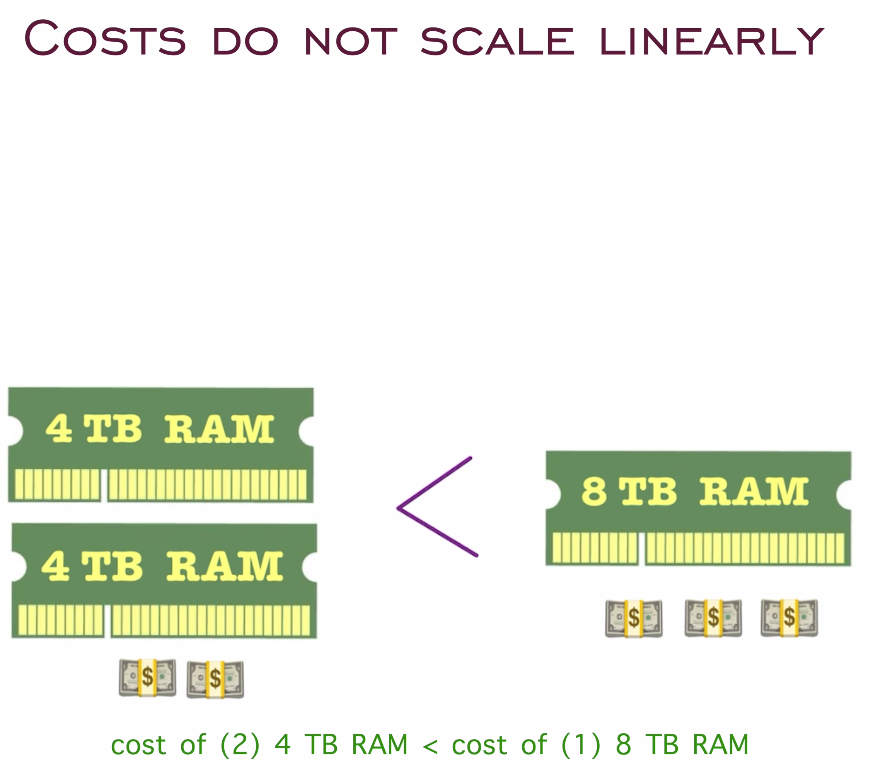
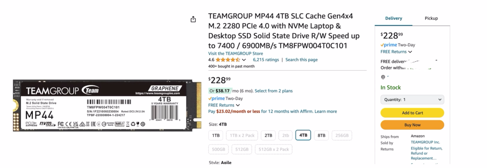
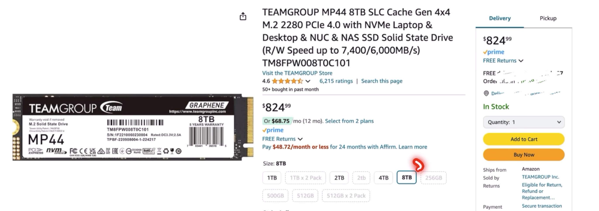

# System Design Overview

## What is System Design?

System design is the process of defining the architecture, components, modules, interfaces, and data for a system to satisfy specified requirements.

## What Do You Mean by Scaling?

### Real-World Example

Consider running a bookstore. Initially, you might handle everything manually – tracking inventory, managing orders, and so on. However, as your business grows, this approach becomes impractical. You need a system to automate these tasks, ensuring that your business can scale efficiently. This is where system design comes in.

## System Design Interviews

System design interviews are a critical part of the hiring process for many tech roles. They assess your ability to:

- **Analyze requirements:** Understand the problem and define the scope of the system.
- **Design components:** Identify key components and their interactions.
- **Scale systems:** Ensure the system can handle varying loads and data volumes.
- **Consider trade-offs:** Balance factors like performance, cost, and complexity.

## Scaling Concepts: Horizontal vs. Vertical Scaling

Let's take a closer look at the two main types of scaling through the lens of both a physical bookstore and a web application.

- **Horizontal Scaling:** Adding more machines or instances to handle increased load.
- **Vertical Scaling:** Adding more resources (CPU, RAM, disk space) to an existing machine.

### Example: Bookstore Scaling

Imagine your bookstore initially runs out of a small shop. As the number of customers grows, you face two options to handle the increased load:

#### Vertical Scaling
- Move to a larger building.
- This improves your capacity but has limits. There's only so big a single building can get.

#### Horizontal Scaling
- Open new branches in different locations.
- This approach offers better scalability and redundancy, as each branch can serve local customers and share the load.

### Visual Examples

If more customers come to the bookstore, we will shut down the store and build a bigger shop:

If more customers come, we are scaling vertically:

What big companies do is open stores in different locations:

### Example: Web Application Scaling

Let's say in real life, if we want to build a basic application:

#### Vertical Scaling
- Upgrade your server with more CPU, RAM, and disk space.
- This can handle more users and requests, but there's a limit to how much you can upgrade a single server.

#### Horizontal Scaling
- Deploy your application across multiple servers or data centers around the world.
- This allows you to handle more traffic, provides redundancy, and reduces latency by serving users from the nearest location.

## Scaling for Millions of Users

If we have to deal with millions of users, then we need to scale appropriately.

### Cost Considerations

**Costs do not scale linearly**

**4GB RAM:**

**8GB RAM:**

## Comparison Table

| Aspect | Bookstore Example | Web Application Example |
|--------|-------------------|------------------------|
| **Horizontal Scaling** | Open multiple branches in various locations | Deploy app to multiple servers/data centers |
| **Vertical Scaling** | Expand to a bigger building | Increase CPU/RAM/Disk on a single server |
| **Pros of Horizontal** | Redundancy, scalable | Redundancy, scalable, reduced latency |
| **Cons of Horizontal** | Management complexity | Load balancing, synchronization |
| **Pros of Vertical** | Simpler to implement | Easier management |
| **Cons of Vertical** | Limited by physical space | Limited by hardware capacity |
