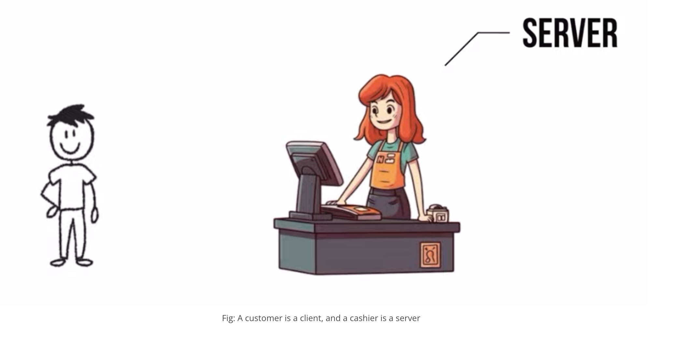
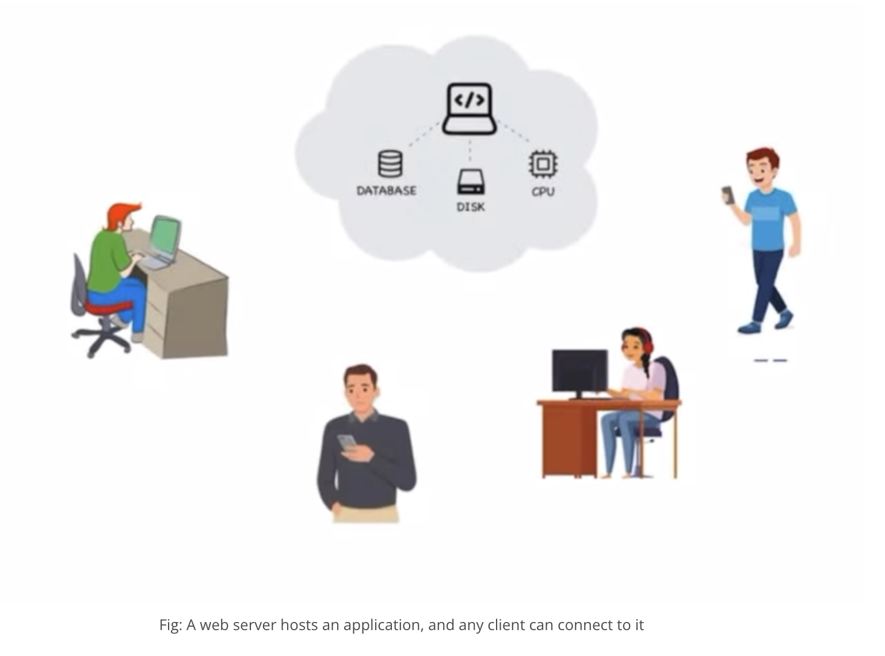
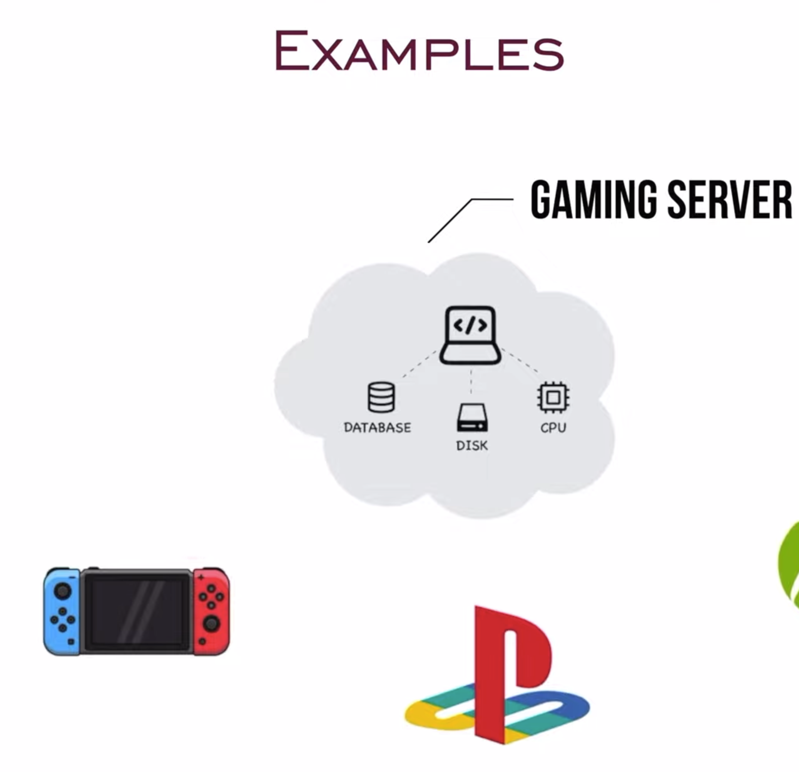
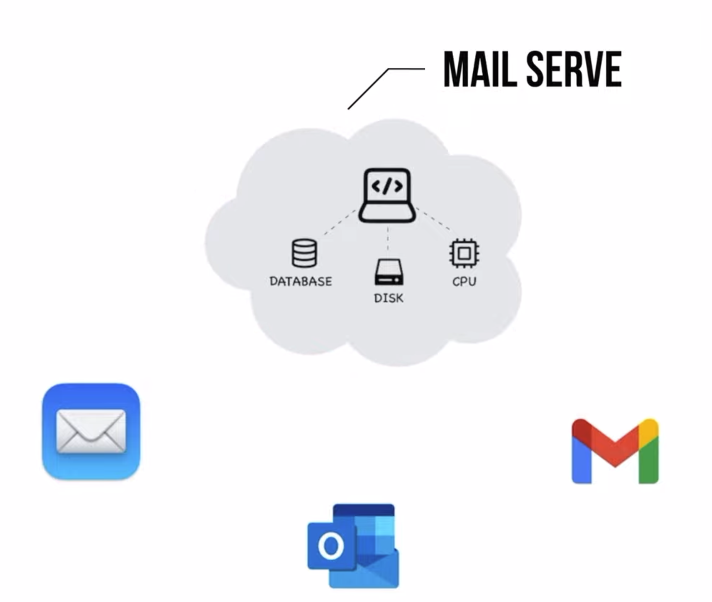
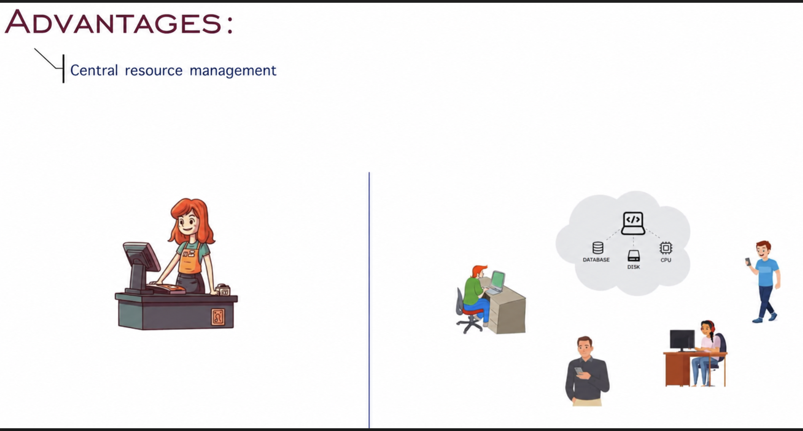
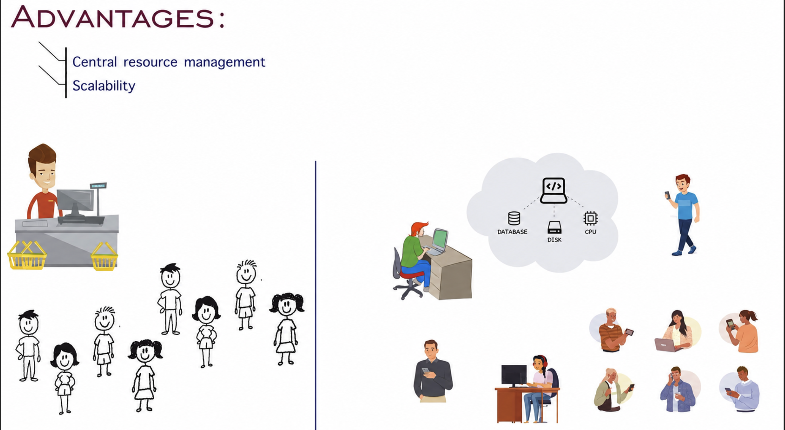
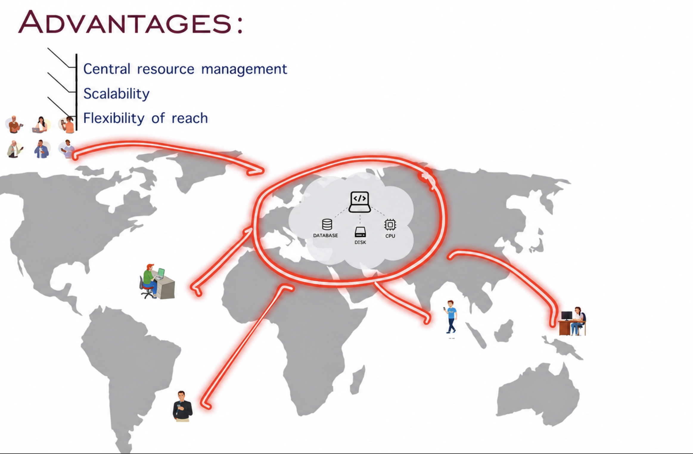
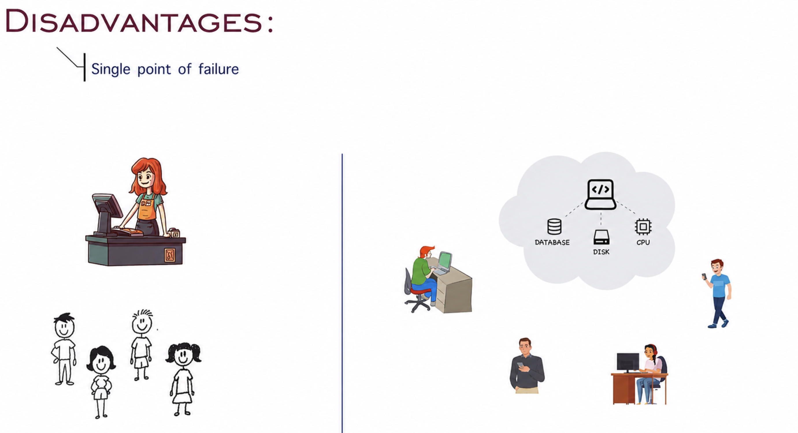
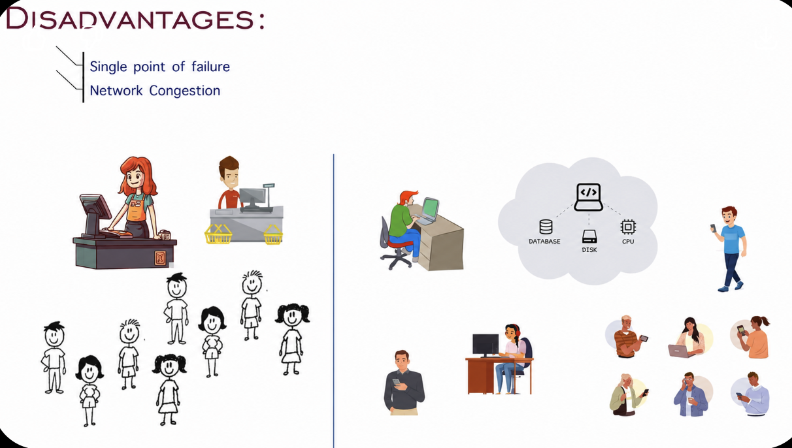
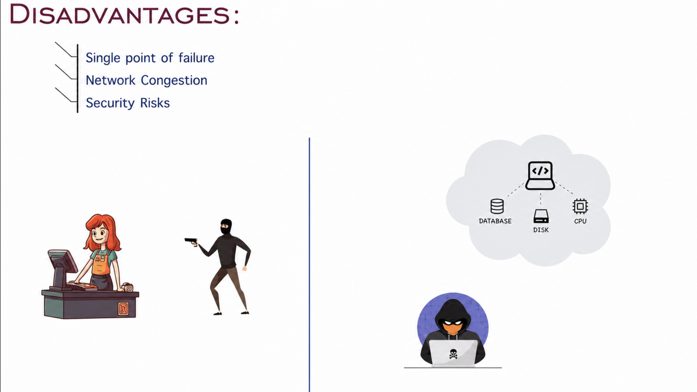

# Client-Server Model

## What is the Client-Server Model?

The Client-Server Model is a distributed application structure that partitions tasks or workloads between providers of a resource or service, called servers, and service requesters, called clients. Typically, clients and servers communicate over a network, making it possible for users to access services and resources remotely.

### Real-World Example

Imagine a bookstore where customers (clients) come to purchase books, and the cashier (server) processes their transactions. The customers do not need to know how the books are organized in the store or how the transactions are recorded; they just interact with the cashier to complete their purchases.

### How it Relates to Web Applications

In a web application, the client is usually a web browser or mobile app, and the server is a remote computer that hosts the application and database. The client sends requests to the server, which processes these requests and sends back the appropriate responses.

## Components of the Client-Server Model

### Client
- **Definition:** The client is a device or application that initiates a request for a service or resource.
- **Examples:** Web browsers, mobile apps, desktop applications.
- **Function:** Clients interact with users and send requests to servers on their behalf.

### Server
- **Definition:** The server is a device or application that provides resources or services to clients.
- **Examples:** Web servers, database servers, application servers.
- **Function:** Servers process client requests, perform necessary operations, and send back the requested data or service.

## Bookstore Example

In our bookstore example:

- **Client:** The customer who walks into the store and wants to buy a book. They request information or services, such as the price of a book or the total cost of their purchase.
- **Server:** The cashier who processes the customer's requests. The cashier looks up book prices, calculates totals, and completes the sale. The customer does not need to know the internal workings of the bookstore's inventory system; they only interact with the cashier to get what they need.

## Web Application Example

When you use your web browser to access a website:

- **Client:** Your web browser, which sends an HTTP request to the web server.
- **Server:** The web server, which processes the request, retrieves the necessary data from a database, and sends back the web page to your browser.

## Interaction Process

The interaction between a client and server can be broken down into the following steps:

1. **Request:** The client sends a request to the server for some resource or service.
2. **Processing:** The server processes the request. This may involve querying a database, performing computations, or interacting with other services.
3. **Response:** The server sends the requested resource or the result of the computation back to the client.

### Example: Bookstore Scenario

1. **Request:** A customer asks the cashier for the price of a specific book.
2. **Processing:** The cashier checks the price in the store's inventory system.
3. **Response:** The cashier tells the customer the price.

### Example: Web Application

1. **Request:** Your web browser requests a web page from a server.
2. **Processing:** The server retrieves the page from its storage and possibly performs some computations (like fetching user-specific data).
3. **Response:** The server sends the web page back to your browser.

## Real-World Examples

### Gaming Server

### Mail Server

## Advantages of the Client-Server Model

### 1. Centralization

Servers centralize the business logic, making it easier to maintain and update the system.

#### Central Resource Management

If we make changes at the centralized system, it will be reflected to all the clients:

### 2. Scalability

Clients can be easily added or removed without significantly affecting the server.

If more customers come:

### 3. Flexibility to Reach

### 4. Security

Servers can enforce security policies and control access to resources.

## Disadvantages of the Client-Server Model

### 1. Single Point of Failure

If the salesman is absent or if the service is down, the entire system becomes unavailable.

**Solution:** Implement backup devices or backup personnel.

### 2. Network Congestion

If more people connect to the system, the application will be slow.

**Solution:** Deploy the application in more places (distributed architecture).

### 3. Security Risks

Centralized systems can be targets for security attacks.

**Solution:** Implement robust security protocols and measures.

