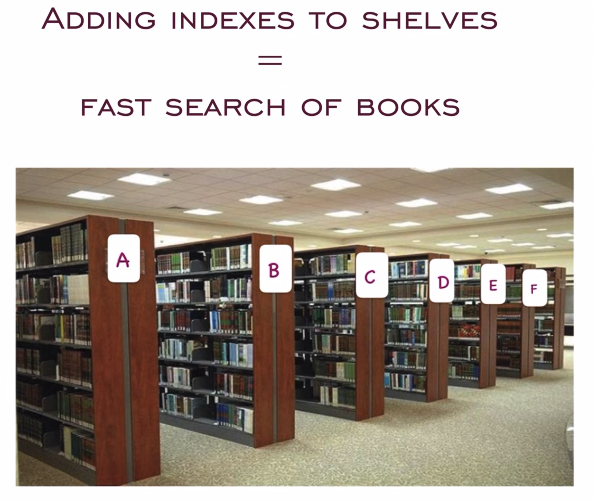
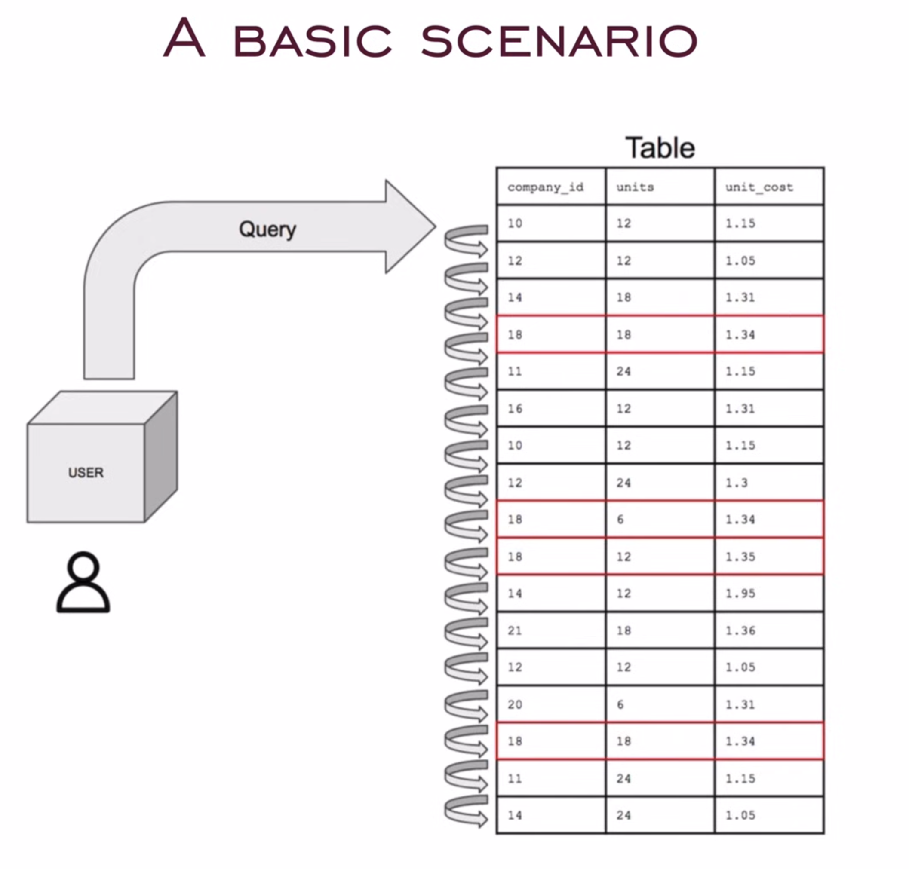
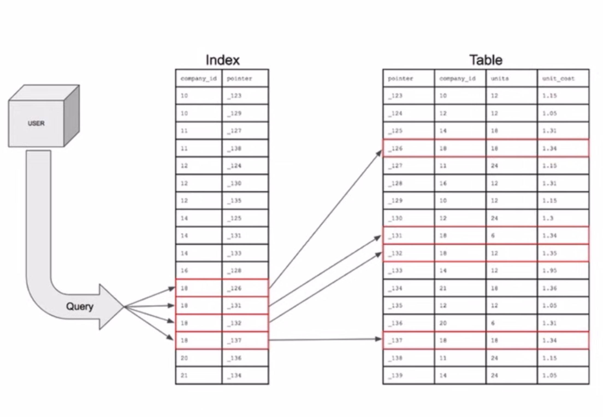
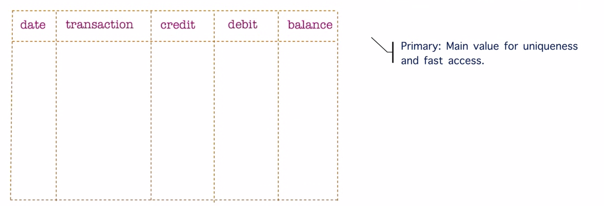
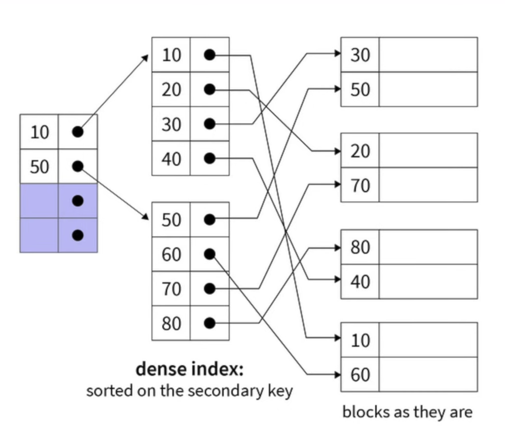
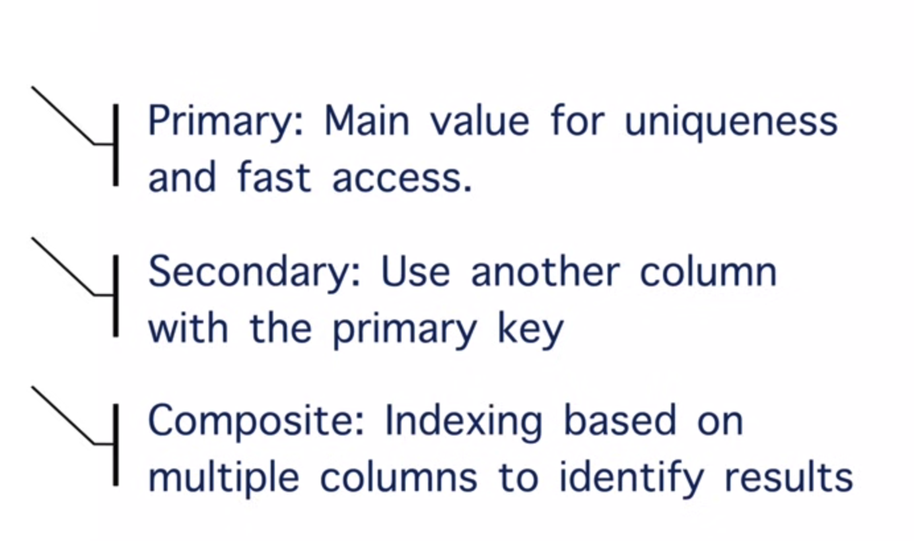
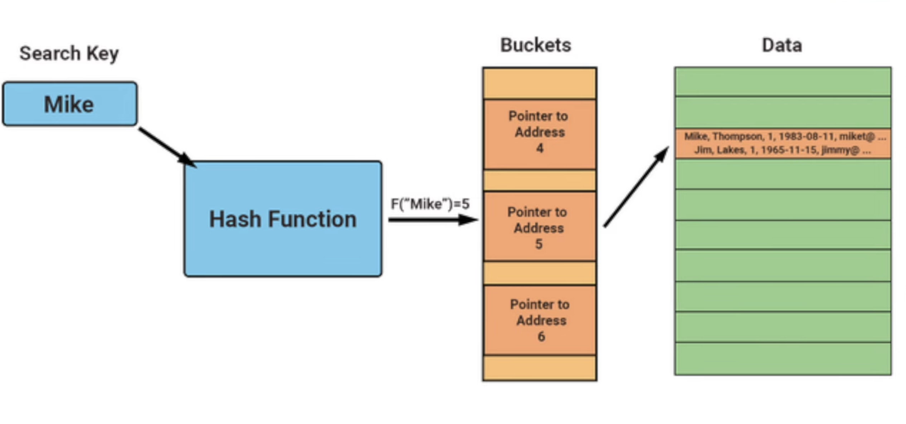
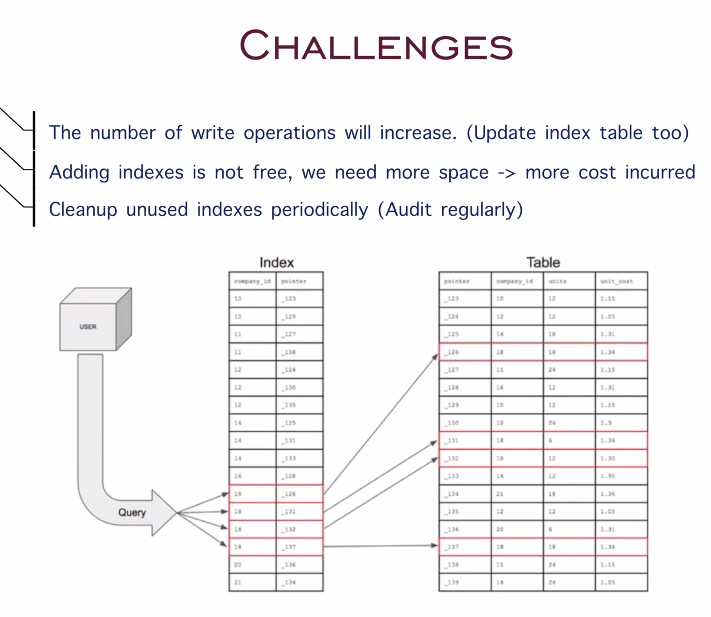

# Part 7: Database Indexing

## What is Indexing?

Indexing is like creating a shortcut for finding the right data quickly. Instead of scanning the entire database, the index helps you jump directly to the location of the data you need, improving the performance of your queries.

---

## Real-World Example

Let's go back to our bookstore analogy. Imagine you want to find a particular book in a large bookstore. Instead of going through every single shelf, you check the index of book categories at the store's entrance. This index tells you exactly which aisle to head to for a particular genre or author, saving you time. The bookstore's index improves efficiency and helps customers find their desired books faster.

### Bookstore without an index

### Bookstore with an index

---

## A Basic Scenario

Without indexing, you need to scan line by line for every query.

### Index Table

An index table acts like a Map to store the memory address:

The indexing is implemented by **B-trees** — all of the values smaller than a node will reside on the left side, and the others on the right side.

---

## Actual Example in a Book

Another familiar example of indexing is in the back of a physical book. The index section lists important terms, topics, or names and provides the exact page numbers where you can find them. Instead of flipping through the entire book, you refer to the index, which quickly directs you to the right page.

---

## Types of Indexes in Databases

In databases, there are several types of indexes that help structure and optimize data retrieval.

### 1. Primary Index

The system creates a primary index on the **primary key** of a table, which uniquely identifies each record.

> The primary index can be a date.

### 2. Secondary Index

A secondary index is created on **non-primary key columns**, allowing you to search based on fields other than the primary key.

### 3. Composite Index

A composite index is an index that involves **multiple columns**. It's useful when you need to search for data based on multiple attributes.

**Example:** Filtering Amazon products

### 4. Hash Index

A hash index uses a **hash function** to convert the index values into a specific address in memory. This type of index is very efficient for equality searches but less effective for range-based queries.

---

## Challenges of Indexing

While indexing improves query performance, it also introduces a few challenges that need to be considered in system design.

- **Extra Write Operations:**
  Every time you insert, update, or delete data, the corresponding index also needs to be updated. This can add overhead to write operations, making them slower.

- **Unused Indexes:**
  Over time, certain indexes may become unused, yet they still consume storage and processing power. Regular auditing is required to identify and remove such indexes.

- **Complexity of Managing Indexes:**
  As the number of indexes grows, the database becomes harder to manage. Too many indexes can slow down the system, as every write operation needs to update all relevant indexes.

