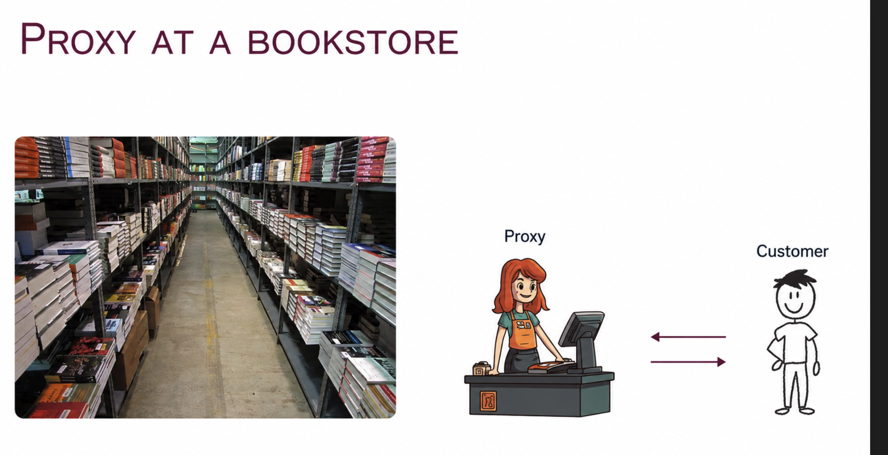
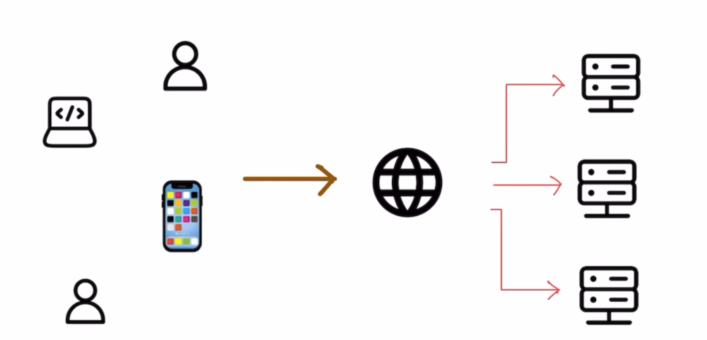
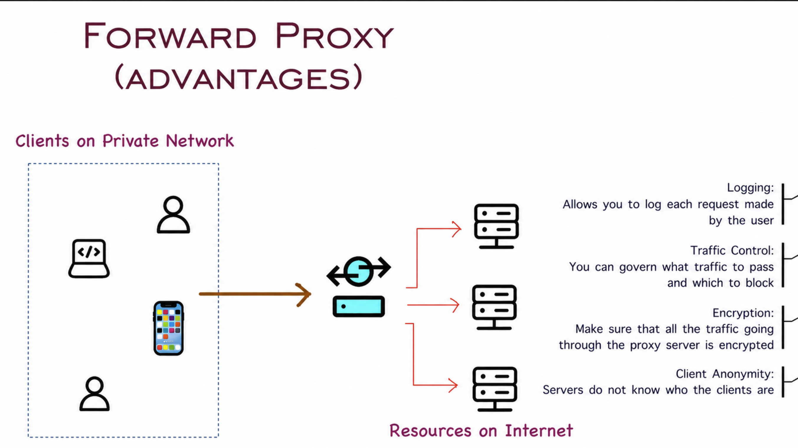
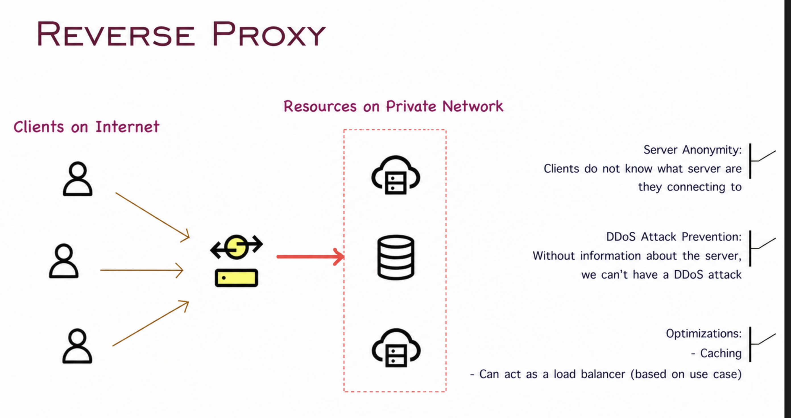

# Part 8: Proxy

## What is a Proxy?

A proxy is essentially an intermediary that sits between a client and a server, forwarding requests and responses between the two. It can be used for various purposes such as load balancing, security, caching, and more.

---

## Real-World Example

Imagine a bookstore where some books are stored in the main shop, and others are kept in a warehouse. As a customer, you don't have direct access to the warehouse. Instead, when you request a book that isn't on the shelves, a staff member (the intermediary) goes to the warehouse, retrieves the book, and hands it to you. This staff member acts as a proxy between you (the client) and the warehouse (the server), ensuring that the system fulfills the request efficiently without you needing to navigate through the entire storage facility.

---

## How a Typical Connection Works Without a Proxy

Without a proxy, the client (the person requesting the book) establishes a direct connection with the server (the warehouse or the server hosting a website). While this setup works, it comes with a few limitations:

- **Efficiency:** Each client interacts directly with the server, potentially overwhelming the server with requests.
- **Security:** Exposing the server directly to the client may lead to security vulnerabilities, as the server's IP address is publicly visible.
- **Scalability:** As more clients make requests, the server may struggle to handle all the traffic, causing slowdowns.

In a real-world scenario, imagine if every customer at the bookstore had direct access to the warehouse. It would lead to chaos, with people wandering around, possibly damaging items or getting lost, and creating bottlenecks.

### A Typical Connection

---

## Forward Proxy: Acting on Behalf of the Client

A forward proxy sits between the client and the server, forwarding the client's requests to the server and returning the server's responses to the client. It essentially acts on behalf of the client, masking the client's identity from the server.

### Benefits of Forward Proxy

- **Privacy & Anonymity:** The forward proxy hides the client's identity. This is useful for privacy, as the server won't know who exactly is making the request.
  - *Example:* When you browse the internet using a proxy, websites won't see your IP address. Instead, they will see the proxy's IP.

- **Content Filtering & Caching:** The proxy can filter requests, blocking access to certain content or caching frequently requested items, reducing load times.
  - *Example:* In a bookstore, the staff member (proxy) could know that certain books are in high demand and retrieve them in advance, ensuring faster service.

- **Security:** Forward proxies can add an extra layer of security, protecting clients from malicious servers by filtering harmful content.

---

## Reverse Proxy: Acting on Behalf of the Server

A reverse proxy sits in front of the server, intercepting client requests and forwarding them to the appropriate server. It acts on behalf of the server, masking the server's identity from the client.

### Benefits of Reverse Proxy

- **Load Balancing:** It can distribute incoming requests across multiple servers to prevent any single server from being overloaded.
- **Security:** Reverse proxies mask the identity of the server, adding a layer of protection. Clients never know the true IP address of the server, reducing the risk of direct attacks.
- **SSL Termination:** Reverse proxies can handle encryption and decryption for SSL (HTTPS) traffic, reducing the load on the backend servers.
- **Working from Home Example:** When you work from home, you often connect to your company's network through a reverse proxy. This routes your requests to the correct server within the company's internal network, ensuring that your communication is secure and that external users can't directly access the company's servers.

---

## Challenges of Using Proxies

While proxies provide numerous benefits, they also introduce some challenges:

- **Latency:** Adding a proxy introduces an additional step in the communication process. This can lead to increased latency if not optimized properly.
- **Single Point of Failure:** If the proxy goes down, it can bring the entire system to a halt, as both clients and servers depend on it to relay messages.
- **Complex Configuration:** Proxies can add complexity to the overall system design, requiring careful configuration and maintenance.
