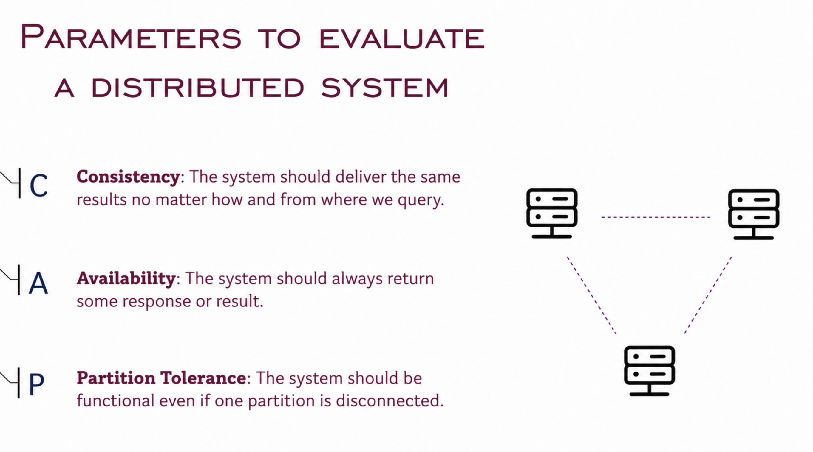
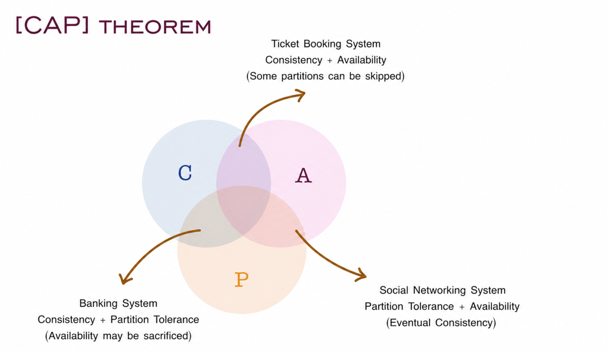

# CAP Theorem

The CAP theorem states that a distributed system can only guarantee **two out of three** of the following properties at the same time:

---

## The Three Properties

- **Consistency:**
  The system should deliver the same results no matter how and from where we query.

- **Availability:**
  The system should always return some response or result.

- **Partition Tolerance:**
  The system should be functional even if one partition is disconnected.

---

## CAP Theorem

