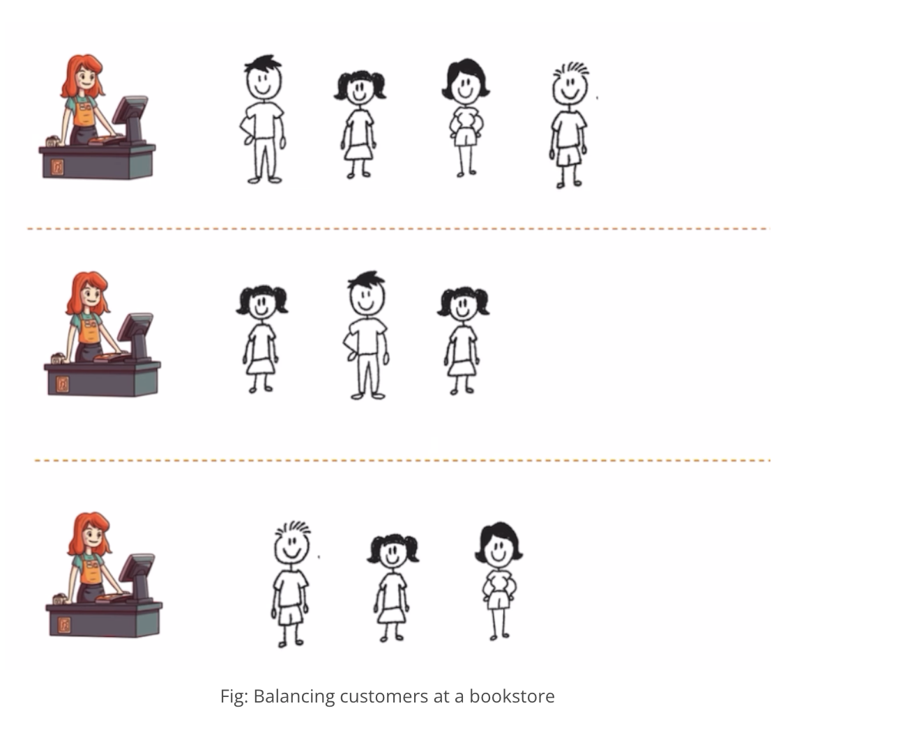
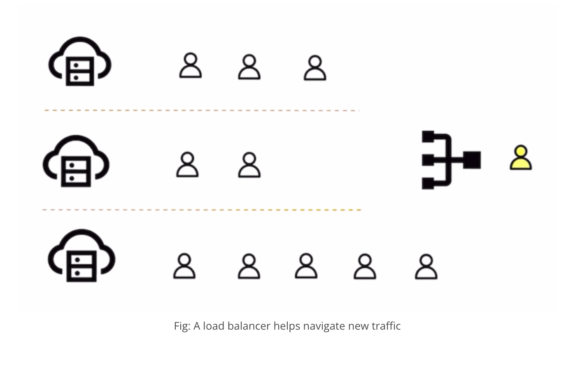
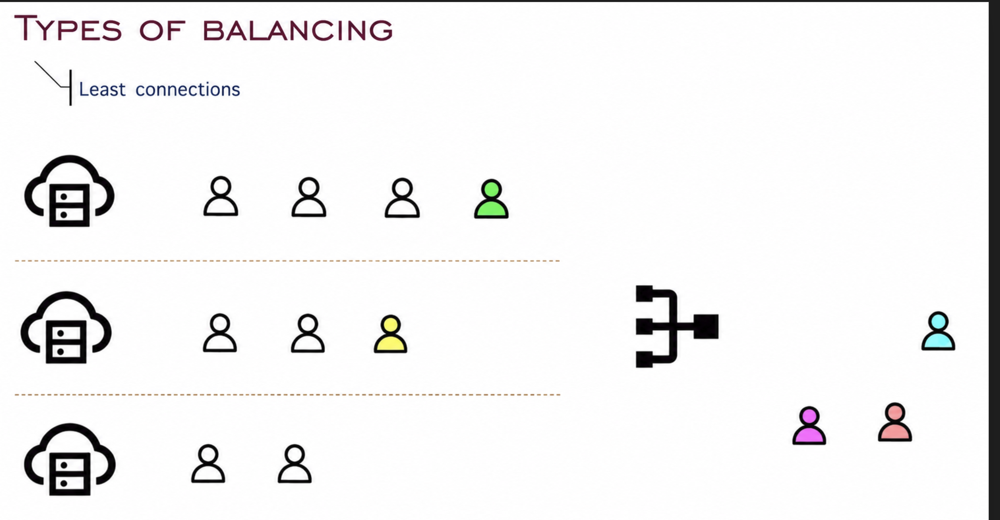
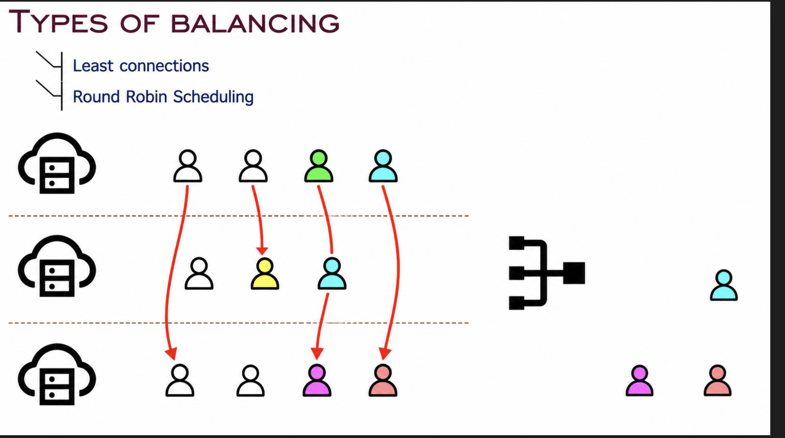
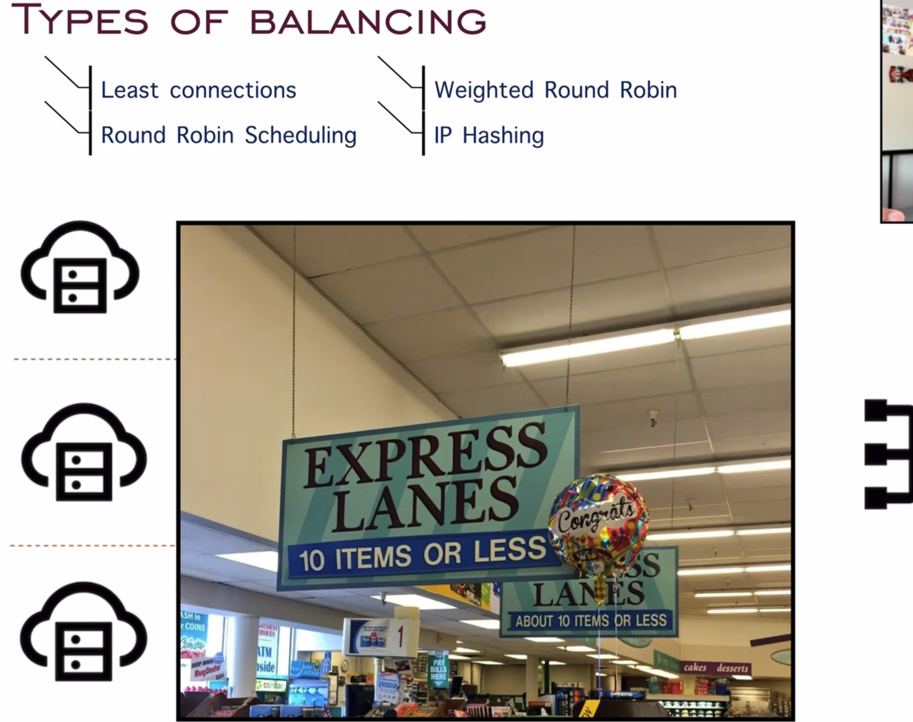
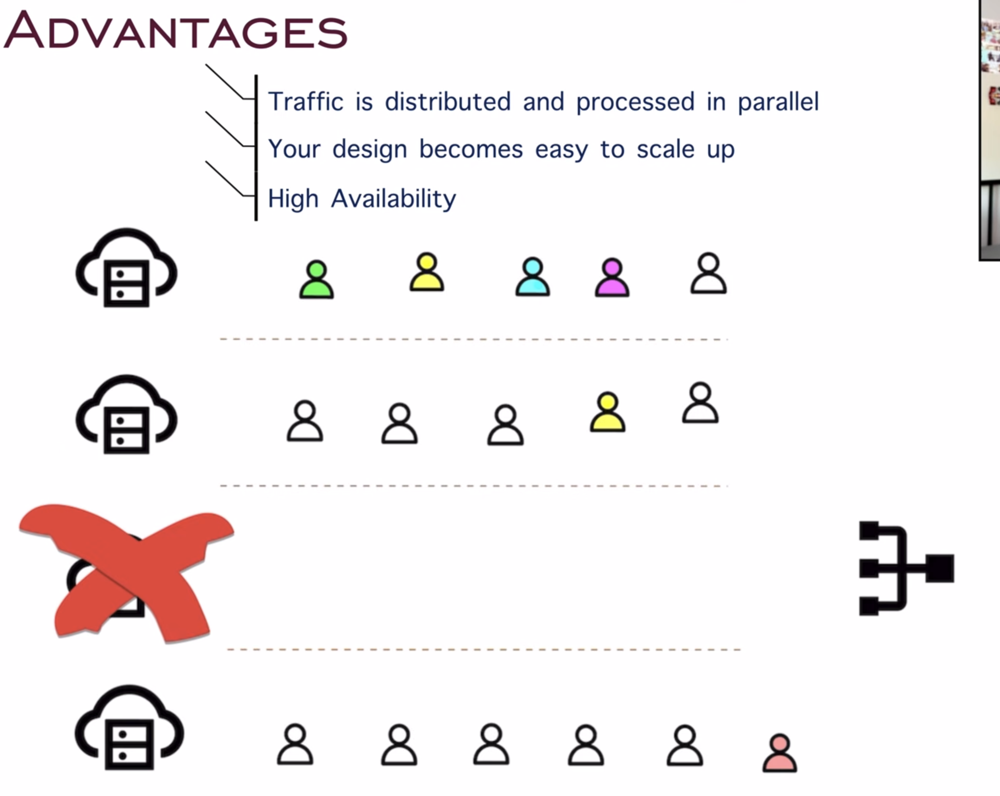
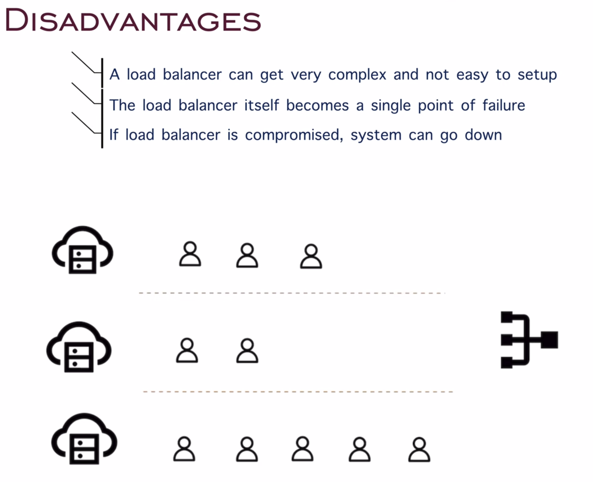

# Load Balancing

## What is a Load Balancer?

A Load Balancer is a device or software that distributes incoming network traffic across multiple servers. The goal is to ensure that no single server becomes overwhelmed, thus improving the performance and reliability of the application.

### Real-World Example

Imagine our bookstore experiencing a surge of customers during a holiday sale. If only one cashier is available, the line will grow long, and customers will become frustrated. To handle the increased load, we could add more cashiers and distribute customers evenly among them. This way, no single cashier is overwhelmed, and customers are served more efficiently.

### How it Relates to Web Applications

In a web application, a load balancer distributes incoming requests across multiple servers. This ensures that no single server handles too many requests, which could slow down the application or cause it to crash. By distributing the load, the application remains responsive and reliable.

## Load Balancing Algorithms

Load balancers use various algorithms to decide how to distribute incoming traffic:

### 1. Least Connections

- **Definition:** Directs traffic to the server with the fewest active connections.
- **Pros:** Balances load more efficiently, especially with varying server capacities.
- **Cons:** Can lead to uneven distribution if not managed properly.

### 2. Round Robin

- **Definition:** Distributes requests sequentially across servers.
- **Pros:** Simple and effective for equally powerful servers.
- **Cons:** Does not account for server load or capacity.

**Note on Round Robin Limitations:**

If there are small tasks for the user at the front (e.g., downloading small files), in the round robin method, the users will be allocated to other servers which is not efficient. The algorithm doesn't consider the current load or task complexity.

### 3. Weighted Round Robin

- **Definition:** We rely on the server capacity and assign the clients accordingly; otherwise, we follow the round robin method.
- **Pros:** Takes server capacity into account, allowing more powerful servers to handle more requests.
- **Cons:** Requires proper configuration and knowledge of server capacities.

This algorithm distributes traffic based on server weights, allowing more powerful servers to receive a proportionally higher number of requests.

### 4. IP Hash

- **Definition:** Distributes requests based on the client's IP address.
- **Pros:** Ensures that requests from the same client go to the same server (session persistence).
- **Cons:** Can cause uneven load distribution if client requests are not evenly distributed.

**Real-World Example:**

Consider streaming services like Hotstar with different subscription tiers:
- **Free version users:** Standard servers
- **Premium users:** Dedicated servers with better performance

The IP Hash method can help route premium users to their dedicated servers based on their account/IP mapping.

## Advantages of Load Balancing

### Key Benefits:

1. **Improved Performance:** Distributes workload evenly, preventing any single server from becoming a bottleneck.

2. **High Availability:** If one server fails, the load balancer redirects traffic to other healthy servers.

3. **Scalability:** Easy to add or remove servers based on demand without affecting the application.

4. **Flexibility:** Supports maintenance and updates by taking servers offline without disrupting service.

5. **Better Resource Utilization:** Ensures all servers are used efficiently, maximizing infrastructure investment.

## Disadvantages of Load Balancing

### Key Challenges:

1. **Additional Complexity:** Adds another layer to the infrastructure that needs to be configured and managed.

2. **Single Point of Failure:** The load balancer itself can become a single point of failure if not properly configured with redundancy.

3. **Cost:** Hardware load balancers can be expensive; even software solutions require resources and maintenance.

4. **Session Persistence:** Some applications require requests from the same client to go to the same server, which can complicate load distribution.

5. **Configuration Overhead:** Requires proper tuning and monitoring to work effectively.
