# What is Caching?

Caching is a technique where systems store frequently accessed data in a temporary storage area, known as a **cache**, to quickly serve future requests for the same data. This temporary storage is typically faster than accessing the original data source, making it ideal for improving system performance.

## Real-World Example

In our bookstore example, think of the "Bestseller" section near the entrance. This section contains the most popular books that customers frequently ask for. Instead of having customers search through the entire store, they can easily find bestsellers in one convenient location. By keeping these popular books readily available, the store improves customer satisfaction and speeds up the shopping process.

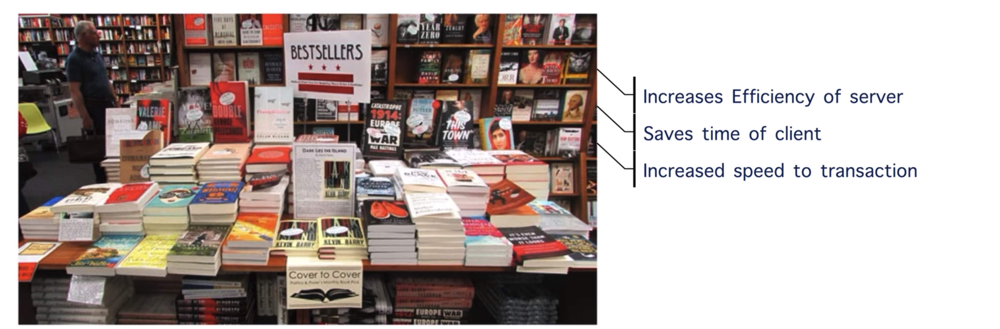

> RAM is a kind of memory — if we increase the RAM, the speed will be increased and performance will be improved, but should not increase it too large.

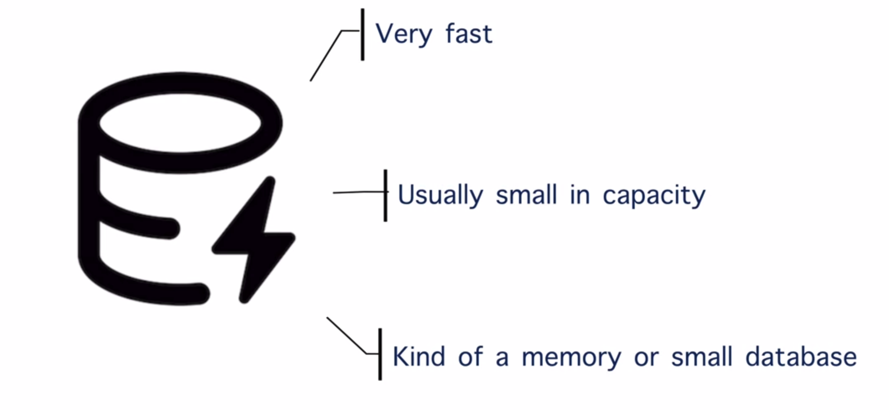

---

## How it Relates to Web Applications

In a web application, caching works similarly by storing frequently accessed data (like user profiles or product listings) in a cache memory. When a user requests this data, the application first checks the cache:

- **Cache Hit** — If the system finds the data, it returns the data quickly, avoiding slower operations like database queries.
- **Cache Miss** — If the system doesn't find the data, it retrieves the data from the database, stores it in the cache for future use, and then returns it to the user.

### If client asks for the breaking news:

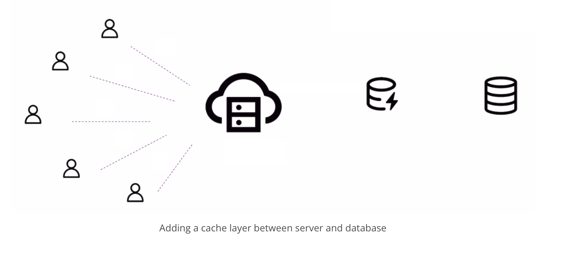

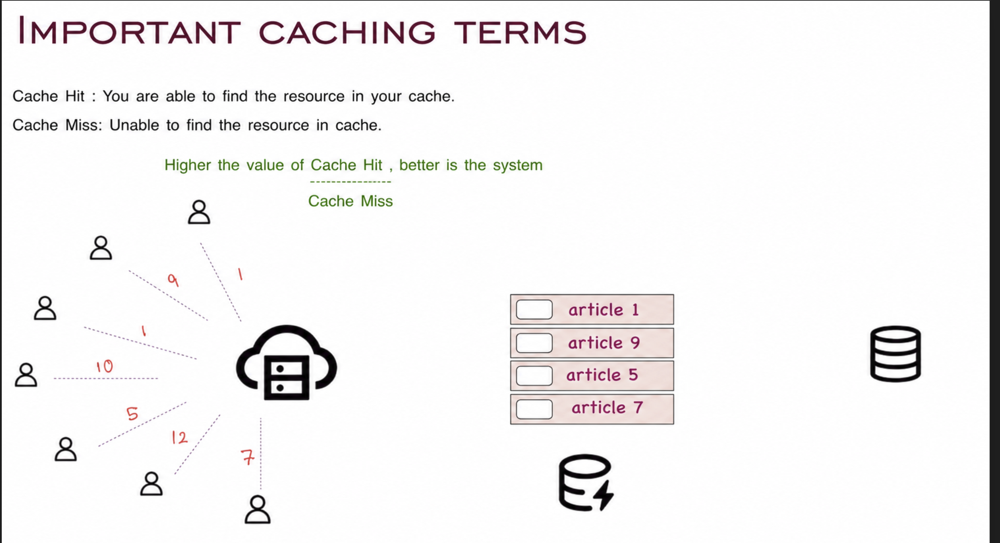

### If there is a breaking news: remove article 5

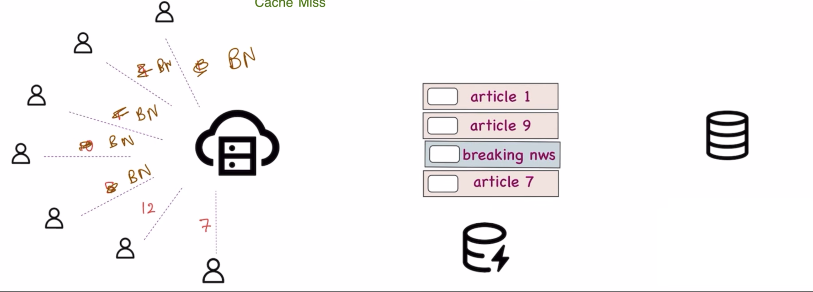

---

## Cache Eviction Methods

### 1) Random Eviction

Randomly removing the articles in the cache.

- **Definition:** Randomly selects and removes items from the cache to make space.
- **Pros:** Simple to implement.
- **Cons:** Not efficient, as important data might be evicted.

### 2) FIFO — First In First Out

- **Definition:** Evicts the oldest items (those that entered the cache first).
- **Pros:** Easy to understand and implement.
- **Cons:** May remove frequently accessed data that entered the cache early.

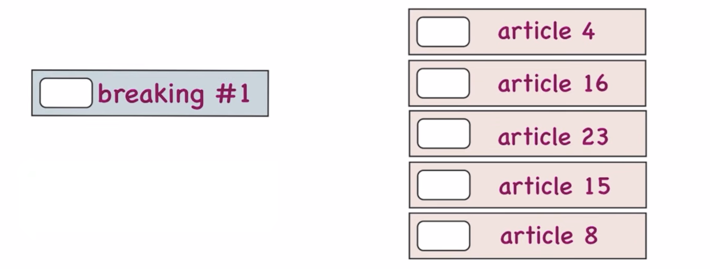 → 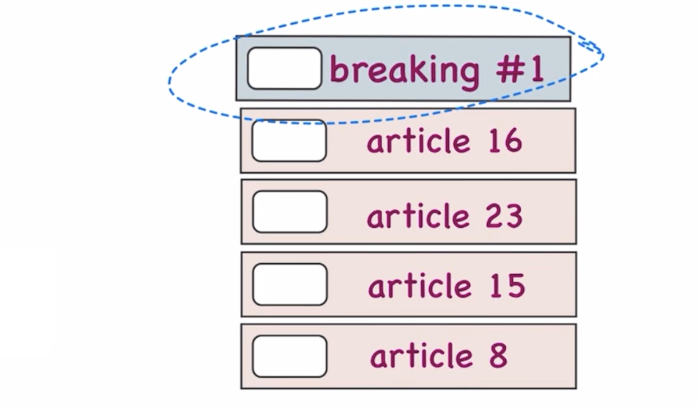 → 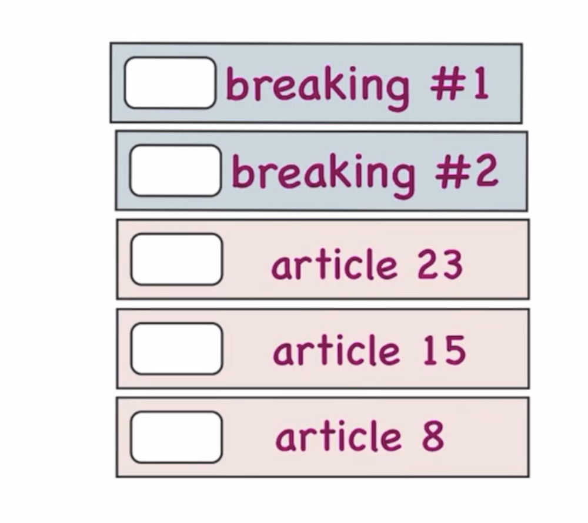

### 3) LFU — Least Frequently Used

- **Definition:** Evicts the items accessed the least number of times.
- **Pros:** Keeps frequently accessed data in the cache.
- **Cons:** Requires tracking access frequency, which can add overhead.

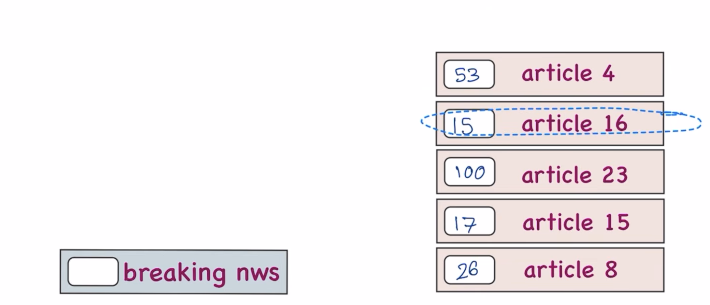 → 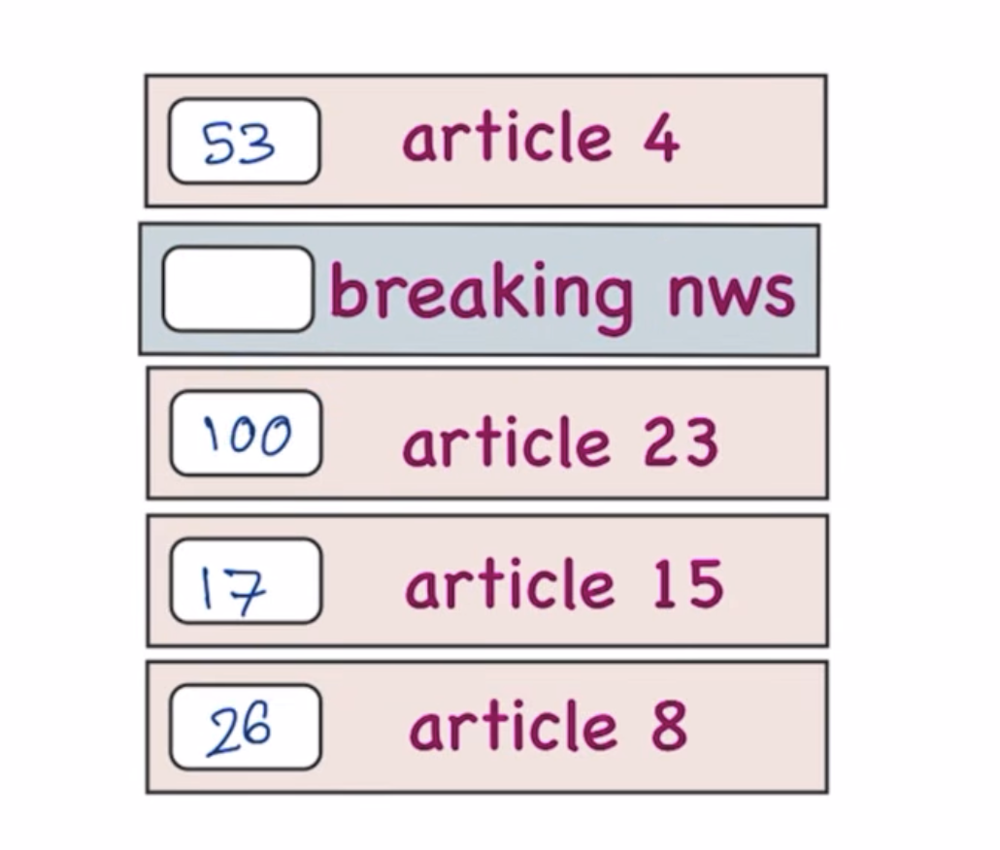

### 4) LRU — Least Recently Used

- **Definition:** Evicts the items that have not been accessed for the longest time.
- **Pros:** Balances recency and frequency, commonly used and effective.
- **Cons:** Requires tracking the access order, which can add complexity.

---

## Things to Be Careful About

> If an article is updated in the DB, update it in the cache also — otherwise it will be a problem.

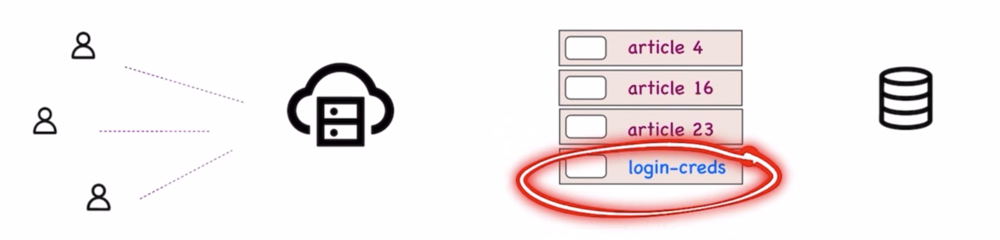

1. **Consistency of Resources** — Cached data must stay in sync with the source of truth.
2. **Coherence** — If the server is deployed in multiple places, and the cache is also present there, all caches should remain the same.
3. **Security** — Sessions and credentials should be cached with caution.

---

## Challenges of Caching

While caching offers significant performance benefits, it also comes with challenges:

| Challenge | Description |
|---|---|
| **Staleness** | Cached data can become outdated if the underlying data changes. Managing cache consistency and ensuring that users see the most recent data is crucial. |
| **Overhead** | Caching requires memory and processing power. Choosing what to cache and managing the cache efficiently is critical to avoid excessive resource consumption. |
| **Consistency** | Maintaining consistency between cached data and the original data source is essential, especially in distributed systems that involve multiple caches. |

### Example Challenges in Bookstore

- **Staleness:** A bestseller is no longer popular, but it still takes up space in the front section.
- **Overhead:** Deciding how much space to allocate for the bestseller section without cluttering the store.
- **Consistency:** Ensuring that the bestseller section is updated regularly with the most popular books.

### Example Challenges in Web Applications

- **Staleness:** Showing outdated product prices or information due to stale cache data.
- **Overhead:** Allocating sufficient memory for caching without impacting the overall system performance.
- **Consistency:** Keeping cached user data in sync with the database to avoid showing incorrect information.
