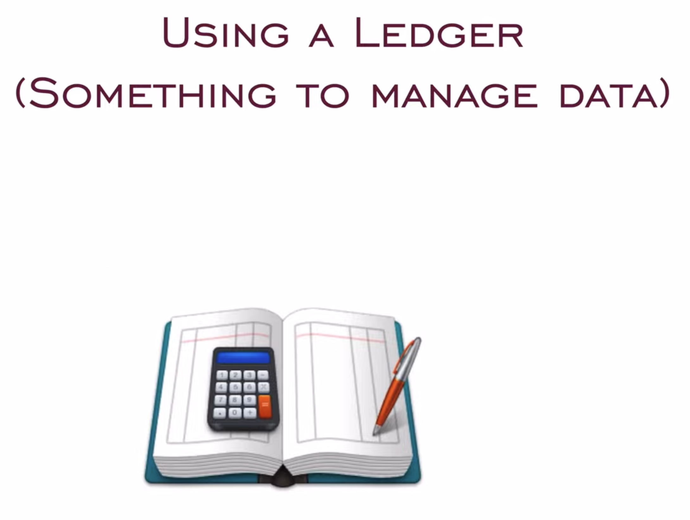
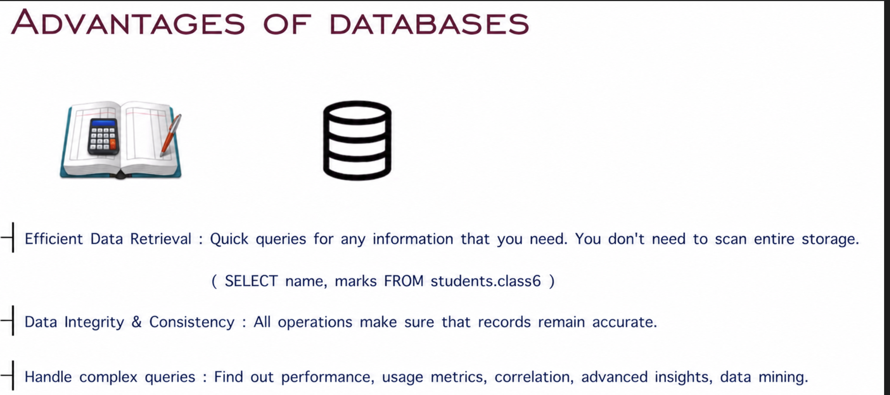
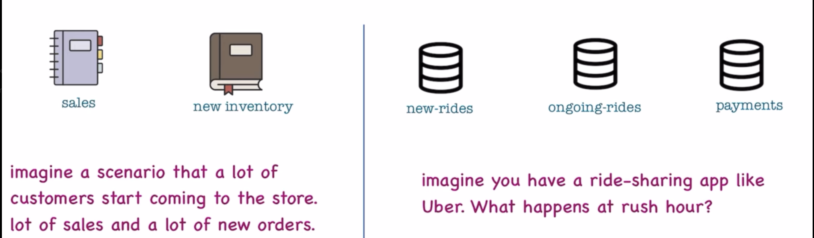
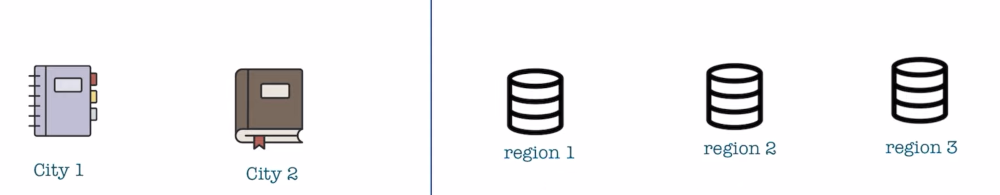
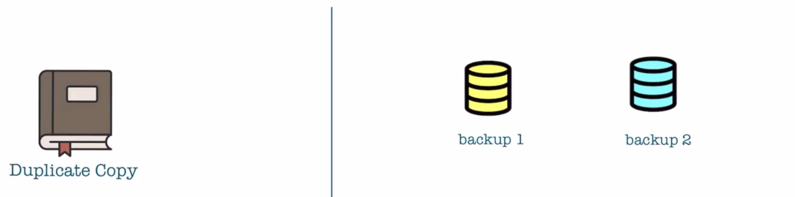
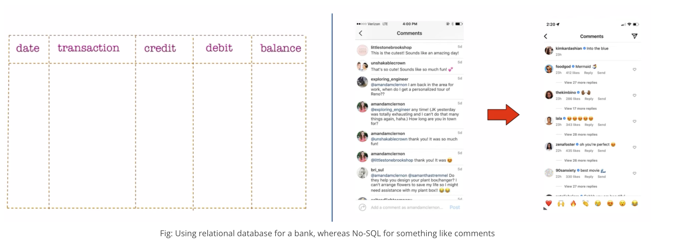

# Database

## Introduction

Looking at our bookstore again:

As the books increase, how can we store all the information of the books? Using a **Ledger** (something to manage data).

In our bookstore example, think of a database as the ledger where the system records all book transactions. This ledger keeps track of the inventory, sales, customer details, and more. Every time a book is sold, the system makes a new entry, updates the stock, and records the sale. This helps the bookstore maintain an accurate record of all its operations.

---

## How it Relates to Web Applications

In a web application, a database works similarly by storing user data, product information, transaction records, etc. It ensures that all the data is available, organized, and retrievable whenever needed. For example, an online bookstore might use a database to store information about books, authors, customers, orders, and payments.

---

## Advantages of Using a Database

### 1. Efficient Data Retrieval

Databases are designed to retrieve data quickly and efficiently. By using indexing and optimized query languages, databases can fetch the required data without scanning the entire dataset, saving time and resources.

> **Bookstore Example:** Quickly finding the details of a particular book, such as its price, author, or stock availability, without going through the entire ledger.

### 2. Data Integrity

Databases ensure that the data is accurate and consistent. Integrity constraints prevent incorrect or inconsistent data from being entered.

> **Bookstore Example:** Ensuring that the number of books sold does not exceed the available stock.

### 3. Handling Complex Queries

Databases can handle complex queries that involve multiple tables and relationships. They allow for data aggregation, filtering, sorting, and joining, making it possible to analyze and extract meaningful insights from the data.

> **Bookstore Example:** Generating a sales report for a particular genre or author over a specific time period.

---

## Challenges of Using Databases

### 1. Scalability

As the amount of data grows, scaling a database can become challenging. Databases must be designed to handle increasing loads without compromising performance.

### 2. Consistency

Maintaining consistency across distributed databases can be difficult. When the system replicates data across multiple locations, ensuring that all copies are updated simultaneously becomes challenging.

### 3. Availability

Ensuring that the database is always available and operational is crucial. Downtime can lead to lost sales and a poor user experience.

---

## SQL vs. NoSQL Databases

Databases come in various types, but the two primary categories are **SQL** and **NoSQL** databases. Each has its strengths and use cases, depending on the nature of the data and the application's requirements.

### SQL Databases (Relational Databases)

- **Definition:** SQL databases use structured query language (SQL) to define and manipulate data. They are relational, meaning the system stores data in tables with predefined schemas and establishes relationships between tables using foreign keys.
- **Examples:** MySQL, PostgreSQL, Oracle, SQL Server.
- **Use Case:** Ideal for structured data with clear relationships. They ensure data integrity and support complex transactions.
- **Real-World Example:** Think of SQL databases like a detailed bank statement. The system records every transaction in a structured format, with specific fields for date, description, amount, and balance. The system highly organizes the data and easily queries it to provide insights such as total monthly expenses or specific transaction details.

### NoSQL Databases (Non-Relational Databases)

- **Definition:** NoSQL databases handle unstructured data. They do not use a fixed schema, making them flexible and scalable. The system stores the data in formats like key-value pairs, documents, graphs, or wide-column stores.
- **Examples:** MongoDB, Cassandra, DynamoDB, Couchbase.
- **Use Case:** Ideal for large volumes of unstructured or semi-structured data. They are often used in applications that require high scalability and fast data retrieval.
- **Real-World Example:** Imagine a NoSQL database as the comment section on Instagram. Comments vary widely in content and structure (text, images, emojis), and the system needs to quickly retrieve and display them to users without predefined schemas or relationships.

### Comparison Table: SQL vs. NoSQL

| Feature | SQL Databases | NoSQL Databases |
|---|---|---|
| **Data Model** | Relational (tables, rows, columns) | Non-relational (key-value, documents) |
| **Schema** | Fixed schema | Dynamic schema |
| **Scalability** | Vertical scaling (adding more power) | Horizontal scaling (adding more nodes) |
| **Use Case** | Structured data, complex queries | Unstructured data, scalability needs |
| **Examples** | MySQL, PostgreSQL | MongoDB, DynamoDB |
| **Real-World Example** | Bank statement (structured records) | Instagram comments (unstructured data) |
