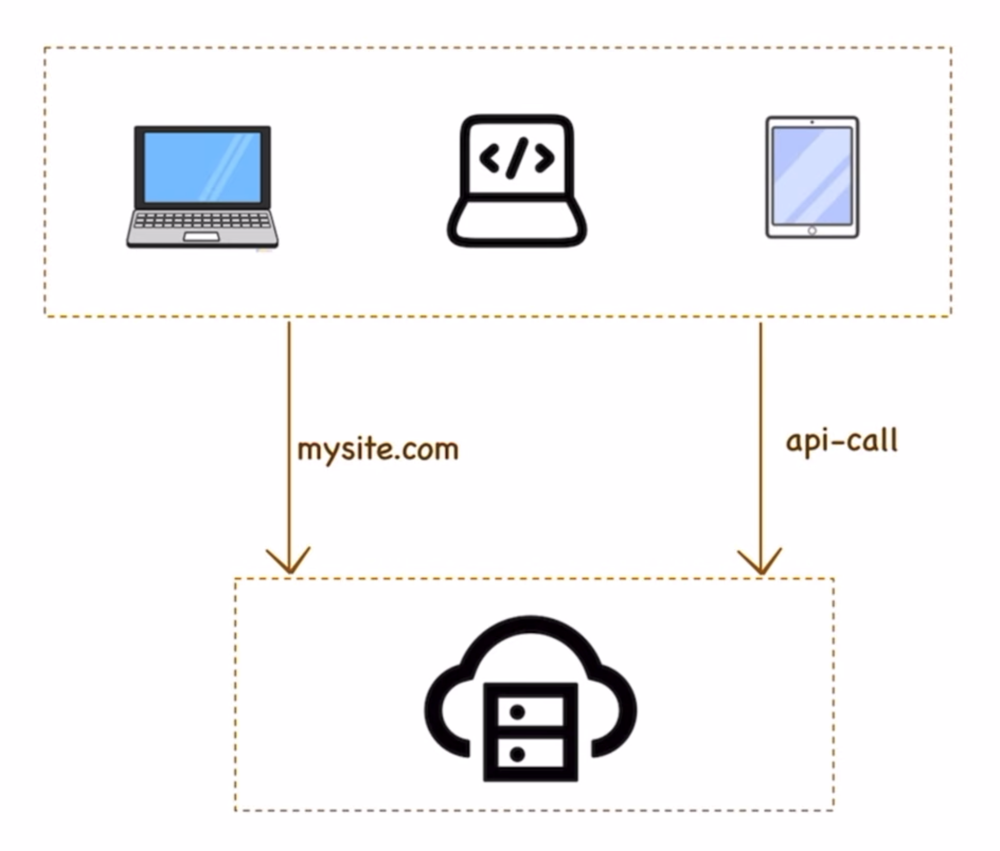
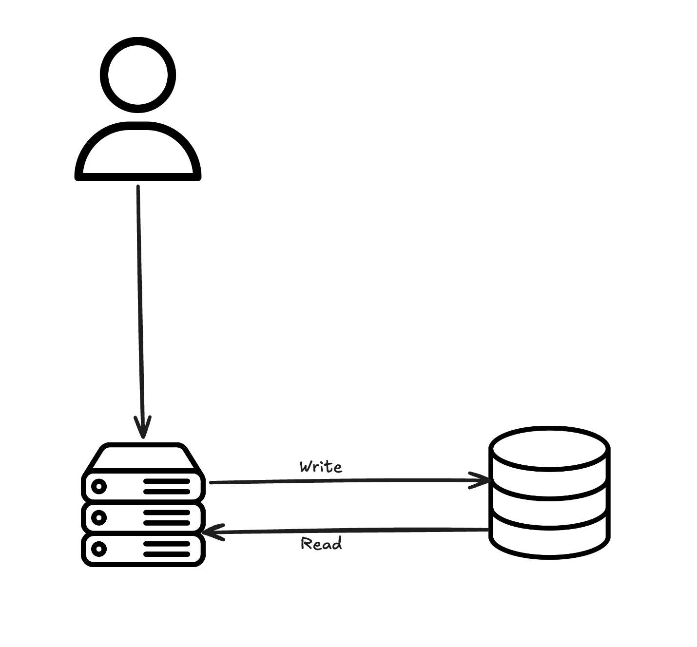
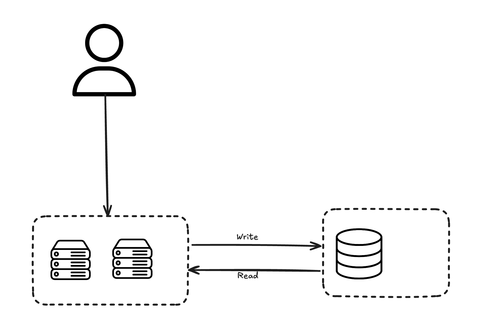
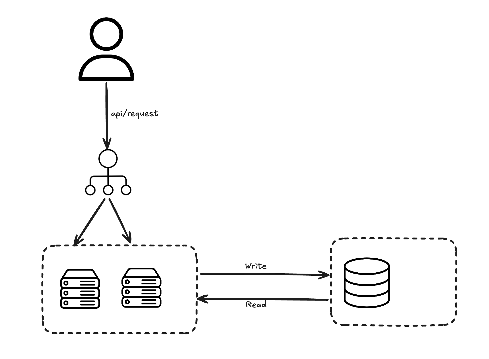
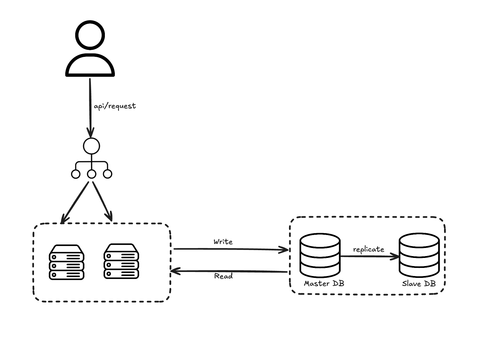
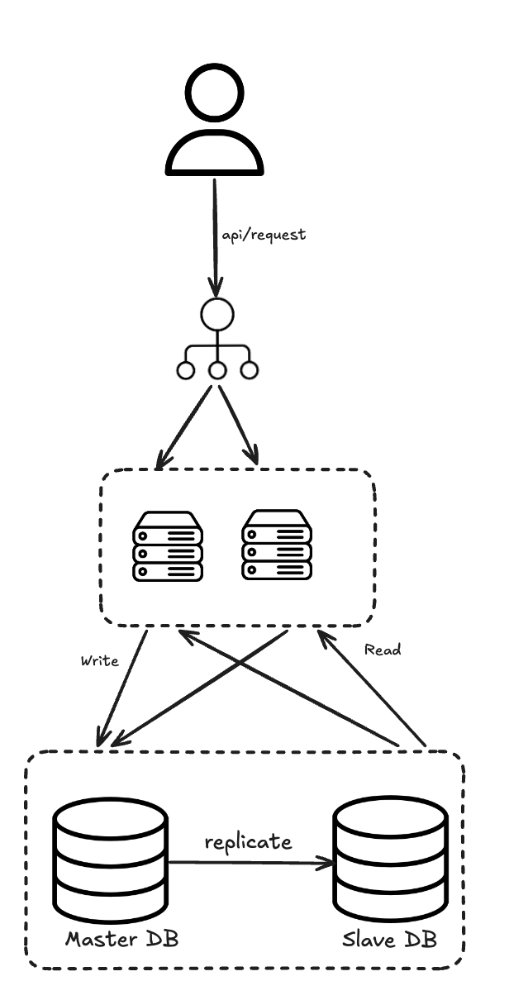
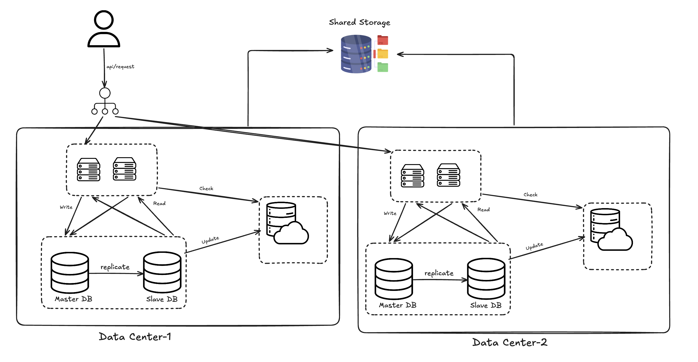
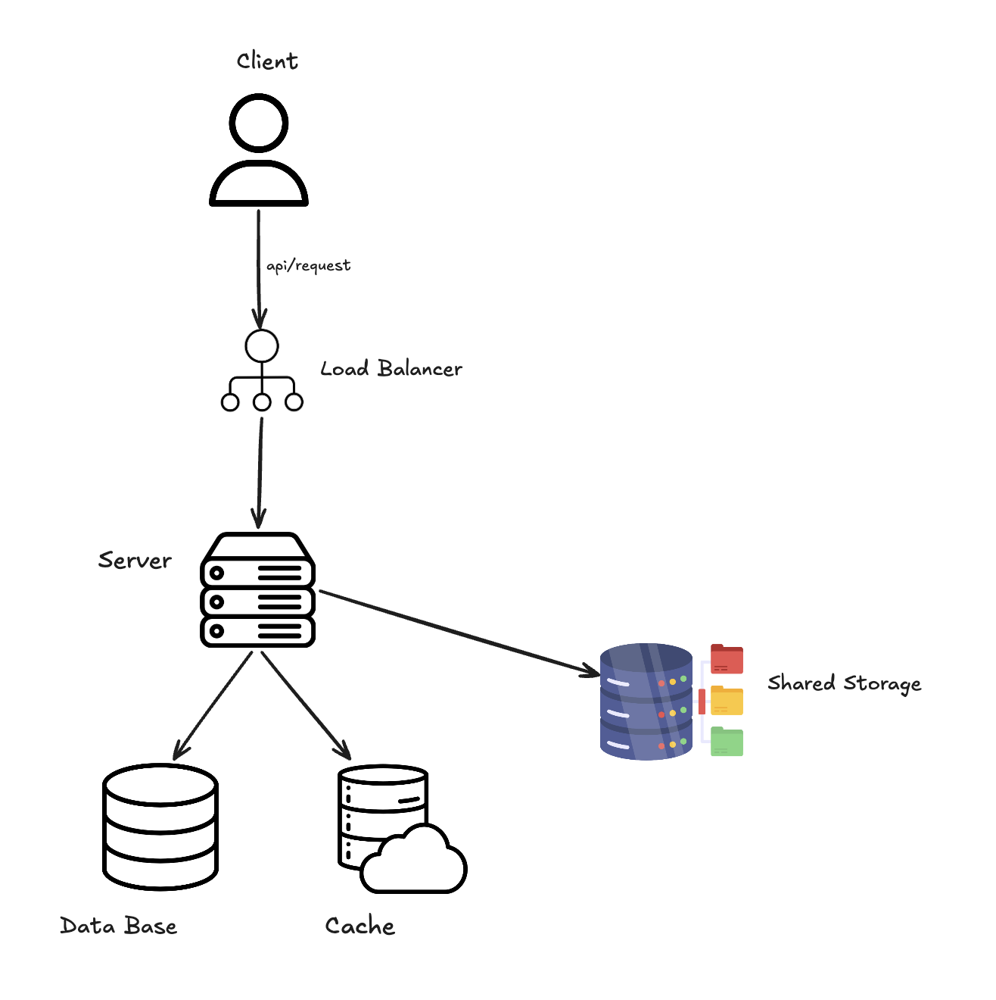

# Creating the Diagrams

## Topics Covered

1. Scaling
2. Client-Server Model
3. Load Balancing
4. Caching
5. Database

> **Excalidraw Diagram:** [https://excalidraw.com/#room=809d901edbdaef0ecf67,GKsT_ienhgL9RuqdSHcthQ](https://excalidraw.com/#room=809d901edbdaef0ecf67,GKsT_ienhgL9RuqdSHcthQ)

---

## Step 1: Client-Server Model

Let's say we want to build an application that should be accessible to everyone all over the world:

- Upload the application to a **server**
- One client asks for the site, another client asks for the API call

---

## Step 2: Database

Now the client wants to store information, so we introduce a concept called **Database**. The server can connect to the database to write and read data.

---

## Step 3: Start Scaling Up

If a lot of users want to access the application, one server can't handle the traffic — so we introduce multiple servers.

**Problem:** If users are only accessing the application from one server, how can this be handled?

### Load Balancing

Here comes **Load Balancing** — distributing traffic across multiple servers.

---

## Step 4: Database Challenge

What if the database goes down? The entire system goes down. To handle this:

- Make the DB a **Master DB** and **Slave DB**
- Update the data from Master DB to Slave DB (hourly / minute / daily)
- **Writing** → goes to the Master DB
- **Reading** → goes from the Slave DB

---

## Step 5: Caching

When repetitive requests are being made to the server, instead of fetching from the main DB, we introduce **Caching** — it stores only the frequently requested data.

- **Shareable data** → Session information is stored in a NoSQL database

---

## Step 6: Data Centers

---

## Simplified Diagram

