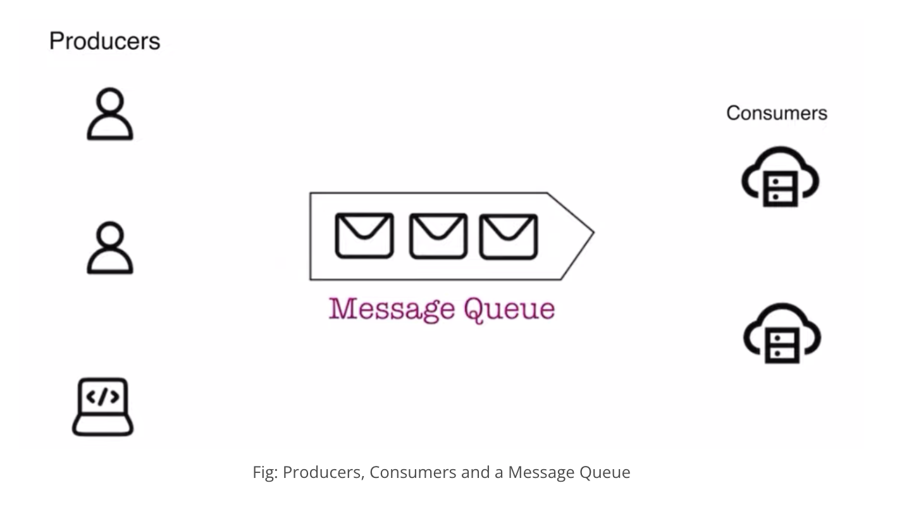

# What is a Message Queue?

A message queue is a system that allows different parts of a system to communicate with each other in an **asynchronous manner**. It acts as a buffer between a **producer** (the part that sends messages) and a **consumer** (the part that processes messages), allowing the producer to continue sending messages even if the consumer isn't ready to process them immediately.

---

## Real-World Example

Let's relate this to our bookstore analogy. Imagine there's a high demand for a particular book in your store. The staff at the counter (**producer**) takes customer orders and places them in a queue. The warehouse workers (**consumers**) fulfill these orders as they become available. The orders pile up in the queue, but the staff at the counter doesn't need to wait for each order to be fulfilled before taking the next one. Instead, they continue adding new orders to the queue, and the warehouse processes them at its own pace.

---

## Components of a Message Queue

- **Producer:**
  The producer is responsible for creating and sending messages to the queue.

- **Queue:**
  The queue is where the messages are stored until they are processed.

- **Consumer:**
  The consumer is responsible for processing the messages.

---

## Advantages of Message Queues

- **Decoupling:**
  Message queues decouple the producer and consumer. This means the producer can continue its work without having to wait for the consumer to be available.

- **Scalability:**
  Since message queues can handle a high volume of messages, they enable systems to scale more easily. Multiple consumers can process messages simultaneously, helping balance the load.

- **Fault Tolerance:**
  Message queues can ensure that no message is lost even if the consumer goes offline temporarily. Messages remain in the queue until they are processed.

---

## Challenges of Message Queues

While message queues provide benefits, they also introduce a few challenges that the system needs to address.

- **Ordering:**
  Ensuring the correct order of message processing can be a challenge, especially in distributed systems. Messages may not always be processed by the system in the order they were sent.

- **Duplicates:**
  Sometimes, messages may be processed more than once, leading to duplicates. This can happen due to retries or errors in the system.

- **Latency:**
  There can be delays between when a message is sent and when it is processed. If the queue becomes too long, it may take some time for a message to reach the consumer.
