# Notification System Design

## Overview

A notification system is a critical component that enables real-time communication between applications and users. When users perform actions like placing an order, making a payment, or receiving messages, the system sends timely notifications through various channels.

**Common Use Cases:**
- E-commerce order confirmations and shipping updates
- Banking transaction alerts
- Social media updates and mentions
- Appointment reminders
- Security alerts and OTP verification

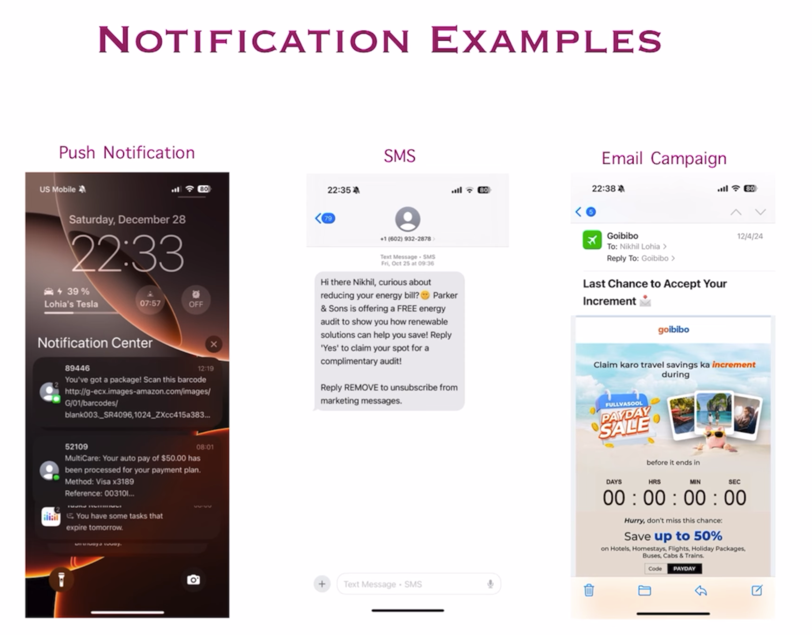

---

## Functional Requirements

Understanding the system requirements is essential for designing an effective notification platform:

### 1. What types of notifications should the system support?
**Answer:** All three major types
- **Email** - For detailed, non-urgent communications
- **SMS** - For urgent, time-sensitive alerts
- **Push Notifications** - For real-time mobile app engagement

### 2. Should notifications be delivered in real-time?
**Answer:** Near real-time delivery
- Target: Within seconds under normal load
- Acceptable: Small delays (few minutes) during peak traffic
- Priority-based delivery for critical notifications

### 3. What devices should be supported?
**Answer:** Cross-platform support
- **Desktop:** Web browsers on Windows, macOS, Linux
- **Mobile:** iOS and Android devices
- **Tablets:** iPad and Android tablets
- **Smart devices:** Watches and IoT devices (future consideration)

### 4. How are notifications triggered?
**Answer:** Multiple trigger mechanisms
- **Automatic** - Event-driven (e.g., order placement, payment confirmation)
- **Scheduled** - Time-based (e.g., daily digests, reminders)
- **Manual** - Admin/user-initiated (e.g., marketing campaigns, announcements)

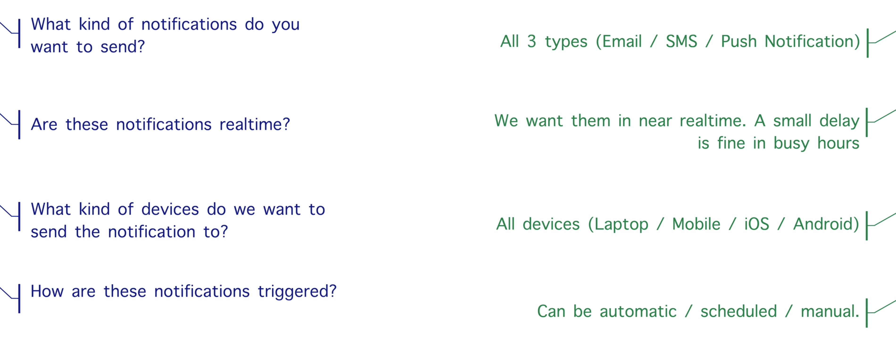

---

## Notification Channel Deep Dive

### Email Service Architecture

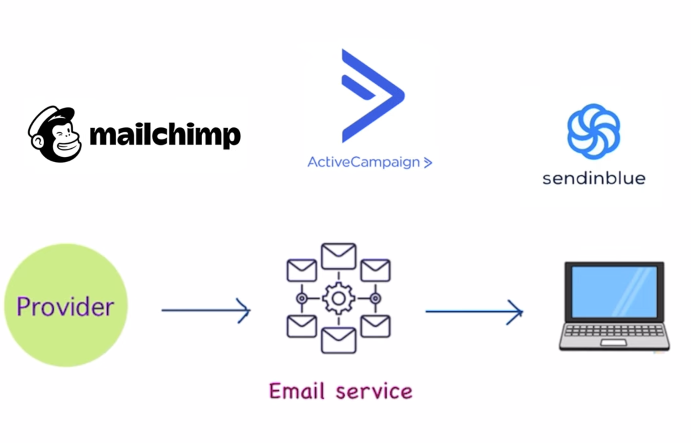

**Email Delivery Flow:**
1. Application generates email notification request
2. Notification service validates and formats the email
3. Third-party email service provider (ESP) handles delivery
   - **Examples:** SendGrid, Amazon SES, Mailgun, Postmark

**Key Considerations:**
- **Deliverability:** SPF, DKIM, DMARC configuration
- **Bounce Handling:** Track hard and soft bounces
- **Unsubscribe Management:** Comply with CAN-SPAM and GDPR
- **Rate Limiting:** Respect ESP quotas
- **Templates:** Use email templates for consistency

---

### SMS Service Architecture

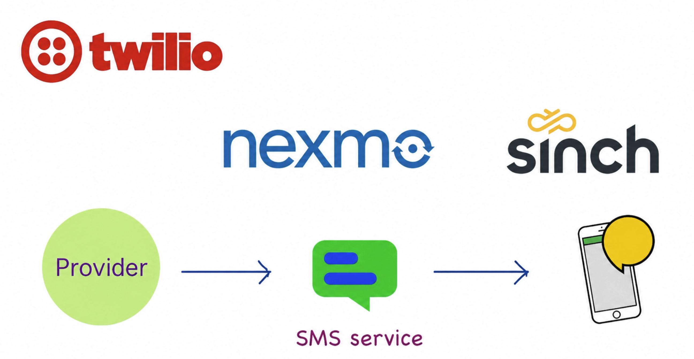

**SMS Delivery Flow:**
1. Application generates SMS notification request
2. Notification service validates phone number and content
3. SMS gateway provider handles delivery
   - **Examples:** Twilio, Nexmo (Vonage), AWS SNS, Plivo

**Key Considerations:**
- **Cost Optimization:** SMS is expensive; use wisely
- **International Support:** Handle country codes and routing
- **Opt-in/Opt-out:** Manage user preferences
- **Character Limits:** Keep messages concise (160 chars for standard SMS)
- **Delivery Receipts:** Track delivery status

---

### Push Notification Service Architecture

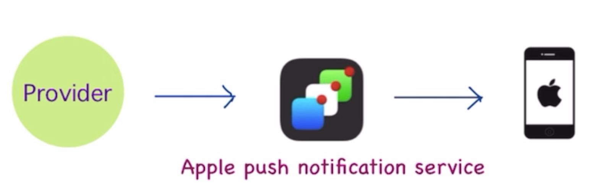

**Push Notification Flow:**
1. Application generates push notification request
2. Notification service routes to platform-specific service
3. Platform service delivers to device
   - **iOS:** Apple Push Notification Service (APNs)
   - **Android:** Firebase Cloud Messaging (FCM)
   - **Web:** Web Push API

**Key Considerations:**
- **Device Tokens:** Manage and update device registration tokens
- **Payload Size:** Keep data compact (4KB for APNs)
- **Time-to-Live (TTL):** Set expiration for notifications
- **Silent Notifications:** Background data sync without alerting user
- **Rich Notifications:** Support images, actions, and custom UI

---

### Firebase Cloud Messaging (FCM)

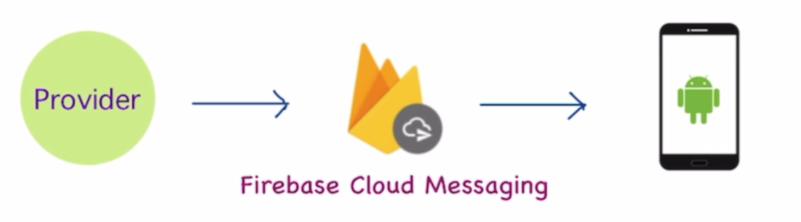

**Why FCM?**
- Unified solution for Android, iOS, and web push
- Free and highly scalable
- Topic-based messaging for broadcast
- Device group messaging
- Analytics and A/B testing support

**FCM Features:**
- **Notification Messages:** Displayed automatically by FCM SDK
- **Data Messages:** Handled by application code
- **Topic Subscriptions:** Send to groups of users
- **Condition-Based Targeting:** Complex audience segmentation

---

## Information Collection and User Preferences

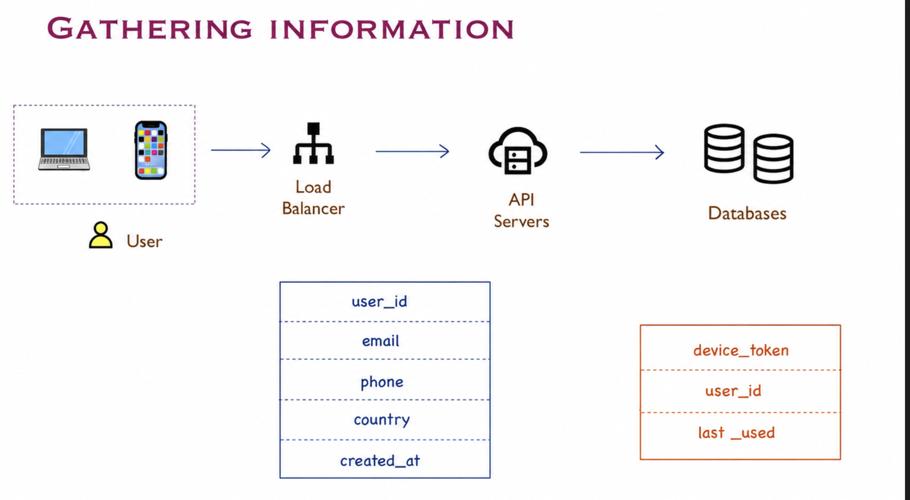

**Required Information:**
1. **Contact Details:**
   - Email addresses
   - Phone numbers (with country codes)
   - Device tokens for push notifications

2. **User Preferences:**
   - Preferred notification channels
   - Opt-in/opt-out settings per notification type
   - Quiet hours (do not disturb schedules)
   - Notification frequency preferences

3. **Device Information:**
   - Device type (iOS, Android, web)
   - App version
   - Device token status (active/expired)

4. **Notification Settings:**
   - Enable/disable by category (e.g., marketing, transactional, security)
   - Priority preferences
   - Language and timezone settings

---

## High-Level System Architecture

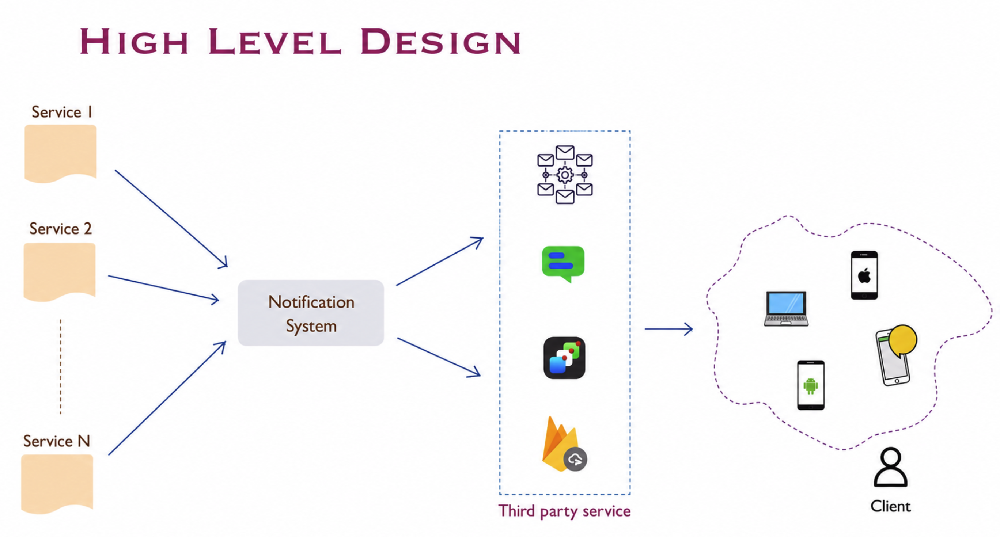

**Core Components:**

1. **Application Services** - Generate notification events
2. **API Gateway** - Entry point for notification requests
3. **Notification Service** - Central orchestration layer
4. **Message Queue** - Buffer for asynchronous processing (Kafka, RabbitMQ, SQS)
5. **Notification Workers** - Process notifications in parallel
6. **Third-Party Providers** - Handle actual delivery (SendGrid, Twilio, FCM/APNs)
7. **Database** - Store notification history, user preferences, templates
8. **Cache** - Store frequently accessed data (Redis)
9. **Analytics Service** - Track delivery rates, open rates, click-through rates

---

## Reliability and Fault Tolerance

### Single Point of Failure Problem

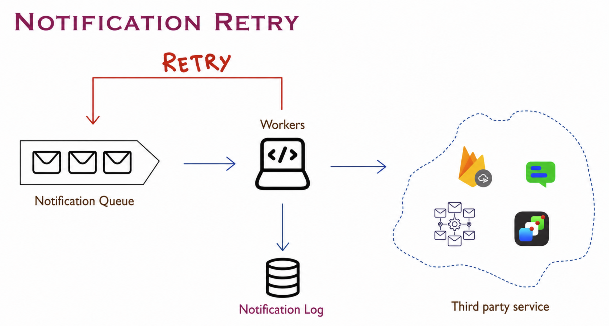

**Risk:** If the notification service goes down, the entire notification system fails.

**Solution:** Implement redundancy and fault tolerance mechanisms.

---

### Highly Available Architecture

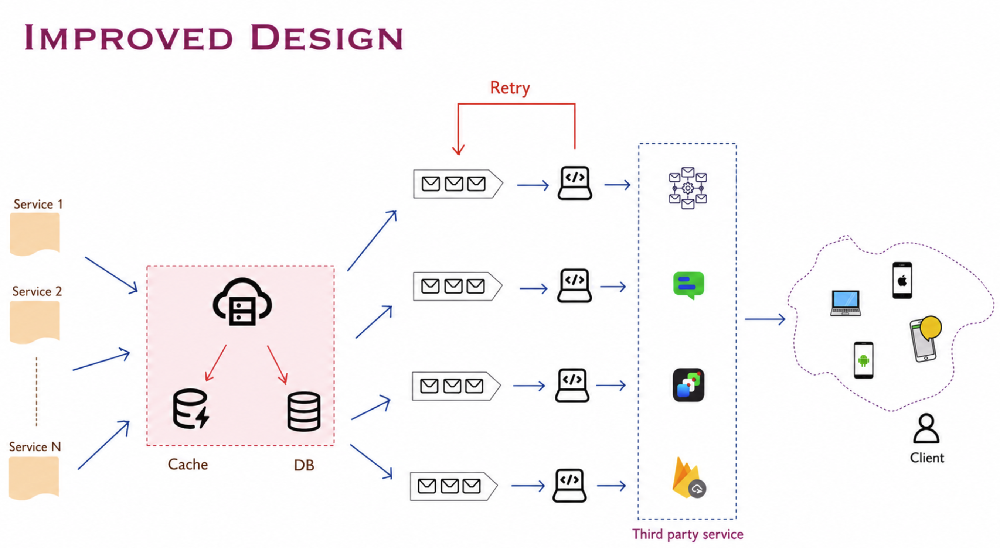

**Strategies for High Availability:**

1. **Multiple Service Instances**
   - Deploy notification service across multiple servers
   - Use load balancers to distribute traffic
   - Auto-scaling based on queue depth

2. **Message Queue as Buffer**
   - Decouple producers (services) from consumers (workers)
   - Persist messages to prevent data loss
   - Enable retry mechanisms

3. **Retry Logic with Exponential Backoff**
   - Retry failed notifications with increasing delays
   - Maximum retry attempts to prevent infinite loops
   - Dead letter queue for permanently failed messages

4. **Circuit Breaker Pattern**
   - Stop sending requests to failing third-party services
   - Fallback to alternative providers
   - Automatic recovery when service is restored

5. **Database Replication**
   - Master-slave replication for read scaling
   - Multi-region deployment for disaster recovery

6. **Monitoring and Alerting**
   - Track success/failure rates
   - Monitor queue depth and processing lag
   - Alert on anomalies

---

## Event Tracking and Analytics

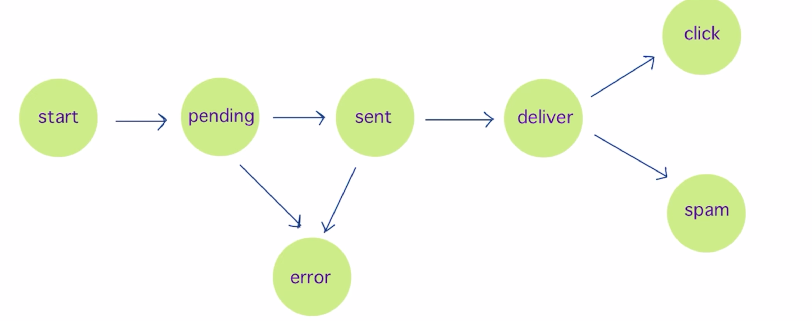

**Tracked Events:**

1. **Notification Lifecycle:**
   - Created - Notification request received
   - Queued - Added to message queue
   - Sent - Delivered to third-party provider
   - Delivered - Confirmed delivery to device/inbox
   - Opened - User opened the notification
   - Clicked - User clicked on notification link
   - Failed - Delivery or processing failure

2. **Metrics to Monitor:**
   - **Delivery Rate** = (Delivered / Sent) × 100%
   - **Open Rate** = (Opened / Delivered) × 100%
   - **Click-Through Rate (CTR)** = (Clicked / Opened) × 100%
   - **Failure Rate** = (Failed / Total) × 100%
   - **Processing Latency** - Time from creation to delivery

3. **Use Cases for Analytics:**
   - Optimize notification timing for better engagement
   - Identify and fix delivery issues
   - A/B testing for notification content
   - Compliance reporting (GDPR, CAN-SPAM)

---

## Generic Notification System Design

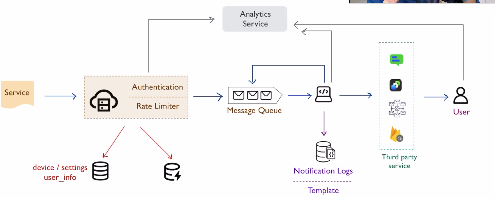

**End-to-End Flow:**

### 1. Notification Creation
```
User Action → Application Service → API Gateway → Notification Service
```

### 2. Processing Pipeline
```
Notification Service → Message Queue → Notification Worker
```

### 3. Channel Routing
```
Worker → Channel Selector (Email/SMS/Push) → Third-Party Provider
```

### 4. Delivery and Tracking
```
Provider → End User Device
Provider → Delivery Receipt → Analytics Service
```

### 5. User Interaction
```
User Opens/Clicks → Tracking Event → Analytics Database
```

---

## Database Schema

### Notifications Table
```sql
CREATE TABLE notifications (
    id BIGINT PRIMARY KEY AUTO_INCREMENT,
    user_id BIGINT NOT NULL,
    type ENUM('email', 'sms', 'push') NOT NULL,
    category VARCHAR(50) NOT NULL, -- e.g., 'order', 'payment', 'marketing'
    template_id VARCHAR(100),
    status ENUM('pending', 'sent', 'delivered', 'failed', 'opened', 'clicked'),
    content TEXT,
    metadata JSON,
    created_at TIMESTAMP DEFAULT CURRENT_TIMESTAMP,
    sent_at TIMESTAMP NULL,
    delivered_at TIMESTAMP NULL,
    INDEX idx_user_id (user_id),
    INDEX idx_status (status),
    INDEX idx_created_at (created_at)
);
```

### User Notification Preferences Table
```sql
CREATE TABLE user_notification_preferences (
    user_id BIGINT PRIMARY KEY,
    email VARCHAR(255),
    phone VARCHAR(20),
    push_token VARCHAR(255),
    email_enabled BOOLEAN DEFAULT TRUE,
    sms_enabled BOOLEAN DEFAULT TRUE,
    push_enabled BOOLEAN DEFAULT TRUE,
    marketing_enabled BOOLEAN DEFAULT FALSE,
    quiet_hours_start TIME,
    quiet_hours_end TIME,
    timezone VARCHAR(50),
    updated_at TIMESTAMP DEFAULT CURRENT_TIMESTAMP ON UPDATE CURRENT_TIMESTAMP
);
```

### Notification Templates Table
```sql
CREATE TABLE notification_templates (
    template_id VARCHAR(100) PRIMARY KEY,
    type ENUM('email', 'sms', 'push') NOT NULL,
    subject VARCHAR(255),
    body TEXT NOT NULL,
    variables JSON,
    created_at TIMESTAMP DEFAULT CURRENT_TIMESTAMP,
    updated_at TIMESTAMP DEFAULT CURRENT_TIMESTAMP ON UPDATE CURRENT_TIMESTAMP
);
```

---

## Optimization Strategies

### 1. Rate Limiting
- **Per-user limits** - Prevent notification fatigue
- **Per-channel limits** - Respect third-party provider quotas
- **Global limits** - Protect system from overload

### 2. Batching
- **Email batching** - Group multiple emails to the same provider
- **Digest notifications** - Combine similar notifications into a summary
- **Scheduled delivery** - Send non-urgent notifications in batches

### 3. Prioritization
- **High Priority:** Security alerts, OTPs, critical transactional notifications
- **Medium Priority:** Order updates, shipping notifications
- **Low Priority:** Marketing emails, promotional messages

### 4. Template Management
- Use parameterized templates to avoid redundant content storage
- Cache frequently used templates
- Version control for template changes

### 5. Deduplication
- Prevent sending duplicate notifications for the same event
- Use idempotency keys to track processed notifications

---

## Security Considerations

1. **Authentication and Authorization**
   - Verify sender identity using API keys or OAuth
   - Implement role-based access control (RBAC)

2. **Data Privacy**
   - Encrypt sensitive data (PII, phone numbers, emails)
   - Comply with GDPR, CCPA, and other privacy regulations
   - Provide user data export and deletion capabilities

3. **Content Security**
   - Validate and sanitize notification content
   - Prevent injection attacks in email/SMS content
   - Rate limit to prevent spam abuse

4. **Provider Security**
   - Store third-party API keys in secure vaults (AWS Secrets Manager, HashiCorp Vault)
   - Rotate API keys regularly
   - Use TLS/SSL for all external communications

---

## Scalability Considerations

### Horizontal Scaling
- **Stateless workers** - Easy to add more instances
- **Partitioned message queues** - Distribute load across multiple queues
- **Load balancing** - Distribute traffic evenly

### Database Scaling
- **Sharding** - Partition by user_id or notification type
- **Read replicas** - Offload read queries for analytics
- **Archiving** - Move old notifications to cold storage

### Caching Strategy
- Cache user preferences for quick access
- Cache notification templates
- Cache third-party provider responses (for idempotency)

---

## Key Takeaways

1. **Multi-channel support** (Email, SMS, Push) is essential for comprehensive coverage
2. **Message queues** provide reliability and enable asynchronous processing
3. **Third-party providers** handle the complexity of actual delivery
4. **High availability** requires redundancy, retry logic, and circuit breakers
5. **Analytics and tracking** are crucial for monitoring and optimization
6. **User preferences** must be respected to avoid notification fatigue
7. **Security and compliance** are non-negotiable (GDPR, CAN-SPAM)
8. **Rate limiting and prioritization** ensure system stability and user experience
9. **Template management** simplifies content updates and localization
10. **Scalability** requires stateless design, horizontal scaling, and efficient data management