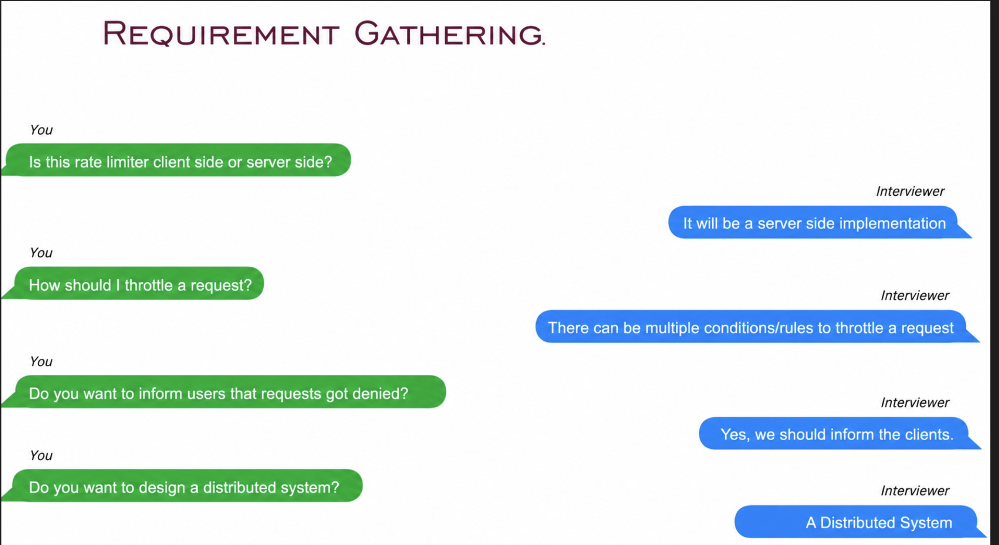
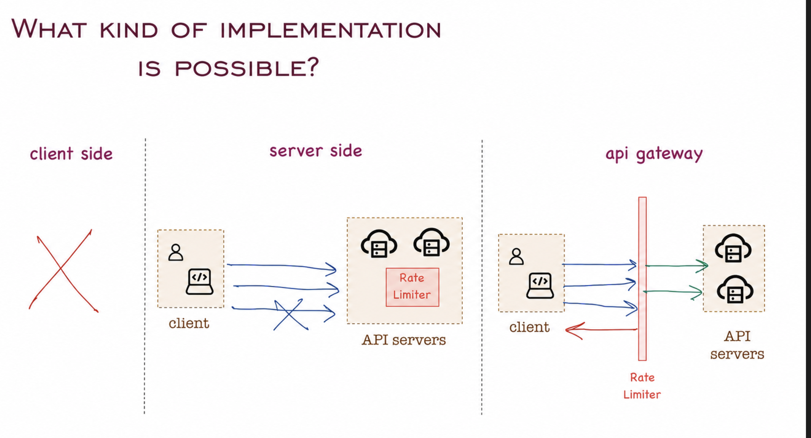
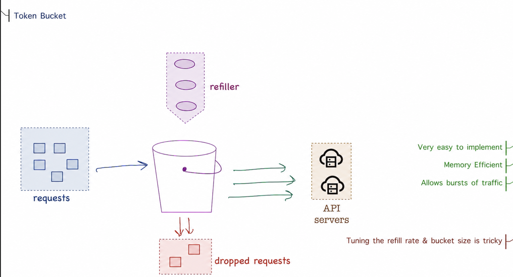
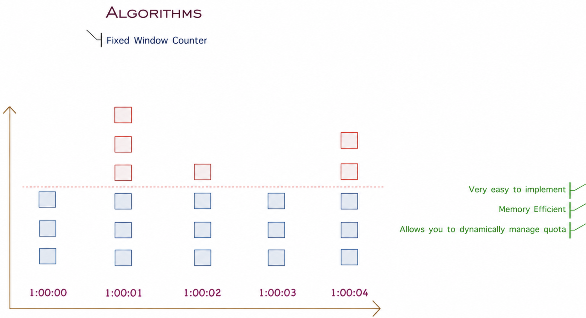
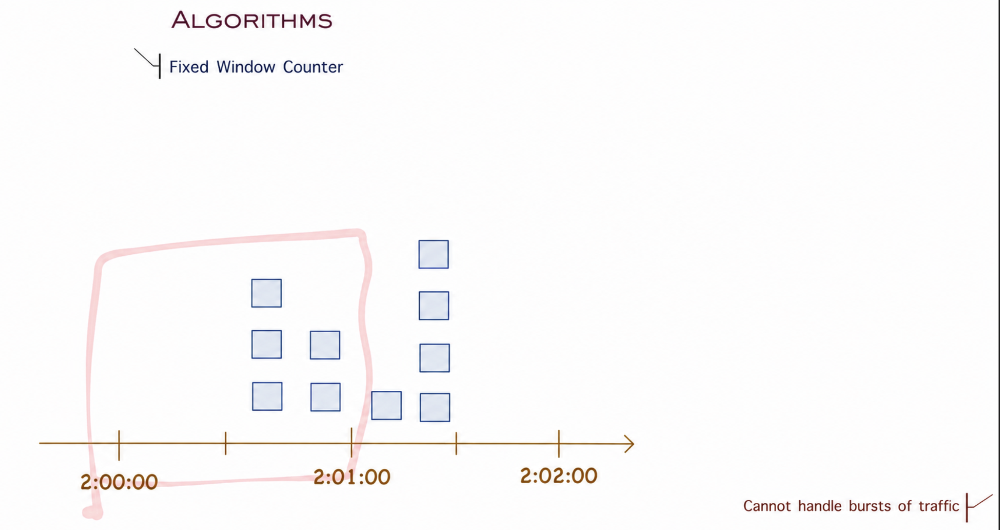
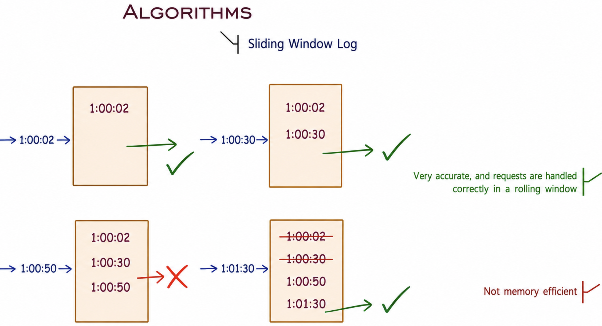
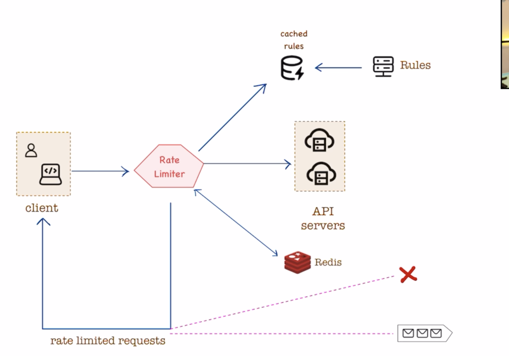
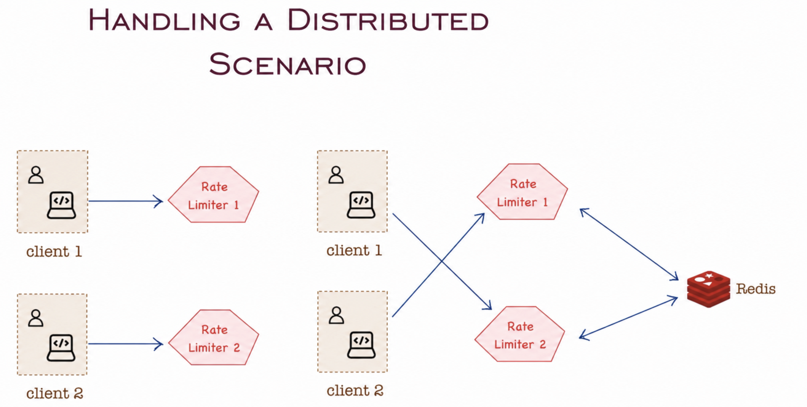

# Rate Limiter System Design

## Overview

Rate limiting is a technique used to control the rate of requests sent or received by a system. It prevents abuse and ensures fair resource distribution among users.

### Real-World Examples
- Limiting users to posting no more than 2 messages per second
- Restricting account creation attempts within a time window
- Allowing Netflix streaming on a maximum of 2 devices simultaneously

### Why Rate Limiting is Essential

Without proper rate limiting, systems become vulnerable to various issues:

1. **Security Issues** - Prevents malicious actors from exploiting vulnerabilities
2. **DDoS Attacks** - Mitigates distributed denial-of-service attacks
3. **Maintenance Issues** - Ensures system stability and predictable resource usage
4. **Quality Issues** - Maintains service quality for all users by preventing resource exhaustion

## Requirements Gathering

### 1. Where should the rate limiter be implemented?
**Answer:** Server-side implementation

Client-side rate limiting can be easily bypassed, so server-side enforcement is necessary.

### 2. How should requests be throttled?
**Answer:** Support multiple conditions and rules

The system should be flexible enough to handle various throttling strategies based on different criteria (user ID, IP address, API endpoint, etc.).

### 3. Should users be notified when requests are denied?
**Answer:** Yes

Users should receive clear feedback when their requests are throttled, typically through HTTP status codes (429 Too Many Requests) and informative error messages.

### 4. Is this a distributed system?
**Answer:** Yes

The rate limiter should work across multiple servers in a distributed environment.

## Implementation Strategies

### Client-Side Rate Limiting
**Not Recommended** - Client-side implementation is unreliable as it can be easily bypassed by malicious users.

### Server-Side Rate Limiting (Direct)
**Not Optimal** - Implementing rate limiting directly in API servers adds complexity and couples rate limiting logic with business logic.

### API Gateway Rate Limiting
**Recommended** - Using a middleware layer (API Gateway) between clients and servers is the best approach:
- Centralized rate limiting logic
- Separation of concerns
- Easy to maintain and scale
- Can be shared across multiple services

## Rate Limiting Algorithms

### 1. Token Bucket Algorithm

The token bucket algorithm works by:
- Maintaining a bucket with a fixed capacity of tokens
- Refilling tokens at a constant rate (e.g., 3 tokens per second)
- Each request consumes one token
- Requests are rejected when no tokens are available
- Rejected requests can be placed in a retry queue or dropped

**Advantages:**
- Simple to implement
- Allows burst traffic within limits
- Memory efficient

### 2. Fixed Window Counter

This algorithm divides time into fixed windows and counts requests in each window:
- Define a time window (e.g., 1 second, 1 minute)
- Set a maximum number of requests allowed per window
- Reset the counter at the start of each new window

**Advantages:**
- Simple and memory efficient
- Easy to understand

**Disadvantages:**
- Can allow burst traffic at window boundaries
- May allow up to 2x the limit in a sliding window scenario

### 3. Sliding Window Log

This algorithm maintains a log of timestamps for each request:
- Store timestamp for each request
- Remove expired timestamps from the log
- Count valid requests within the current sliding window
- Reject if count exceeds the limit

**Advantages:**
- Most accurate rate limiting
- No boundary issues

**Disadvantages:**
- Higher memory consumption (stores all request timestamps)
- More computationally expensive

## System Architecture

### High-Level Design

The rate limiter system consists of:
- **API Gateway** - Entry point for all requests
- **Rate Limiter Service** - Evaluates requests against configured rules
- **Cache/Storage** - Stores rate limit counters (Redis is commonly used)
- **Configuration Service** - Manages rate limiting rules
- **Backend Services** - Actual API servers handling business logic

## Distributed System Considerations

In a distributed environment, the rate limiter must handle:

### Key Challenges
1. **Race Conditions** - Multiple servers trying to update counters simultaneously
2. **Synchronization** - Keeping rate limit data consistent across servers
3. **Performance** - Minimizing latency introduced by distributed coordination

### Solutions
- **Centralized Data Store** - Use Redis or similar in-memory data store for shared state
- **Atomic Operations** - Use Redis INCR or similar atomic operations to prevent race conditions
- **Eventual Consistency** - Accept slight inaccuracies for better performance
- **Sticky Sessions** - Route users to the same server when possible (reduces synchronization overhead)

## Best Practices

1. **Choose the right algorithm** based on your use case:
   - Token Bucket for burst tolerance
   - Fixed Window for simplicity
   - Sliding Window Log for accuracy

2. **Use appropriate error responses** - Return HTTP 429 with Retry-After header

3. **Monitor and alert** - Track rate limiting metrics to detect attacks or adjust limits

4. **Make limits configurable** - Allow different limits for different users/endpoints

5. **Consider multiple dimensions** - Rate limit by user ID, IP address, API key, etc.

