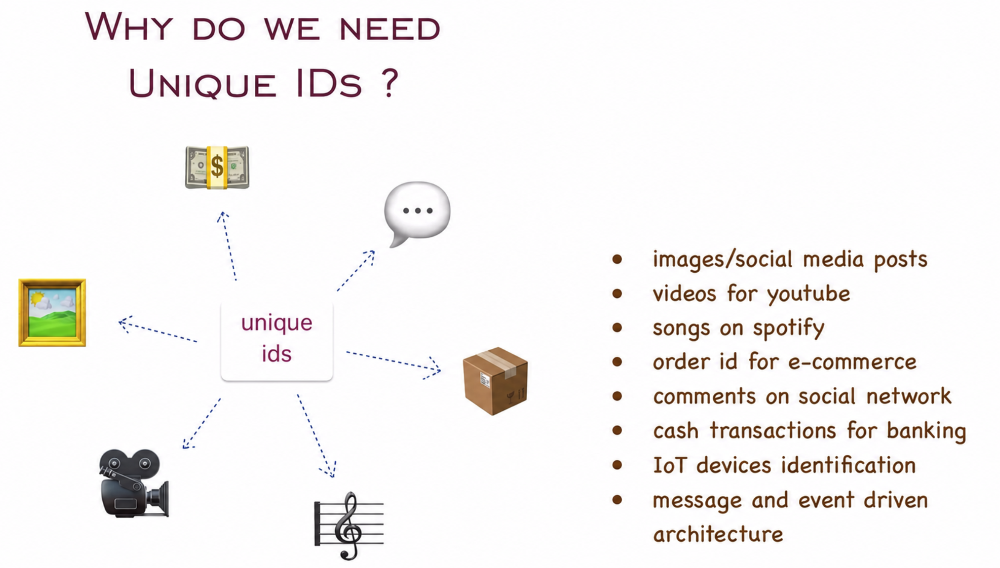
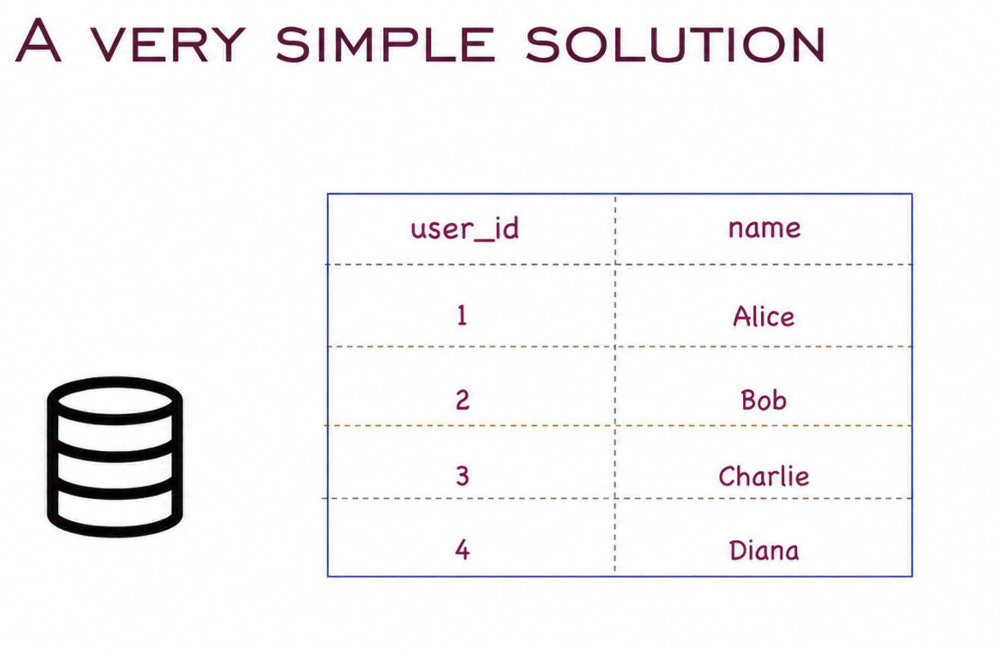
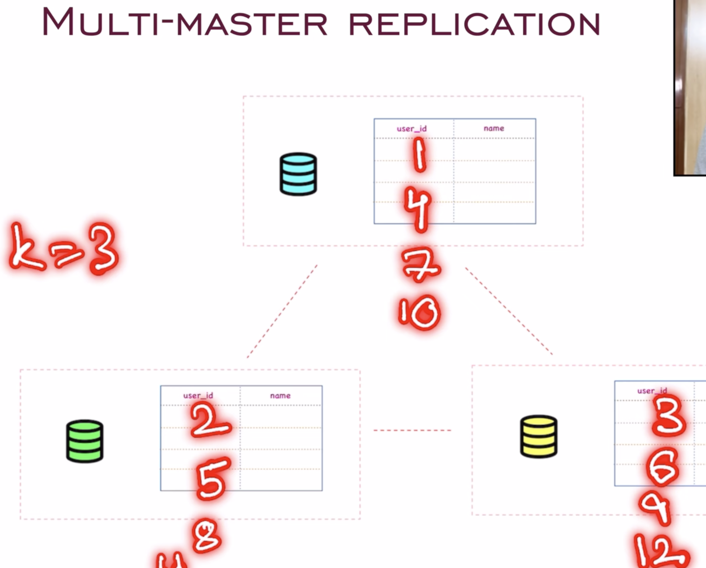
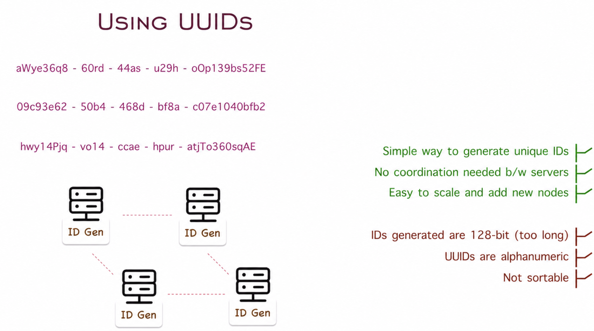
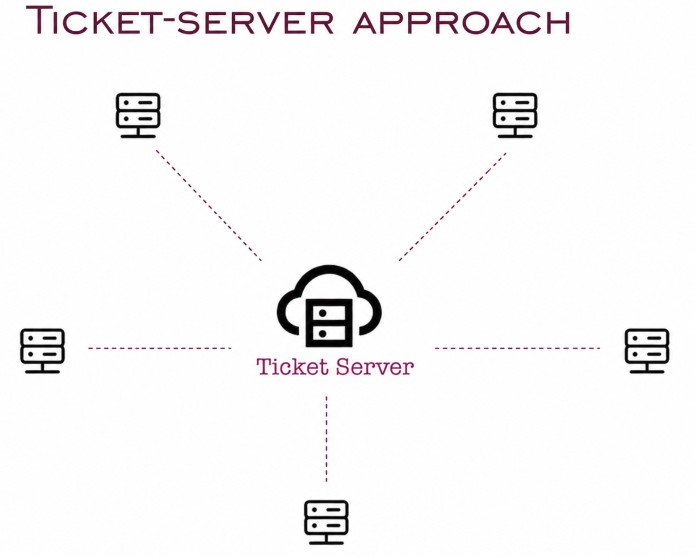
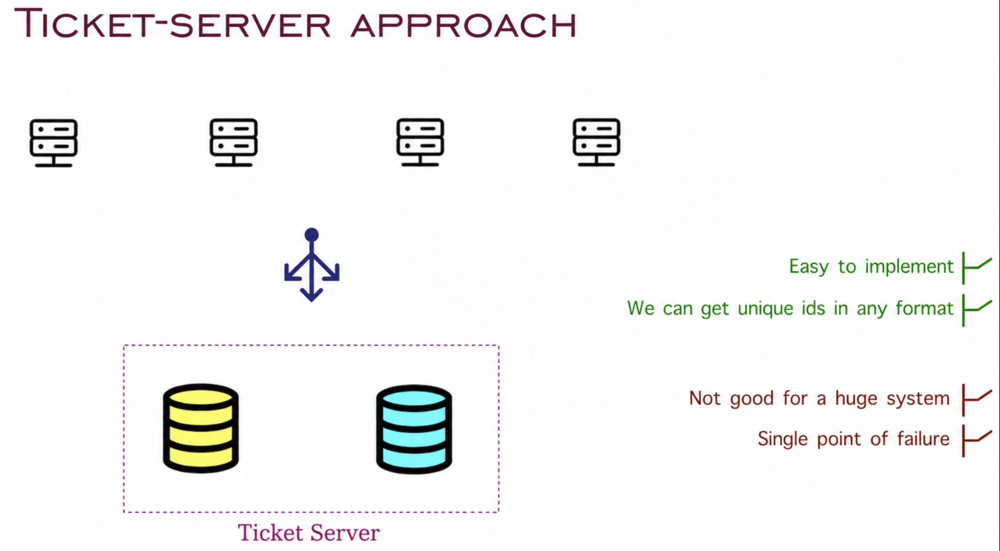
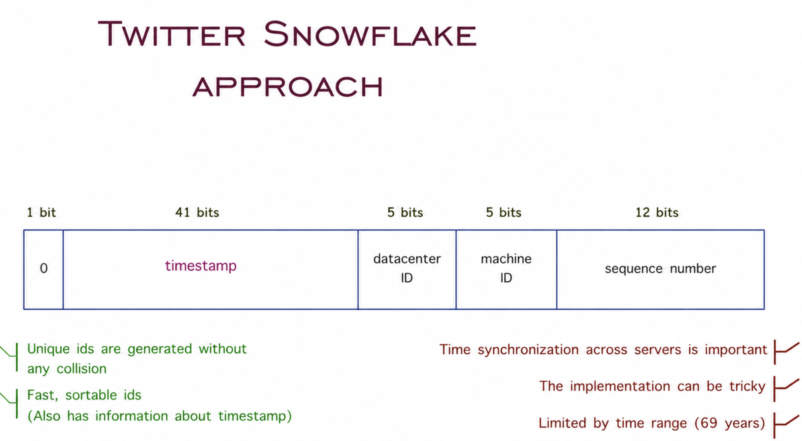

# Unique ID Generator System Design

## Overview

Unique identifiers are fundamental to many systems - from assigning roll numbers to students and employee IDs to workers, unique IDs are essential for identifying and tracking entities across distributed systems.

**Challenge:** Design a system that can generate thousands of unique IDs per second across a distributed environment without collisions.



## Requirements

- Generate **unique** IDs at scale (e.g., 10,000+ IDs per second)
- Work in a **distributed system** with multiple servers
- IDs should be **sortable** (preferably time-ordered)
- High **availability** and low latency
- IDs should be **numeric** or **alphanumeric** based on requirements

## Approaches to Unique ID Generation

### 1. Auto-Increment Database (Single Server)

The simplest approach uses a database with an auto-incrementing primary key.



**How it works:**
- Single database table with an auto-incrementing ID field
- Each new record gets the next sequential ID

**Pros:**
- Simple to implement
- IDs are sequential and sortable
- No collisions

**Cons:**
- Single point of failure
- Does not scale in distributed systems
- Performance bottleneck under high load

**Limitation in Distributed Systems:**

When multiple servers try to generate IDs from the same database, it creates a bottleneck and potential race conditions.


---

### 2. Multi-Master Replication

This approach uses multiple database masters, each generating IDs with different offsets.



**How it works:**
- Each database server uses auto-increment with a different starting value and step
- Server 1: 1, 3, 5, 7, 9... (odd numbers)
- Server 2: 2, 4, 6, 8, 10... (even numbers)
- Or with 3 servers: Server 1 (1, 4, 7...), Server 2 (2, 5, 8...), Server 3 (3, 6, 9...)

**Pros:**
- Easy to implement
- Leverages existing database features
- No ID collisions

**Cons:**
- Difficult to scale (adding new servers requires reconfiguration)
- IDs are not time-ordered
- Still have database as a dependency
- Hard to handle server failures

---

### 3. UUID (Universally Unique Identifier)

UUIDs are 128-bit identifiers that can be generated independently without coordination.



**How it works:**
- Each server generates UUIDs locally using standard algorithms (UUID v4)
- No central coordination required
- 128-bit format (32 hexadecimal characters)

**Example:** `550e8400-e29b-41d4-a716-446655440000`

**Pros:**
- Very simple to implement
- No coordination needed between servers
- Extremely low collision probability (if generating billions of UUIDs per second, first collision expected after ~100 years)
- Scales infinitely

**Cons:**
- 128-bit IDs are long (not storage efficient)
- Not sortable by time (UUID v4)
- Not numeric (if that's a requirement)
- UUIDs can be non-sequential, making database indexing less efficient

**Best for:** Systems where ID length is not a concern and maximum simplicity is desired.

---

### 4. Ticket Server Approach (Flickr Method)

Flickr developed this centralized ticket server approach to generate unique numeric IDs.



**How it works:**
- Dedicated lightweight ticket servers generate unique IDs
- Application servers request IDs from the ticket server
- Can use multiple ticket servers with odd/even ID distribution for redundancy



**Pros:**
- Numeric IDs
- Relatively simple to implement
- IDs are sequential
- Better than direct database dependency

**Cons:**
- Ticket server can become a single point of failure (mitigated by having multiple servers)
- Still requires network calls to ticket server
- May become a bottleneck at very high scale

**Best for:** Medium-scale systems that need numeric, sequential IDs.

---

### 5. Twitter Snowflake Approach ⭐ (Recommended)

Twitter's Snowflake is a distributed ID generation algorithm that creates 64-bit unique IDs using a divide-and-conquer technique.



**Structure (64 bits):**
```
┌─────────────────────────────────────────────────────────────┐
│ 1 bit   │ 41 bits        │ 10 bits     │ 12 bits           │
│ Sign    │ Timestamp      │ Machine ID  │ Sequence Number   │
└─────────────────────────────────────────────────────────────┘
```

**Breakdown:**
1. **1 bit (Sign):** Always 0 (reserved for future use, ensures positive number)
2. **41 bits (Timestamp):** Milliseconds since custom epoch (gives ~69 years)
3. **10 bits (Machine ID):** Supports up to 1,024 machines (5 bits datacenter + 5 bits machine)
4. **12 bits (Sequence Number):** 4,096 IDs per millisecond per machine

**How it works:**
- Each server has a unique machine ID
- When generating an ID, combine:
  - Current timestamp (milliseconds)
  - Machine ID
  - Sequence counter (resets every millisecond)
- IDs are generated locally without coordination

**Pros:**
- ✅ 64-bit IDs (more compact than UUIDs)
- ✅ Time-ordered (sortable)
- ✅ No coordination needed between servers
- ✅ Highly scalable (supports 1,024 machines)
- ✅ Can generate 4,096 IDs per millisecond per machine = ~4 million IDs/second per machine
- ✅ No single point of failure

**Cons:**
- Requires clock synchronization across machines (NTP)
- Machine IDs must be managed and assigned
- Timestamp will overflow after ~69 years (but can adjust epoch)

**Best for:** Large-scale distributed systems requiring high throughput and sortable IDs.

---

## Comparison Table

| Approach | Scalability | Complexity | ID Size | Time-Ordered | Coordination Required |
|----------|-------------|------------|---------|--------------|----------------------|
| Auto-Increment DB | Low | Low | Small | Yes | Yes |
| Multi-Master | Medium | Medium | Small | No | Yes |
| UUID | Very High | Very Low | Large (128-bit) | No | No |
| Ticket Server | Medium | Medium | Small | Yes | Yes |
| Snowflake | Very High | Medium | Medium (64-bit) | Yes | No |

---

## Recommended Approach

**For most distributed systems:** Use **Twitter Snowflake** or a similar approach because it provides:
- Excellent scalability
- Time-ordered IDs
- No coordination overhead
- Compact 64-bit IDs

**Alternative:** If implementation simplicity is paramount and ID size isn't a concern, use **UUIDs**.

---

## Key Takeaways

1. **Single database auto-increment** works only for small, non-distributed systems
2. **UUIDs** are simple but create large IDs that aren't time-ordered
3. **Snowflake-style algorithms** offer the best balance of scalability, performance, and practicality for distributed systems
4. Always consider your specific requirements: ID size, sortability, throughput, and system complexity
5. Clock synchronization is critical when using timestamp-based approaches

