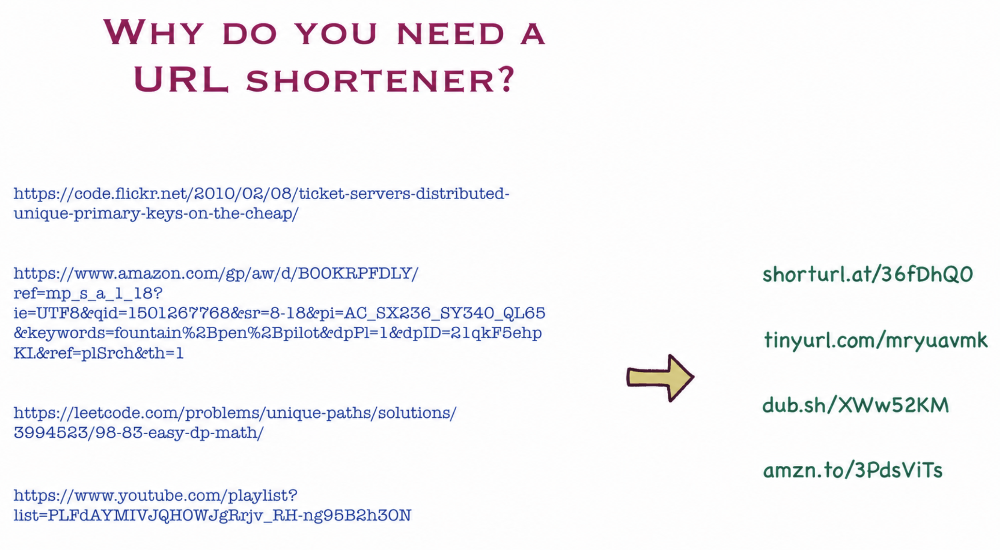
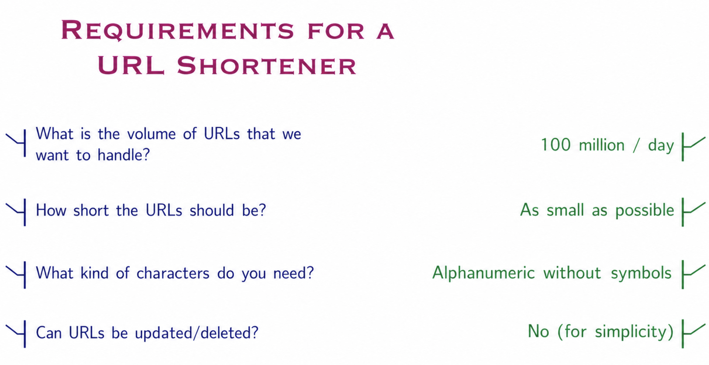
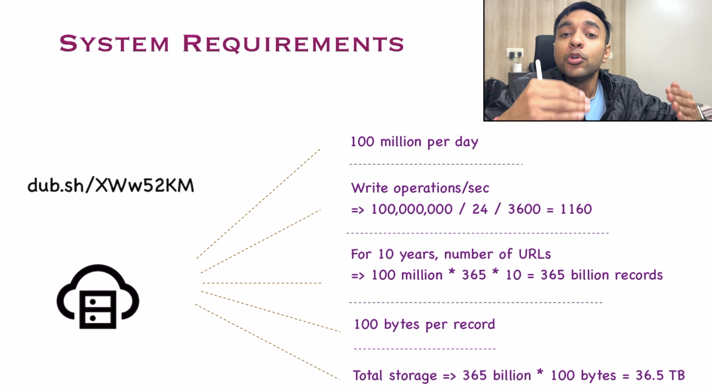
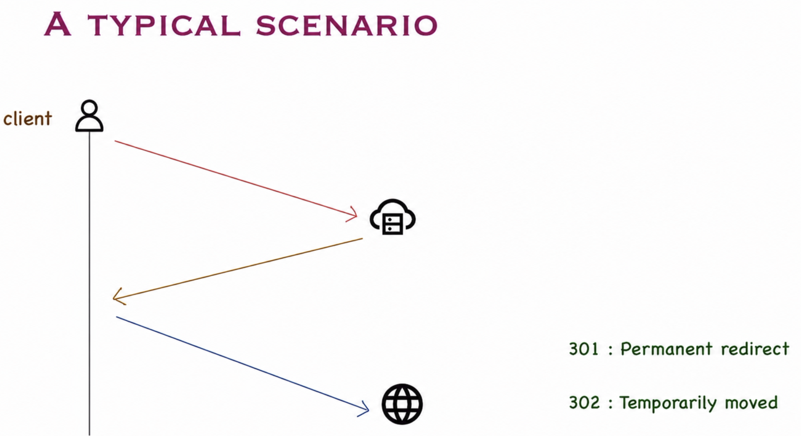
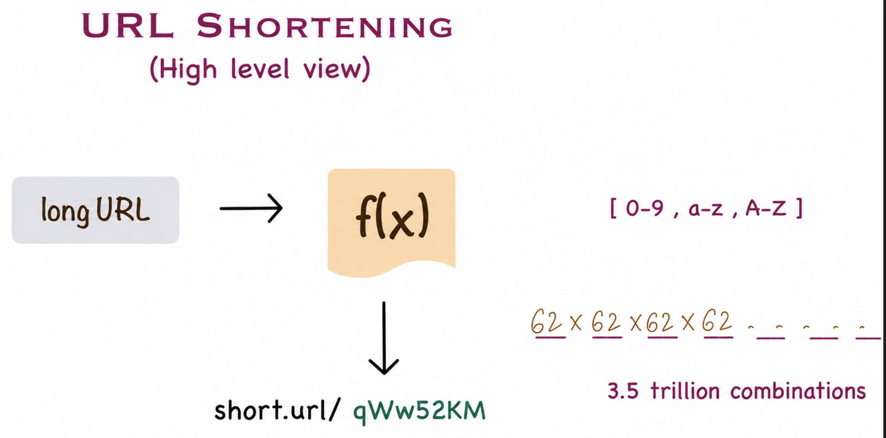
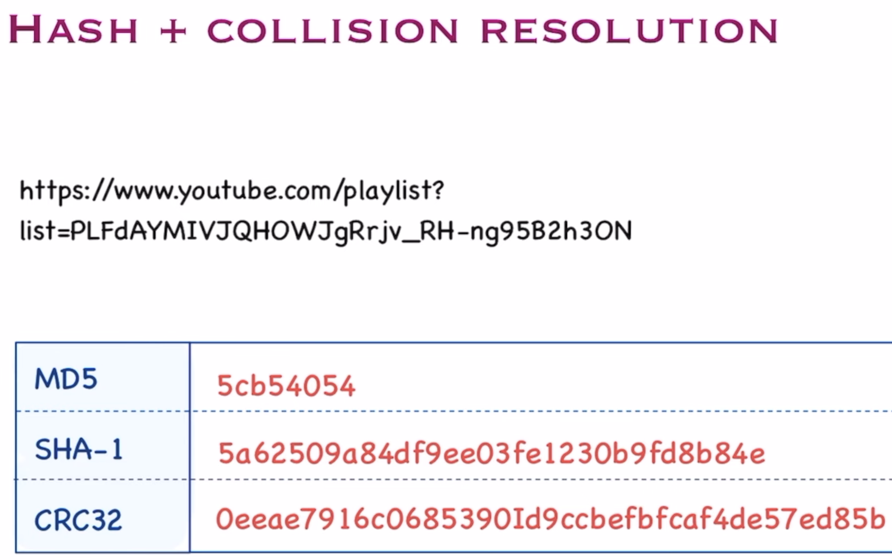
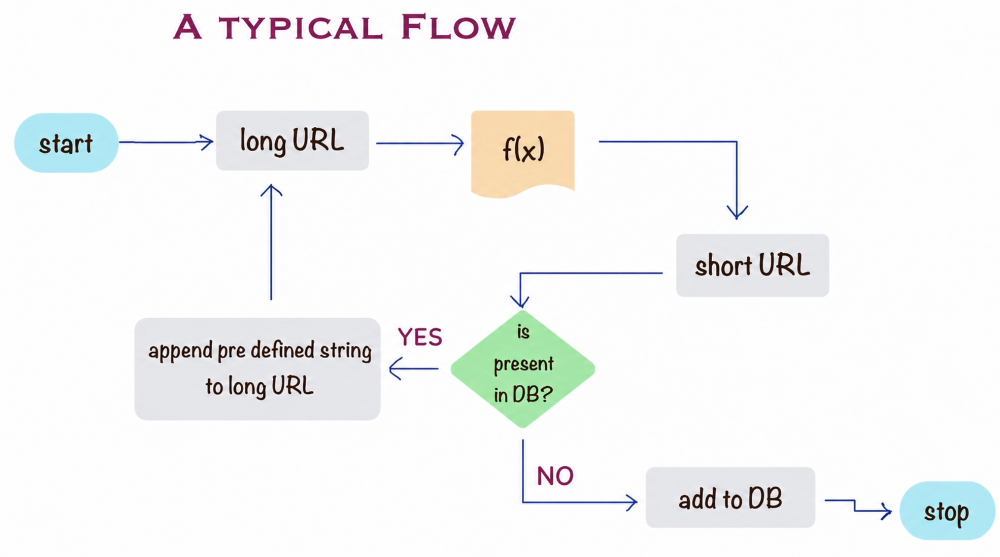
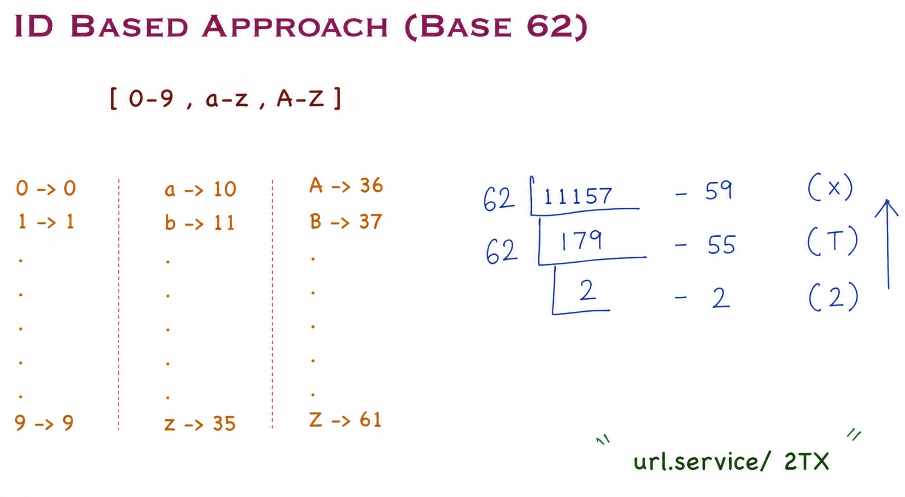
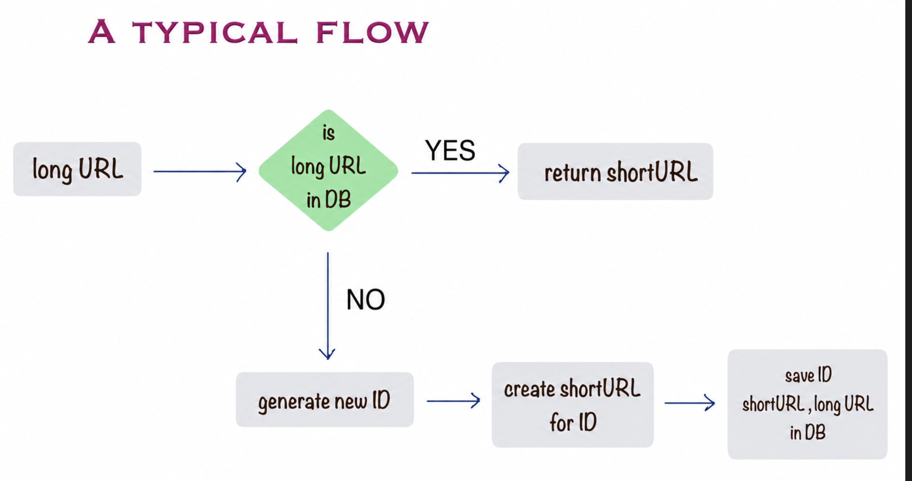
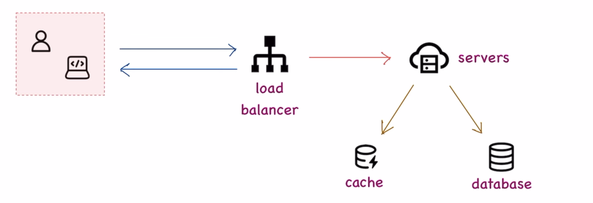

# URL Shortener System Design

## Overview

A URL shortener is a service that converts long URLs into short, manageable links that redirect to the original URL. Services like bit.ly, TinyURL, and goo.gl are popular examples.



### Why We Need URL Shorteners

1. **Easier to Share** - Short URLs are more convenient to share via social media, SMS, or verbally
2. **Cleaner Appearance** - Compact URLs look professional and simple
3. **Space Efficient** - Important for platforms with character limits (e.g., Twitter)
4. **Analytics** - Track click rates, geographic data, and user engagement
5. **Better Performance** - Shorter URLs reduce bandwidth and improve efficiency

---

## Functional Requirements

Understanding the requirements is crucial for designing a scalable system:

### 1. What is the volume of URLs to handle?
**Answer:** 100 million URLs per day

### 2. How short should the URLs be?
**Answer:** As short as possible (typically 7-8 characters)

### 3. What characters are allowed?
**Answer:** Alphanumeric characters only (a-z, A-Z, 0-9) without special symbols

### 4. Can URLs be updated or deleted?
**Answer:** No (for simplicity, URLs are immutable once created)



---

## System Capacity Estimation

### Write Operations

**Daily URL Generation:** 100 million URLs/day

**Write Operations per Second:**
```
100,000,000 / (24 × 3600) = 1,160 writes/second
```

### Storage Requirements

**10-Year Projection:**
```
Total URLs = 100 million/day × 365 days × 10 years
           = 365 billion records
```

**Storage per URL:** ~100 bytes (including original URL, short URL, metadata, timestamps)

**Total Storage:**
```
365 billion × 100 bytes = 36.5 TB
```

### Read-to-Write Ratio

URL shorteners are typically **read-heavy** systems. Assuming a 100:1 read-to-write ratio:

**Read Operations per Second:**
```
1,160 writes/sec × 100 = 116,000 reads/second
```



**Key Takeaway:** The system must be optimized for high read throughput with caching strategies.

---

## API Design

### 1. Create Short URL (POST)

**Endpoint:** `POST /api/v1/shorten`

**Request:**
```json
{
  "longUrl": "https://www.example.com/very/long/url/with/parameters?id=123"
}
```

**Response:**
```json
{
  "shortUrl": "https://short.ly/abc123X",
  "longUrl": "https://www.example.com/very/long/url/with/parameters?id=123",
  "createdAt": "2026-05-29T10:30:00Z"
}
```

### 2. Redirect to Original URL (GET)

**Endpoint:** `GET /{shortCode}`

**Response:** HTTP 301 or 302 redirect to the original URL

---

## HTTP Redirect Behavior



### 301 vs 302 Redirects

**301 - Permanent Redirect:**
- Indicates the URL has permanently moved
- Browsers cache this response
- Subsequent requests go directly to the original URL (bypassing the shortener)
- **Pros:** Reduces server load
- **Cons:** Cannot track analytics after first visit

**302 - Temporary Redirect:**
- Indicates the URL has temporarily moved
- Browsers do NOT cache this response
- All requests go through the shortener
- **Pros:** Complete analytics tracking
- **Cons:** Higher server load

**Recommendation:** Use **302 redirects** for URL shorteners to maintain analytics and tracking capabilities.

---

## High-Level Architecture



**Components:**

1. **Load Balancer** - Distributes traffic across application servers
2. **Application Servers** - Handle URL shortening and redirection logic
3. **Cache Layer (Redis/Memcached)** - Stores frequently accessed URL mappings
4. **Database** - Persistent storage for URL mappings
5. **Analytics Service** - Tracks clicks, user agents, geolocation

---

## URL Shortening Algorithms

### Approach 1: Hash + Collision Resolution



**How it works:**
1. Hash the long URL using MD5, SHA-256, or similar
2. Take the first 7-8 characters of the hash
3. Check for collisions in the database
4. If collision exists, append a counter or rehash with salt

**Pros:**
- Simple to implement
- Deterministic (same URL always generates same hash)

**Cons:**
- Collision handling adds complexity
- Hash collisions increase as database grows
- Requires database lookup for every generation
- Not guaranteed to be the shortest possible



---

### Approach 2: Base62 Encoding (ID-Based) ⭐ (Recommended)



**How it works:**
1. Generate a unique numeric ID (auto-increment or distributed ID generator like Snowflake)
2. Convert the numeric ID to Base62 encoding
3. Base62 uses: `[a-z, A-Z, 0-9]` = 62 characters

**Base62 Encoding:**
```
0 → a, 1 → b, ..., 25 → z
26 → A, 27 → B, ..., 51 → Z
52 → 0, 53 → 1, ..., 61 → 9
```

**Example:**
```
ID: 12345 → Base62: "3D7"
ID: 987654321 → Base62: "14q60P"
```

**Capacity Analysis:**
- 7-character Base62 can represent: 62^7 = **3.5 trillion** unique URLs
- 8-character Base62 can represent: 62^8 = **218 trillion** unique URLs



**Pros:**
- ✅ No collisions (each ID is unique)
- ✅ Predictable short URL length
- ✅ Highly scalable
- ✅ Fast encoding/decoding
- ✅ No database lookup needed during generation

**Cons:**
- IDs might be sequential (can be mitigated by shuffling or using distributed ID generators)
- Need to manage ID generation across distributed systems

**Best Practice:** Use a distributed ID generator (like Twitter Snowflake) combined with Base62 encoding.

---

## Complete System Design



### Data Flow

**Creating a Short URL:**
1. Client sends long URL to API server
2. Server generates unique ID
3. Encode ID to Base62
4. Store mapping in database: `{shortCode: longURL, metadata}`
5. Return short URL to client
6. Asynchronously update cache

**Redirecting a Short URL:**
1. Client requests short URL
2. Check cache (Redis) for mapping
   - **Cache Hit:** Return long URL and redirect (302)
   - **Cache Miss:** Query database
3. Store result in cache for future requests
4. Log analytics data asynchronously
5. Redirect user to original URL

---

## Database Schema

### URL Mappings Table

```sql
CREATE TABLE url_mappings (
    id BIGINT PRIMARY KEY AUTO_INCREMENT,
    short_code VARCHAR(10) UNIQUE NOT NULL,
    long_url VARCHAR(2048) NOT NULL,
    created_at TIMESTAMP DEFAULT CURRENT_TIMESTAMP,
    expires_at TIMESTAMP NULL,
    INDEX idx_short_code (short_code)
);
```

### Analytics Table (Optional)

```sql
CREATE TABLE url_analytics (
    id BIGINT PRIMARY KEY AUTO_INCREMENT,
    short_code VARCHAR(10) NOT NULL,
    clicked_at TIMESTAMP DEFAULT CURRENT_TIMESTAMP,
    ip_address VARCHAR(45),
    user_agent VARCHAR(512),
    referer VARCHAR(512),
    country VARCHAR(2),
    INDEX idx_short_code (short_code),
    INDEX idx_clicked_at (clicked_at)
);
```

---

## Optimization Strategies

### 1. Caching Strategy
- **Cache popular URLs** using LRU (Least Recently Used) eviction
- **Cache Hit Ratio Target:** 80-90%
- **TTL (Time to Live):** Set appropriate expiration for cache entries

### 2. Database Optimization
- **Indexing:** Create index on `short_code` for fast lookups
- **Partitioning:** Partition by creation date for better query performance
- **Read Replicas:** Use read replicas for handling high read traffic

### 3. Rate Limiting
- Prevent abuse by limiting URL creation per user/IP
- Use token bucket or sliding window algorithms

### 4. CDN Integration
- Serve short URLs through CDN for lower latency
- Reduce load on origin servers

### 5. Analytics
- Use asynchronous message queues (Kafka, RabbitMQ) for analytics
- Decouple analytics from critical path to maintain low latency

---

## Security Considerations

1. **URL Validation** - Validate and sanitize input URLs to prevent malicious redirects
2. **Rate Limiting** - Prevent spam and abuse
3. **Blacklist Checking** - Check against known malicious domains
4. **HTTPS Only** - Use secure connections
5. **Expiration** - Optionally expire old or unused short URLs

---

## Scalability Considerations

### Horizontal Scaling
- Stateless application servers allow easy horizontal scaling
- Use load balancers to distribute traffic

### Database Scaling
- Use database sharding based on hash of short_code
- Implement master-slave replication for read scaling

### Distributed ID Generation
- Use Twitter Snowflake or similar for generating unique IDs across servers
- Avoid single point of failure in ID generation

---

## Key Takeaways

1. **Base62 encoding with unique ID generation** is the recommended approach for URL shortening
2. **302 redirects** are preferred over 301 for analytics tracking
3. **Caching is critical** for handling high read traffic (100:1 read-to-write ratio)
4. **Distributed ID generators** (Snowflake) solve the unique ID problem at scale
5. **Decouple analytics** from the critical path using message queues
6. **System must handle 116,000 reads/second** and 1,160 writes/second
7. **Plan for 36.5 TB storage** over 10 years with proper database partitioning


